## Results with great score differences

    **********************************************************************
    ******************* Question type: IS HE *******************
    **********************************************************************
    ----------------------------------------------------------------------
    ----------> Questions answered CORRECTLY by model with kb <----------
    ----------------------------------------------------------------------
    ('Ans Score kb:', 0.51258367300033569)
    ('Ans Score no kb:', 0.9031183123588562)
    Question [222370006]: Is he wearing a helmet?
    Correct Answer:  no
    Incorrect Answer:  yes

    /home/fariquelme/venvs/farc-py27/local/lib/python2.7/site-packages/skimage/transform/_warps.py:84: UserWarning: The default mode, 'constant', will be changed to 'reflect' in skimage 0.15.
      warn("The default mode, 'constant', will be changed to 'reflect' in "

    3412
    1.00002

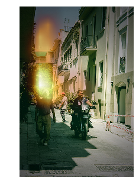

    <matplotlib.figure.Figure at 0x7fb28576e290>

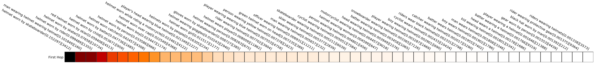

    ('Ans Score kb:', 0.83145767450332642)
    ('Ans Score no kb:', 0.52397757768630981)
    Question [183677001]: Is he being messy?
    Correct Answer:  yes
    Incorrect Answer:  no
    6018
    1.00001

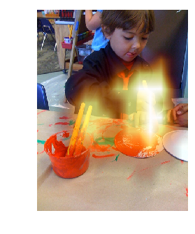

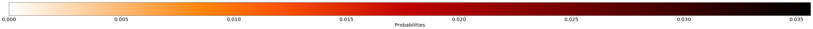

    <matplotlib.figure.Figure at 0x7fb263ddb150>

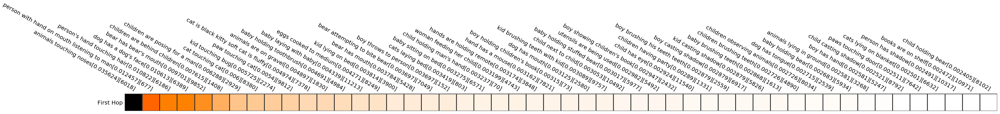

    ('Ans Score kb:', 0.48973456025123596)
    ('Ans Score no kb:', 0.79963845014572144)
    Question [434786006]: Is he smoking?
    Correct Answer:  yes
    Incorrect Answer:  no
    1344
    1.00001

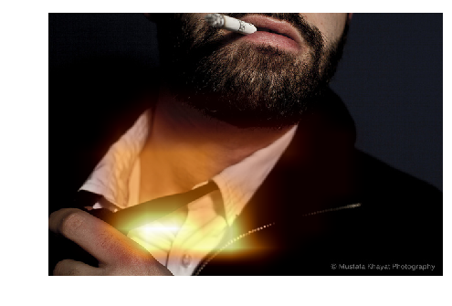

    <matplotlib.figure.Figure at 0x7fb24b4a7290>

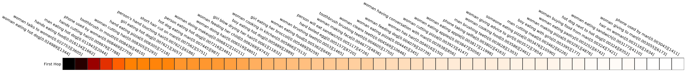

    ('Ans Score kb:', 0.52174556255340576)
    ('Ans Score no kb:', 0.84993958473205566)
    Question [43625003]: Is he catching the object?
    Correct Answer:  yes
    Incorrect Answer:  no
    6084
    1.0

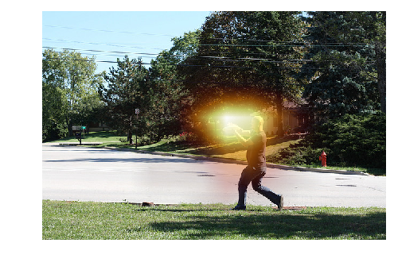

    <matplotlib.figure.Figure at 0x7fb2a36ebe90>

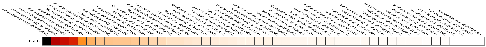

    ----------------------------------------------------------------------
    ----------> Questions answered INCORRECTLY by model with kb <----------
    ----------------------------------------------------------------------
    ('Ans Score kb:', 0.49445915222167969)
    ('Ans Score no kb:', 0.81454825401306152)
    Question [133343004]: Is he smoking?
    Correct Answer:  no
    Incorrect Answer:  yes
    1344
    1.00001

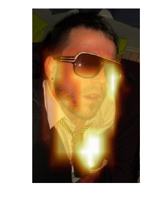

    <matplotlib.figure.Figure at 0x7fb2889d86d0>

    ('Ans Score kb:', 0.44935402274131775)
    ('Ans Score no kb:', 0.056037250906229019)
    Question [339676004]: Is he coming in from or going out to the ocean?
    Correct Answer:  out
    Incorrect Answer:  in
    11929
    1.0

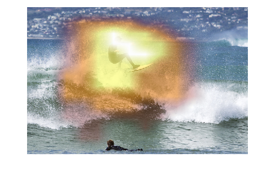

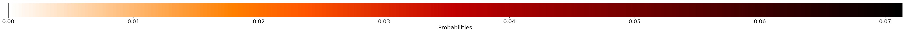

    <matplotlib.figure.Figure at 0x7fb2835adfd0>

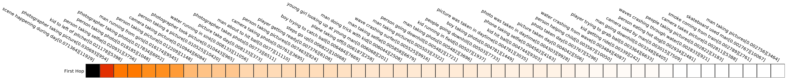

    ('Ans Score kb:', 0.18393802642822266)
    ('Ans Score no kb:', 0.50917679071426392)
    Question [539937002]: Is he surfing or kneeboarding?
    Correct Answer:  neither
    Incorrect Answer:  real
    0
    1.00002

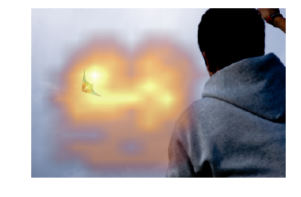

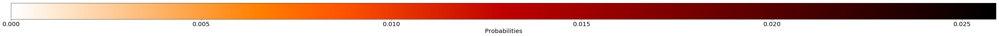

    <matplotlib.figure.Figure at 0x7fb27e9a7f90>

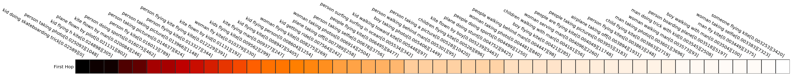

    **********************************************************************
    ******************* Question type: IS THE PERSON *******************
    **********************************************************************
    ----------------------------------------------------------------------
    ----------> Questions answered CORRECTLY by model with kb <----------
    ----------------------------------------------------------------------
    ('Ans Score kb:', 0.29350495338439941)
    ('Ans Score no kb:', 0.89962339401245117)
    Question [77351010]: Is the person in pink , young or old?
    Correct Answer:  young
    Incorrect Answer:  old
    5
    1.00002

    <matplotlib.figure.Figure at 0x7fb279f9c090>

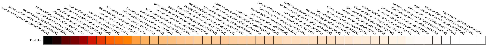

    ('Ans Score kb:', 0.458219975233078)
    ('Ans Score no kb:', 0.14803186058998108)
    Question [302716000]: Is the person looking at a cabinet shelf or a refrigerator shelf?
    Correct Answer:  refrigerator
    Incorrect Answer:  kitchen
    5087
    1.00001

    <matplotlib.figure.Figure at 0x7fb274da4e90>

    ----------------------------------------------------------------------
    ----------> Questions answered INCORRECTLY by model with kb <----------
    ----------------------------------------------------------------------
    ('Ans Score kb:', 0.2621338963508606)
    ('Ans Score no kb:', 0.71609926223754883)
    Question [404249001]: Is the person riding the skateboard child or adult?
    Correct Answer:  child
    Incorrect Answer:  adult
    11839
    1.00002

    <matplotlib.figure.Figure at 0x7fb26fca92d0>

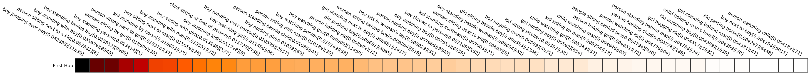

    ('Ans Score kb:', 0.26546862721443176)
    ('Ans Score no kb:', 0.88009071350097656)
    Question [551944001]: Is the person moving toward or away from the photographer?
    Correct Answer:  away
    Incorrect Answer:  towards
    1048
    1.00001

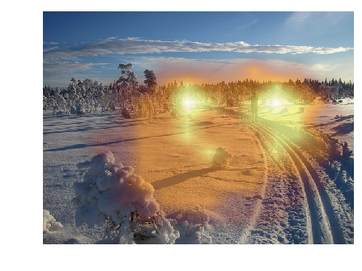

    <matplotlib.figure.Figure at 0x7fb276211610>

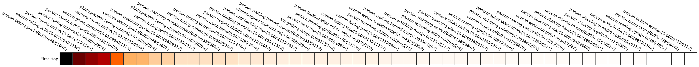

    **********************************************************************
    ******************* Question type: IS THE MAN *******************
    **********************************************************************
    ----------------------------------------------------------------------
    ----------> Questions answered CORRECTLY by model with kb <----------
    ----------------------------------------------------------------------
    ('Ans Score kb:', 0.56282085180282593)
    ('Ans Score no kb:', 0.8630681037902832)
    Question [490441004]: Is the man wearing a tie?
    Correct Answer:  yes
    Incorrect Answer:  no
    283
    1.00001

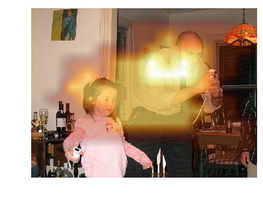

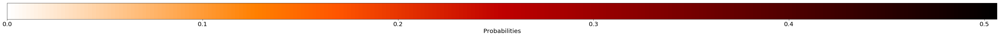

    <matplotlib.figure.Figure at 0x7fb245637410>

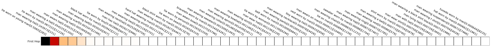

    ('Ans Score kb:', 0.50499600172042847)
    ('Ans Score no kb:', 0.82883012294769287)
    Question [474095003]: Is the man smoking?
    Correct Answer:  yes
    Incorrect Answer:  no
    2044
    1.00002

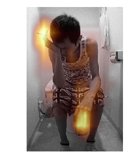

    <matplotlib.figure.Figure at 0x7fb24e4a1fd0>

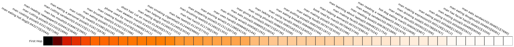

    ----------------------------------------------------------------------
    ----------> Questions answered INCORRECTLY by model with kb <----------
    ----------------------------------------------------------------------
    ('Ans Score kb:', 0.16871888935565948)
    ('Ans Score no kb:', 0.69704055786132812)
    Question [218439002]: Is the man wearing pants or shorts?
    Correct Answer:  pants
    Incorrect Answer:  shorts
    108
    1.00002

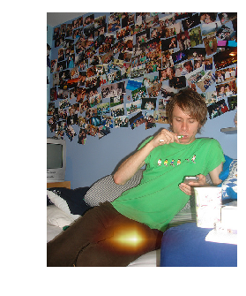

    <matplotlib.figure.Figure at 0x7fb282210bd0>

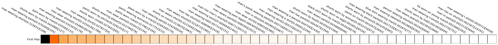

    ('Ans Score kb:', 0.50137650966644287)
    ('Ans Score no kb:', 0.88580185174942017)
    Question [486568002]: Is the man at a restaurant?
    Correct Answer:  no
    Incorrect Answer:  yes
    3646
    1.00001

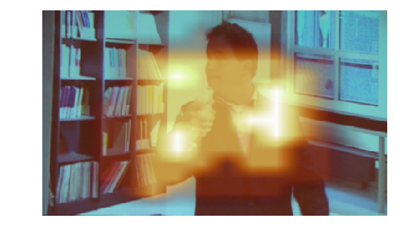

    <matplotlib.figure.Figure at 0x7fb27126da90>

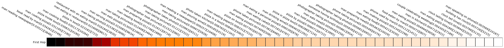

    ('Ans Score kb:', 0.55552273988723755)
    ('Ans Score no kb:', 0.8631095290184021)
    Question [478664003]: Is the man asleep?
    Correct Answer:  no
    Incorrect Answer:  yes
    6206
    1.00002

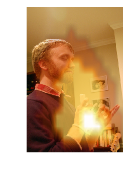

    <matplotlib.figure.Figure at 0x7fb272acf110>

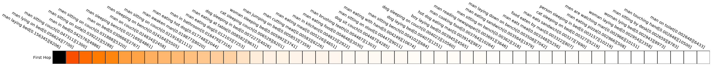

    ('Ans Score kb:', 0.50098079442977905)
    ('Ans Score no kb:', 0.80939704179763794)
    Question [201561026]: Is the man running?
    Correct Answer:  no
    Incorrect Answer:  yes
    2072
    1.00001

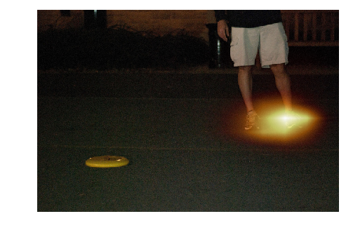

    <matplotlib.figure.Figure at 0x7fb27be17f50>

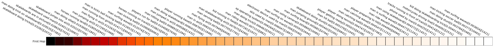

    ('Ans Score kb:', 0.52454155683517456)
    ('Ans Score no kb:', 0.86630487442016602)
    Question [129784003]: Is the man in the photo wearing glasses?
    Correct Answer:  no
    Incorrect Answer:  yes
    49
    1.00001

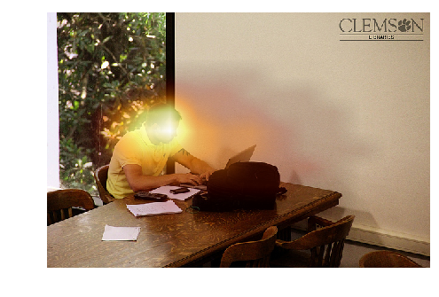

    <matplotlib.figure.Figure at 0x7fb2836543d0>

    **********************************************************************
    ******************* Question type: ARE THEY *******************
    **********************************************************************
    ----------------------------------------------------------------------
    ----------> Questions answered CORRECTLY by model with kb <----------
    ----------------------------------------------------------------------
    ('Ans Score kb:', 0.3316437304019928)
    ('Ans Score no kb:', 0.73493784666061401)
    Question [495020003]: Are they on a river or the ocean?
    Correct Answer:  river
    Incorrect Answer:  lake
    156
    1.00002

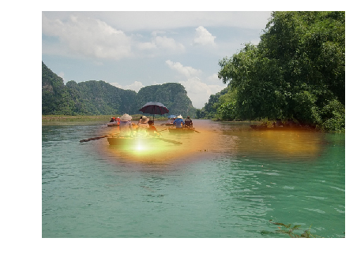

    <matplotlib.figure.Figure at 0x7fb28ba28090>

    ----------------------------------------------------------------------
    ----------> Questions answered INCORRECTLY by model with kb <----------
    ----------------------------------------------------------------------
    ('Ans Score kb:', 0.50795555114746094)
    ('Ans Score no kb:', 0.85649371147155762)
    Question [559012009]: Are they marching?
    Correct Answer:  no
    Incorrect Answer:  yes
    11421
    1.00001

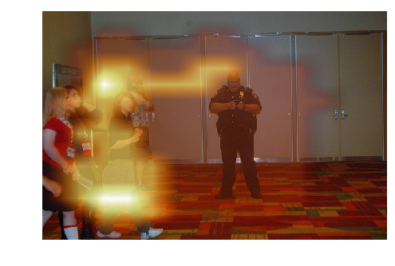

    <matplotlib.figure.Figure at 0x7fb29743c990>

    ('Ans Score kb:', 0.50442367792129517)
    ('Ans Score no kb:', 0.83788025379180908)
    Question [476903000]: Are they playing golf?
    Correct Answer:  no
    Incorrect Answer:  yes
    1014
    1.00002

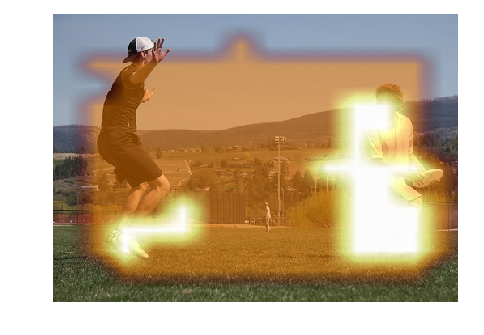

    <matplotlib.figure.Figure at 0x7fb2676ea350>

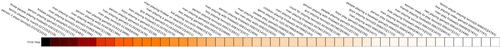

    ('Ans Score kb:', 0.65518605709075928)
    ('Ans Score no kb:', 0.099403306841850281)
    Question [540473001]: Are they playing golf or tennis?
    Correct Answer:  neither
    Incorrect Answer:  wii
    4783
    1.00002

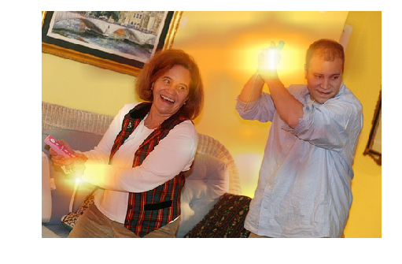

    <matplotlib.figure.Figure at 0x7fb261fe3090>

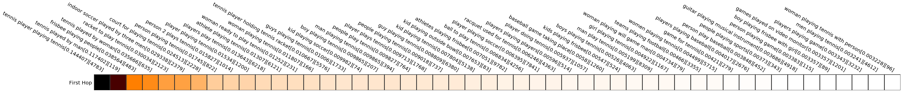

    ('Ans Score kb:', 0.15658468008041382)
    ('Ans Score no kb:', 0.51400423049926758)
    Question [333095002]: Are they family or coworkers?
    Correct Answer:  family
    Incorrect Answer:  friends
    84
    1.00003

    <matplotlib.figure.Figure at 0x7fb25c3db1d0>

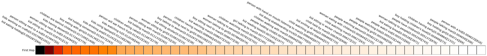

    ('Ans Score kb:', 0.32419490814208984)
    ('Ans Score no kb:', 0.72552478313446045)
    Question [376209011]: Are they family or coworkers?
    Correct Answer:  family
    Incorrect Answer:  friends
    84
    1.00003

    <matplotlib.figure.Figure at 0x7fb2551fee90>

    ('Ans Score kb:', 0.18395502865314484)
    ('Ans Score no kb:', 0.97007542848587036)
    Question [358572003]: Are they playing couples or singles tennis?
    Correct Answer:  singles
    Incorrect Answer:  doubles
    231
    1.00002

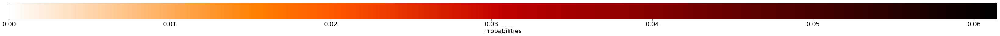

    <matplotlib.figure.Figure at 0x7fb256868e90>

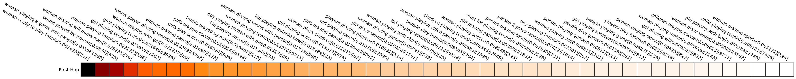

    **********************************************************************
    ******************* Question type: ARE *******************
    **********************************************************************
    ----------------------------------------------------------------------
    ----------> Questions answered CORRECTLY by model with kb <----------
    ----------------------------------------------------------------------
    ('Ans Score kb:', 0.38374787569046021)
    ('Ans Score no kb:', 0.035875901579856873)
    Question [401092001]: Are those pickles or cucumbers?
    Correct Answer:  cucumber
    Incorrect Answer:  no
    4944
    1.00001

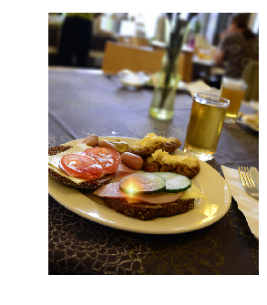

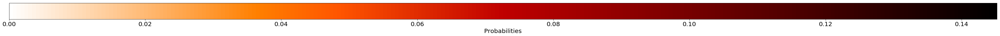

    <matplotlib.figure.Figure at 0x7fb24861e710>

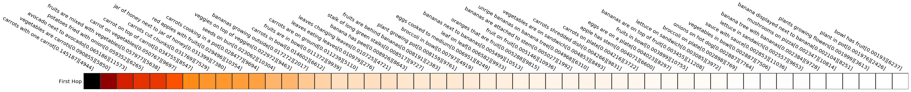

    ('Ans Score kb:', 0.50640827417373657)
    ('Ans Score no kb:', 0.83589524030685425)
    Question [475586008]: Are his eyes open?
    Correct Answer:  yes
    Incorrect Answer:  no
    5388
    1.0

    <matplotlib.figure.Figure at 0x7fb24126e4d0>

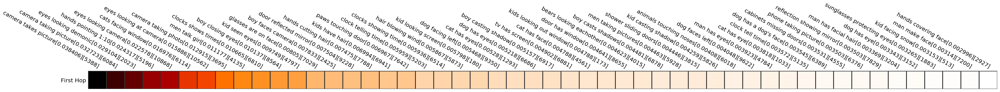

    ('Ans Score kb:', 0.67859554290771484)
    ('Ans Score no kb:', 0.085012756288051605)
    Question [383018000]: Are technology and nature fighting or working together artistically in this photo?
    Correct Answer:  yes
    Incorrect Answer:  no
    296
    1.00001

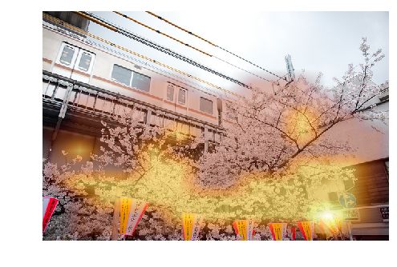

    <matplotlib.figure.Figure at 0x7fb23aaa4f50>

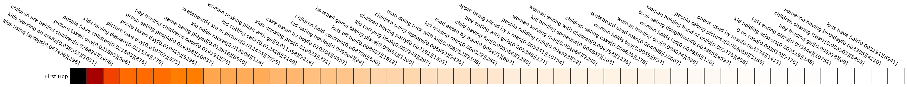

    ----------------------------------------------------------------------
    ----------> Questions answered INCORRECTLY by model with kb <----------
    ----------------------------------------------------------------------
    ('Ans Score kb:', 0.54306048154830933)
    ('Ans Score no kb:', 0.86444646120071411)
    Question [138975037]: Are this the ancient days?
    Correct Answer:  no
    Incorrect Answer:  yes
    10179
    1.0

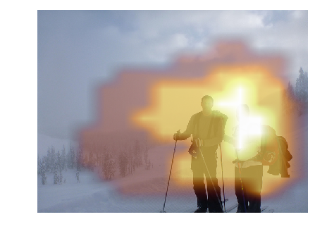

    <matplotlib.figure.Figure at 0x7fb23489e450>

    ('Ans Score kb:', 0.22918437421321869)
    ('Ans Score no kb:', 0.55420511960983276)
    Question [308678000]: Are those children or adults?
    Correct Answer:  adults
    Incorrect Answer:  children
    57
    1.00003

    <matplotlib.figure.Figure at 0x7fb233fec390>

    ('Ans Score kb:', 0.52587753534317017)
    ('Ans Score no kb:', 0.83591371774673462)
    Question [525024001]: Are we looking up an incline?
    Correct Answer:  no
    Incorrect Answer:  yes
    11296
    1.0

    <matplotlib.figure.Figure at 0x7fb3eac82e10>

