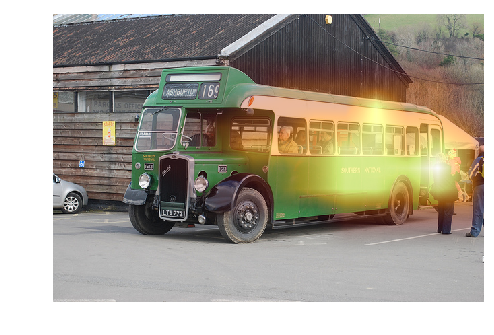
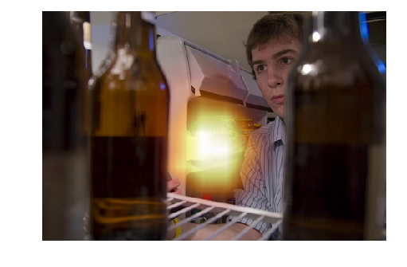
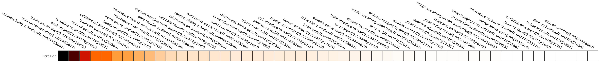
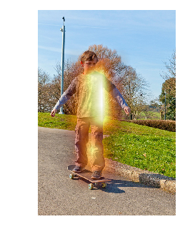
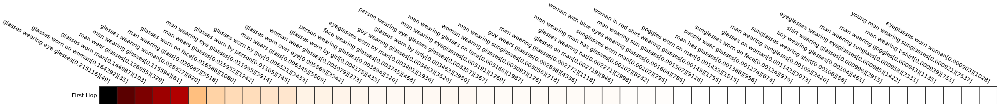

```python
from matplotlib import pyplot as plt
import matplotlib as mpl
from caffe_model import *
from copy import deepcopy
import json, codecs
import random
```


```python
def heatmap(data, row_labels, col_labels, ax=None, cbar_kw={}, cbarlabel="", **kwargs):
    fig, ax = plt.subplots(figsize=(50, 5))
    if not ax:
        ax = plt.gca()
    im = ax.imshow(data, **kwargs)
    ax.set_xticks(np.arange(data.shape[1]))
    ax.set_yticks(np.arange(data.shape[0]))
    ax.set_xticklabels(col_labels)
    ax.set_yticklabels(row_labels)
    ax.tick_params(top=True, bottom=False, labeltop=True, labelbottom=False)
    plt.setp(ax.get_xticklabels(), rotation=-30, ha="right", rotation_mode="anchor")
    ax.set_xticks(np.arange(data.shape[1]+1)-.5, minor=True)
    ax.set_yticks(np.arange(data.shape[0]+1)-.5, minor=True)
    ax.grid(which="minor", color="w", linestyle='-', linewidth=3)
    #ax.grid(b=False, which='major', color='0.2', linestyle='-')
    ax.grid(b=False, which='minor', color='0.2', linestyle='-')
    ax.tick_params(which="minor", bottom=False, left=False)
    for spine in plt.gca().spines.values():
        spine.set_visible(False) #Indentation updated..
    ax.xaxis.set_ticks_position('none')
    ax.yaxis.set_ticks_position('none') 
    return im
def color_bar(cmap,kb_att):
    fig = plt.figure(figsize=(50, 5))
    ax1 = fig.add_axes([0.05, 0.80, 0.9, 0.15])
    norm = mpl.colors.Normalize(vmin=0, vmax=kb_att.max())
    cb1 = mpl.colorbar.ColorbarBase(ax1, cmap=cmap, norm=norm, orientation='horizontal')
    cb1.set_label('Probabilities')
    plt.show()
    plt.clf()
    
def plot_kb_attention(top_relations_first_hop,top_relations_second_hop,kb_relations,cmap,n=50):
    rel_names = lambda RelIdx: ' '.join(RelIdx[0][0]) + '['+str(RelIdx[1][0]) + ']'
    
    
    print(top_relations_first_hop.argmax(),top_relations_second_hop.argmax())
    
    top_relations_idx_first_hop = top_relations_first_hop.argsort()[::-1][:n].reshape(-1,1)
    relations_hop_1 = map(rel_names, zip(kb_relations[top_relations_idx_first_hop],top_relations_idx_first_hop))
    mpl.rcParams.update({'font.size': 20})
    cmap = plt.cm.get_cmap('gist_heat_r')
    color_bar(cmap,top_relations_first_hop[top_relations_idx_first_hop])
    im = heatmap(top_relations_first_hop[top_relations_idx_first_hop].T,['First Hop'],relations_hop_1, cmap=cmap)

    top_relations_idx_second_hop = top_relations_second_hop.argsort()[::-1][:n].reshape(-1,1)
    relations_hop_2 = map(rel_names, zip(kb_relations[top_relations_idx_second_hop],top_relations_idx_second_hop))
    mpl.rcParams.update({'font.size': 20})
    cmap = plt.cm.get_cmap('gist_heat_r')
    color_bar(cmap,top_relations_second_hop[top_relations_idx_second_hop])
    im = heatmap(top_relations_second_hop[top_relations_idx_second_hop].T,['Second Hop'],relations_hop_2,cmap=cmap)
    plt.tight_layout()
    
    
def plot_question_summary(question,correct_answer,incorrect_answer):
    outputs = model.make_dataset_question_caffe(question['question_id'])
    question_vis={'image_url':'/mnt/nas2/GrimaRepo/datasets/mscoco/coco2014/{}2014/COCO_{}2014_'.format(split,split) + str(question['image_id']).zfill(12) + '.jpg','question':question['question']}
    print 'Question [{}]: {}'.format(question['question_id'], question['question'])
    print 'Correct Answer: ', correct_answer
    print 'Incorrect Answer: ', incorrect_answer
    top_predictions_labels,top_predictions_labels,ans,image = model.visualize(question_vis,outputs[1],outputs[3],only_picture=True)
  
    plot_kb_attention(outputs[4],outputs[5],kb_relations,cmap)
    return outputs
  
def plot_custom_question_summary(question,image_id):
    question = {'question':question,'image_id':image_id}
    outputs = model.make_new_question_caffe(question)
    question_vis={'image_url':'/mnt/nas2/GrimaRepo/datasets/mscoco/coco2014/{}2014/COCO_{}2014_'.format(split,split) + str(question['image_id']).zfill(12) + '.jpg','question':question['question']}
    top_predictions_labels,top_predictions_labels,ans,image = model.visualize(question_vis,outputs[1],outputs[3],only_picture=True)
    plot_kb_attention(outputs[4],outputs[5],kb_relations,cmap)
    return outputs

  
def plot_kb_attention_no_hop(top_relations_first_hop,kb_relations,n=50):
    rel_names = lambda RelIdx: ' '.join(RelIdx[0][0]) + '[' +str(round(RelIdx[2][0],6))+']' +'['+str(RelIdx[1][0]) + ']'
    print(top_relations_first_hop.argmax())
    top_relations_idx_first_hop = top_relations_first_hop.argsort()[::-1][:n].reshape(-1,1)
    print(top_relations_first_hop.sum())
    relations_hop_1 = map(rel_names, zip(kb_relations[top_relations_idx_first_hop],top_relations_idx_first_hop,top_relations_first_hop[top_relations_idx_first_hop]))
    mpl.rcParams.update({'font.size': 20})
    cmap = plt.cm.get_cmap('gist_heat_r')
    color_bar(cmap,top_relations_first_hop[top_relations_idx_first_hop])
    im = heatmap(top_relations_first_hop[top_relations_idx_first_hop].T,['First Hop'],relations_hop_1, cmap=cmap)
    plt.tight_layout()

def plot_question_summary_no_hop(question,correct_answer,incorrect_answer):
    outputs = model.make_dataset_question_caffe(question['question_id'])
    question_vis={'image_url':'/mnt/nas2/GrimaRepo/datasets/mscoco/coco2014/{}2014/COCO_{}2014_'.format(split,split) + str(question['image_id']).zfill(12) + '.jpg','question':question['question']}
    print 'Question [{}]: {}'.format(question['question_id'], question['question'])
    print 'Correct Answer: ', correct_answer
    print 'Incorrect Answer: ', incorrect_answer
    top_predictions_labels,top_predictions_labels,ans,image = model.visualize(question_vis,outputs[1],outputs[3],only_picture=True)
  
    plot_kb_attention_no_hop(outputs[4],kb_relations)
    return outputs
  
def plot_custom_question_summary_no_hop(question,image_id):
    question = {'question':question,'image_id':image_id}
    outputs = model.make_new_question_caffe(question)
    question_vis={'image_url':'/mnt/nas2/GrimaRepo/datasets/mscoco/coco2014/{}2014/COCO_{}2014_'.format(split,split) + str(question['image_id']).zfill(12) + '.jpg','question':question['question']}
    top_predictions_labels,top_predictions_labels,ans,image = model.visualize(question_vis,outputs[1],outputs[3],only_picture=True)
    plot_kb_attention_no_hop(outputs[4],kb_relations,cmap)
    return outputs
```


```python
PATH_PREFIX = '/home/fariquelme/tesis/accuracy_analisys/'
# Model 1 has kb, model 2 has no kb
question_types_by_model_dict = json.load(open(PATH_PREFIX + 'question_types_by_model_dict.json','r'))
annotations_by_type_train = json.load(open(PATH_PREFIX + 'annotations_by_type_train.json','r'))
    
annotations_by_type_val = json.load(open(PATH_PREFIX + 'annotations_by_type_val.json','r'))
```


```python
#RELATIONSHIPS_PATH = '/home/fariquelme/tesis/top_relationships/ top_3000_region_object_relationships.npz'
#RELATIONSHIPS_PATH = '/home/fariquelme/tesis/top_3000_relationships.npz'
RELATIONSHIPS_PATH = '/home/fariquelme/tesis/top_relationships/top_12000_supervised_labels_FULL_relationships.npz'
kb_relations = np.load(RELATIONSHIPS_PATH)['relations']

RELATIONSHIPS_PATH = '/home/fariquelme/tesis/top_relationships/top_12000_supervised_labels_FULL_relationships.npz'
kb_relations = np.load(RELATIONSHIPS_PATH)['relations']


split = 'val'


model = VQA_KB('/mnt/nas2/GrimaRepo/fariquelme/KL_result/model_checkpts/qlstm_solver_iter_100000.caffemodel',split)
#model = VQA_KB('/mnt/nas2/GrimaRepo/fariquelme/KL_result/model_checkpts_kb_v2/test_200000_iters.caffemodel',split)
#model = VQA_KB('/mnt/nas2/GrimaRepo/fariquelme/KL_result/model_checkpts_kb_v1/test_200000_iters.caffemodel',split)
```

    reading :  /storage2/fariquelme/vqa-v2/v2_OpenEnded_mscoco_val2014_questions.json
    Loaded adict and vdict
    reading:  /home/fariquelme/tesis/top_relationships/supervised_labels_FULL_top_12000_relationships_glove.npz
    214354 total questions
    Model loaded: /mnt/nas2/GrimaRepo/fariquelme/KL_result/model_checkpts/qlstm_solver_iter_100000.caffemodel
    Image feature prefix: /storage2/fariquelme/cco_feats/resnet_res5c_bgrms_large/val2014/COCO_val2014_


```python
limmit = 5
for q_type,qas_dict in question_types_by_model_dict.items():
    limmit_counter = 0
    print('*'*70) 
    print('*'*19 + ' Question type: {0} '.format(q_type.upper()) + '*'*19)#({1} questions in val [{2:.2f}%],{3} questions in train [{4:.2f}%]) '.format(q_type.upper(),annotations_by_type_val[q_type]['count'],(float(annotations_by_type_val[q_type]['count'])/annotations_by_type_val['total_annotations'])*100,annotations_by_type_train[q_type]['count'],(float(annotations_by_type_train[q_type]['count'])/annotations_by_type_train['total_annotations'])*100) + '*'*30)
    print('*'*70) 
    print('-'*70)
    print('-'*10 + '> Questions answered CORRECTLY by model with kb <'+'-'*10)
    print('-'*70)
    
    
    for qid,qa in random.sample(list(qas_dict['model_1_correct'].items()), limmit):
      (qid, ans ,att_1,att_2 ,kb_attention_hop_1, lstm_12, concat_embed, embed_ba, att, t_word, t_cont, t_img_feature, t_att_cont) = plot_question_summary_no_hop(qa[0],qa[1],qa[2])
      
      limmit_counter +=1
      plt.show()
    limmit_counter = 0
    print('-'*70)
    print('-'*10 + '> Questions answered INCORRECTLY by model with kb <'+'-'*10)
    print('-'*70)
    for qid,qa in random.sample(list(qas_dict['model_2_correct'].items()), limmit):
      plot_question_summary_no_hop(qa[0],qa[2],qa[1])
      limmit_counter +=1
      plt.show()
```

### Debug results


```python
outs = []
for q_type,qas_dict in question_types_by_model_dict.items():
    for qid,qa in qas_dict['model_1_correct'].items():
      
      (qid, ans ,att_1,att_2 ,kb_attention_hop_1, kb_attention_hop_2, q_kb_addressed, q_emb_tanh_droped_resh_KB, lstm_12, concat_embed, embed_ba, att, t_word, t_cont, t_img_feature, t_att_cont) = plot_question_summary(qa[0],qa[1],qa[2])

      
      
      preds_kb = np.load(PATH_PREFIX + FOLDER_PREFIX + 'kb' + '/' + str(qid) +'.npz')['preds']
      preds_no_kb = np.load(PATH_PREFIX + FOLDER_PREFIX + 'no_kb' + '/' + str(qid) +'.npz')['preds']
      print('#'*30, preds_kb.max(), preds_no_kb.max())   
      
      print 'Before Softmax highest:',np.sort(q_kb_addressed[0])[::-1][:30]
      print 'Before Softmax lowest:',np.sort(q_kb_addressed[0])[:30]
      print(q_kb_addressed.argmax())
      plt.show()
      #outs.append(deepcopy((qid,ans ,att_1,att_2 ,kb_attention_hop_1, kb_attention_hop_2, q_kb_addressed, kbkey_kb_emb, value_mat_emb, q_kbkey_elwise, q_emb_tanh_droped_resh_KB, lstm_12,concat_embed,embed_ba, att, t_word, t_cont, t_img_feature, t_att_cont)))
```

## Results with great score differences


```python
PATH_PREFIX = '/mnt/nas2/GrimaRepo/fariquelme/vqa_predictions_dict/'
ITERATIONS = 100000
FOLDER_PREFIX = '{}_qid_preds_'.format(ITERATIONS)

FOLDER_PREFIX2 = '200000_qid_preds_'

PREDICTION_PATHS = [('kb',PATH_PREFIX + '{}_val_results_full_kb_supervised.json.preds_dict.json'.format(ITERATIONS)),('no_kb',PATH_PREFIX + '{}_val_results_no_kb_v2.json.preds_dict.json'.format(ITERATIONS))] # kb_path, no kb_path
#array = np.load(PATH_PREFIX + FOLDER_PREFIX + 'kb' + '/99984005.npz')['preds']
rev_adict = json.load(open(PATH_PREFIX + 'rev_adict.json'))

```


```python
min_diff= .3
limmit = 6
for q_type,qas_dict in question_types_by_model_dict.items():
    limmit_counter = 0
    print('*'*70) 
    print('*'*19 + ' Question type: {0} '.format(q_type.upper()) + '*'*19)#({1} questions in val [{2:.2f}%],{3} questions in train [{4:.2f}%]) '.format(q_type.upper(),annotations_by_type_val[q_type]['count'],(float(annotations_by_type_val[q_type]['count'])/annotations_by_type_val['total_annotations'])*100,annotations_by_type_train[q_type]['count'],(float(annotations_by_type_train[q_type]['count'])/annotations_by_type_train['total_annotations'])*100) + '*'*30)
    print('*'*70) 
    print('-'*70)
    print('-'*10 + '> Questions answered CORRECTLY by model with kb <'+'-'*10)
    print('-'*70)
    for qid,qa in qas_dict['model_1_correct'].items():
      if limmit_counter > limmit: break
      preds_kb = np.load(PATH_PREFIX + FOLDER_PREFIX + 'kb' + '/' + str(qid) +'.npz')['preds']
      preds_no_kb = np.load(PATH_PREFIX + FOLDER_PREFIX2 + 'no_kb' + '/' + str(qid) +'.npz')['preds']
      if abs(preds_kb.max() - preds_no_kb.max()) < min_diff: continue
      print('Ans Score kb:', preds_kb.max())
      print ('Ans Score no kb:',preds_no_kb.max())
      plot_question_summary_no_hop(qa[0],qa[1],qa[2])
      limmit_counter +=1
      plt.show()
      
    print('-'*70)
    print('-'*10 + '> Questions answered INCORRECTLY by model with kb <'+'-'*10)
    print('-'*70)
    for qid,qa in qas_dict['model_2_correct'].items():
      if limmit_counter > limmit: break
      preds_kb = np.load(PATH_PREFIX + FOLDER_PREFIX + 'kb' + '/' + str(qid) +'.npz')['preds']
      preds_no_kb = np.load(PATH_PREFIX + FOLDER_PREFIX2 + 'no_kb' + '/' + str(qid) +'.npz')['preds']
      if abs(preds_kb.max() - preds_no_kb.max()) < min_diff: continue
      print('Ans Score kb:', preds_kb.max())
      print ('Ans Score no kb:',preds_no_kb.max())
      plot_question_summary_no_hop(qa[0],qa[2],qa[1])
      limmit_counter +=1
      plt.show()  

```

    **********************************************************************
    ******************* Question type: IS HE *******************
    **********************************************************************
    ----------------------------------------------------------------------
    ----------> Questions answered CORRECTLY by model with kb <----------
    ----------------------------------------------------------------------
    ('Ans Score kb:', 0.51258367300033569)
    ('Ans Score no kb:', 0.9031183123588562)
    Question [222370006]: Is he wearing a helmet?
    Correct Answer:  no
    Incorrect Answer:  yes


    /home/fariquelme/venvs/farc-py27/local/lib/python2.7/site-packages/skimage/transform/_warps.py:84: UserWarning: The default mode, 'constant', will be changed to 'reflect' in skimage 0.15.
      warn("The default mode, 'constant', will be changed to 'reflect' in "


    3412
    1.00002


    <matplotlib.figure.Figure at 0x7fb28576e290>


    ('Ans Score kb:', 0.83145767450332642)
    ('Ans Score no kb:', 0.52397757768630981)
    Question [183677001]: Is he being messy?
    Correct Answer:  yes
    Incorrect Answer:  no
    6018
    1.00001


    <matplotlib.figure.Figure at 0x7fb263ddb150>


    ('Ans Score kb:', 0.48973456025123596)
    ('Ans Score no kb:', 0.79963845014572144)
    Question [434786006]: Is he smoking?
    Correct Answer:  yes
    Incorrect Answer:  no
    1344
    1.00001


    <matplotlib.figure.Figure at 0x7fb24b4a7290>


    ('Ans Score kb:', 0.52174556255340576)
    ('Ans Score no kb:', 0.84993958473205566)
    Question [43625003]: Is he catching the object?
    Correct Answer:  yes
    Incorrect Answer:  no
    6084
    1.0


    <matplotlib.figure.Figure at 0x7fb2a36ebe90>


    ----------------------------------------------------------------------
    ----------> Questions answered INCORRECTLY by model with kb <----------
    ----------------------------------------------------------------------
    ('Ans Score kb:', 0.49445915222167969)
    ('Ans Score no kb:', 0.81454825401306152)
    Question [133343004]: Is he smoking?
    Correct Answer:  no
    Incorrect Answer:  yes
    1344
    1.00001


    <matplotlib.figure.Figure at 0x7fb2889d86d0>


    ('Ans Score kb:', 0.44935402274131775)
    ('Ans Score no kb:', 0.056037250906229019)
    Question [339676004]: Is he coming in from or going out to the ocean?
    Correct Answer:  out
    Incorrect Answer:  in
    11929
    1.0


    <matplotlib.figure.Figure at 0x7fb2835adfd0>


    ('Ans Score kb:', 0.18393802642822266)
    ('Ans Score no kb:', 0.50917679071426392)
    Question [539937002]: Is he surfing or kneeboarding?
    Correct Answer:  neither
    Incorrect Answer:  real
    0
    1.00002


    <matplotlib.figure.Figure at 0x7fb27e9a7f90>


    **********************************************************************
    ******************* Question type: IS THE PERSON *******************
    **********************************************************************
    ----------------------------------------------------------------------
    ----------> Questions answered CORRECTLY by model with kb <----------
    ----------------------------------------------------------------------
    ('Ans Score kb:', 0.29350495338439941)
    ('Ans Score no kb:', 0.89962339401245117)
    Question [77351010]: Is the person in pink , young or old?
    Correct Answer:  young
    Incorrect Answer:  old
    5
    1.00002





    <matplotlib.figure.Figure at 0x7fb279f9c090>


    ('Ans Score kb:', 0.458219975233078)
    ('Ans Score no kb:', 0.14803186058998108)
    Question [302716000]: Is the person looking at a cabinet shelf or a refrigerator shelf?
    Correct Answer:  refrigerator
    Incorrect Answer:  kitchen
    5087
    1.00001





    <matplotlib.figure.Figure at 0x7fb274da4e90>





    ----------------------------------------------------------------------
    ----------> Questions answered INCORRECTLY by model with kb <----------
    ----------------------------------------------------------------------
    ('Ans Score kb:', 0.2621338963508606)
    ('Ans Score no kb:', 0.71609926223754883)
    Question [404249001]: Is the person riding the skateboard child or adult?
    Correct Answer:  child
    Incorrect Answer:  adult
    11839
    1.00002





    <matplotlib.figure.Figure at 0x7fb26fca92d0>


    ('Ans Score kb:', 0.26546862721443176)
    ('Ans Score no kb:', 0.88009071350097656)
    Question [551944001]: Is the person moving toward or away from the photographer?
    Correct Answer:  away
    Incorrect Answer:  towards
    1048
    1.00001


    <matplotlib.figure.Figure at 0x7fb276211610>


    **********************************************************************
    ******************* Question type: IS THE MAN *******************
    **********************************************************************
    ----------------------------------------------------------------------
    ----------> Questions answered CORRECTLY by model with kb <----------
    ----------------------------------------------------------------------
    ('Ans Score kb:', 0.56282085180282593)
    ('Ans Score no kb:', 0.8630681037902832)
    Question [490441004]: Is the man wearing a tie?
    Correct Answer:  yes
    Incorrect Answer:  no
    283
    1.00001


    <matplotlib.figure.Figure at 0x7fb245637410>


    ('Ans Score kb:', 0.50499600172042847)
    ('Ans Score no kb:', 0.82883012294769287)
    Question [474095003]: Is the man smoking?
    Correct Answer:  yes
    Incorrect Answer:  no
    2044
    1.00002


    <matplotlib.figure.Figure at 0x7fb24e4a1fd0>


    ----------------------------------------------------------------------
    ----------> Questions answered INCORRECTLY by model with kb <----------
    ----------------------------------------------------------------------
    ('Ans Score kb:', 0.16871888935565948)
    ('Ans Score no kb:', 0.69704055786132812)
    Question [218439002]: Is the man wearing pants or shorts?
    Correct Answer:  pants
    Incorrect Answer:  shorts
    108
    1.00002


    <matplotlib.figure.Figure at 0x7fb282210bd0>


    ('Ans Score kb:', 0.50137650966644287)
    ('Ans Score no kb:', 0.88580185174942017)
    Question [486568002]: Is the man at a restaurant?
    Correct Answer:  no
    Incorrect Answer:  yes
    3646
    1.00001


    <matplotlib.figure.Figure at 0x7fb27126da90>


    ('Ans Score kb:', 0.55552273988723755)
    ('Ans Score no kb:', 0.8631095290184021)
    Question [478664003]: Is the man asleep?
    Correct Answer:  no
    Incorrect Answer:  yes
    6206
    1.00002


    <matplotlib.figure.Figure at 0x7fb272acf110>


    ('Ans Score kb:', 0.50098079442977905)
    ('Ans Score no kb:', 0.80939704179763794)
    Question [201561026]: Is the man running?
    Correct Answer:  no
    Incorrect Answer:  yes
    2072
    1.00001


    <matplotlib.figure.Figure at 0x7fb27be17f50>


    ('Ans Score kb:', 0.52454155683517456)
    ('Ans Score no kb:', 0.86630487442016602)
    Question [129784003]: Is the man in the photo wearing glasses?
    Correct Answer:  no
    Incorrect Answer:  yes
    49
    1.00001


    <matplotlib.figure.Figure at 0x7fb2836543d0>





    **********************************************************************
    ******************* Question type: ARE THEY *******************
    **********************************************************************
    ----------------------------------------------------------------------
    ----------> Questions answered CORRECTLY by model with kb <----------
    ----------------------------------------------------------------------
    ('Ans Score kb:', 0.3316437304019928)
    ('Ans Score no kb:', 0.73493784666061401)
    Question [495020003]: Are they on a river or the ocean?
    Correct Answer:  river
    Incorrect Answer:  lake
    156
    1.00002


    <matplotlib.figure.Figure at 0x7fb28ba28090>


    ----------------------------------------------------------------------
    ----------> Questions answered INCORRECTLY by model with kb <----------
    ----------------------------------------------------------------------
    ('Ans Score kb:', 0.50795555114746094)
    ('Ans Score no kb:', 0.85649371147155762)
    Question [559012009]: Are they marching?
    Correct Answer:  no
    Incorrect Answer:  yes
    11421
    1.00001


    <matplotlib.figure.Figure at 0x7fb29743c990>


    ('Ans Score kb:', 0.50442367792129517)
    ('Ans Score no kb:', 0.83788025379180908)
    Question [476903000]: Are they playing golf?
    Correct Answer:  no
    Incorrect Answer:  yes
    1014
    1.00002


    <matplotlib.figure.Figure at 0x7fb2676ea350>


    ('Ans Score kb:', 0.65518605709075928)
    ('Ans Score no kb:', 0.099403306841850281)
    Question [540473001]: Are they playing golf or tennis?
    Correct Answer:  neither
    Incorrect Answer:  wii
    4783
    1.00002


    <matplotlib.figure.Figure at 0x7fb261fe3090>


    ('Ans Score kb:', 0.15658468008041382)
    ('Ans Score no kb:', 0.51400423049926758)
    Question [333095002]: Are they family or coworkers?
    Correct Answer:  family
    Incorrect Answer:  friends
    84
    1.00003


    <matplotlib.figure.Figure at 0x7fb25c3db1d0>


    ('Ans Score kb:', 0.32419490814208984)
    ('Ans Score no kb:', 0.72552478313446045)
    Question [376209011]: Are they family or coworkers?
    Correct Answer:  family
    Incorrect Answer:  friends
    84
    1.00003


    <matplotlib.figure.Figure at 0x7fb2551fee90>


    ('Ans Score kb:', 0.18395502865314484)
    ('Ans Score no kb:', 0.97007542848587036)
    Question [358572003]: Are they playing couples or singles tennis?
    Correct Answer:  singles
    Incorrect Answer:  doubles
    231
    1.00002


    <matplotlib.figure.Figure at 0x7fb256868e90>


    **********************************************************************
    ******************* Question type: ARE *******************
    **********************************************************************
    ----------------------------------------------------------------------
    ----------> Questions answered CORRECTLY by model with kb <----------
    ----------------------------------------------------------------------
    ('Ans Score kb:', 0.38374787569046021)
    ('Ans Score no kb:', 0.035875901579856873)
    Question [401092001]: Are those pickles or cucumbers?
    Correct Answer:  cucumber
    Incorrect Answer:  no
    4944
    1.00001


    <matplotlib.figure.Figure at 0x7fb24861e710>


    ('Ans Score kb:', 0.50640827417373657)
    ('Ans Score no kb:', 0.83589524030685425)
    Question [475586008]: Are his eyes open?
    Correct Answer:  yes
    Incorrect Answer:  no
    5388
    1.0


    <matplotlib.figure.Figure at 0x7fb24126e4d0>


    ('Ans Score kb:', 0.67859554290771484)
    ('Ans Score no kb:', 0.085012756288051605)
    Question [383018000]: Are technology and nature fighting or working together artistically in this photo?
    Correct Answer:  yes
    Incorrect Answer:  no
    296
    1.00001


    <matplotlib.figure.Figure at 0x7fb23aaa4f50>


    ----------------------------------------------------------------------
    ----------> Questions answered INCORRECTLY by model with kb <----------
    ----------------------------------------------------------------------
    ('Ans Score kb:', 0.54306048154830933)
    ('Ans Score no kb:', 0.86444646120071411)
    Question [138975037]: Are this the ancient days?
    Correct Answer:  no
    Incorrect Answer:  yes
    10179
    1.0


    <matplotlib.figure.Figure at 0x7fb23489e450>


    ('Ans Score kb:', 0.22918437421321869)
    ('Ans Score no kb:', 0.55420511960983276)
    Question [308678000]: Are those children or adults?
    Correct Answer:  adults
    Incorrect Answer:  children
    57
    1.00003


    <matplotlib.figure.Figure at 0x7fb233fec390>


    ('Ans Score kb:', 0.52587753534317017)
    ('Ans Score no kb:', 0.83591371774673462)
    Question [525024001]: Are we looking up an incline?
    Correct Answer:  no
    Incorrect Answer:  yes
    11296
    1.0


    <matplotlib.figure.Figure at 0x7fb3eac82e10>


```python
get_matching_relations(kb_relations,'is',)
```

## Question Variations for interesting cases 


```python
def get_matching_relations(kb_relations,relation = None,subject=None,obj = None):
  matching = []
  if relation != None:
    if obj is None and subject is not None:
      for rel in kb_relations:
        if rel[1] == relation and rel[0] == subject:
          matching.append(' '.join(rel))
    elif subject is None and obj is not None: 
      for rel in kb_relations:
        if rel[1] == relation and rel[2] == obj:
          matching.append(' '.join(rel))
    else:
      for rel in kb_relations:
        if rel[1] == relation and rel[0] == subject and rel[2] == obj:
          matching.append(' '.join(rel))
  else:
    if obj is None and subject is not None:
      for rel in kb_relations:
        if rel[0] == subject:
          matching.append(' '.join(rel))
    elif subject is None and obj is not None: 
      for rel in kb_relations:
        if rel[2] == obj:
          matching.append(' '.join(rel))
    else:
      for rel in kb_relations:
        if rel[0] == subject and rel[2] == obj:
          matching.append(' '.join(rel))
  return matching
```


```python
get_matching_relations(kb_relations,relation = None,obj='wii', subject = None)
```


```python
print('Model with KB answered Correctly')
qid=579666000
q = {'question_id':qid,'question':'What is the person wearing?','image_id':model.dp.getImgId(qid)}
plot_question_summary(q,'shirt','suit')
plt.show()
plot_custom_question_summary('What is the man jumping on?',model.dp.getImgId(qid)) # Persona tirando feesbie
plt.show()
print(get_matching_relations(kb_relations,'wearing',obj='shirt'))
```


```python
print('Model with KB answered Correctly')
qid=289960007
q = {'question_id':qid,'question':'What is the man holding?','image_id':model.dp.getImgId(qid)}
plot_question_summary(q,'kite','board')
plt.show()
plot_custom_question_summary('What is the man using?',model.dp.getImgId(qid)) # Persona tirando feesbie
plt.show()
plot_custom_question_summary('What is the person using?',model.dp.getImgId(qid)) # Persona tirando feesbie
plt.show()
plot_custom_question_summary('What is the person holding?',model.dp.getImgId(qid)) # Persona tirando feesbie
plt.show()
print(get_matching_relations(kb_relations,'holding',obj='kite'))
```


```python
print('Model with KB answered Correctly')
qid=105052023
q = {'question_id':qid,'question':'What is the woman holding?','image_id':model.dp.getImgId(qid)}
plot_question_summary(q,'purse','camera')
plt.show()
plot_custom_question_summary('Who has the purse?',model.dp.getImgId(qid)) # Persona tirando feesbie
plt.show()
plot_custom_question_summary('Who has the camera?',model.dp.getImgId(qid)) # Persona tirando feesbie
plt.show()
print(get_matching_relations(kb_relations,'holding',obj='purse'))
print(get_matching_relations(kb_relations,'holding',obj='camera'))
```


```python
qid=149268003
q = {'question_id':qid,'question':'What is the woman doing?','image_id':model.dp.getImgId(qid)}
plot_question_summary(q,'flyingn kite','walking')
plt.show()
plot_custom_question_summary('Who is walking?',model.dp.getImgId(qid)) # Persona tirando feesbie
plt.show()
plot_custom_question_summary('Who is flying a kite?',model.dp.getImgId(qid)) # Persona tirando feesbie
plt.show()
print(get_matching_relations(kb_relations,'flying',obj='kite'))
```


```python
qid=440106014
q = {'question_id':qid,'question':'What is the woman wearing around her neck?','image_id':model.dp.getImgId(qid)}

plot_question_summary(q,'tie','necklace')
plt.show()
plot_custom_question_summary('Who is wearing a tie?',model.dp.getImgId(qid)) # Persona tirando feesbie
plt.show()
print(get_matching_relations(kb_relations,'wearing',obj='tie'))
```


```python
# correct solution:
def softmax(x):
    """Compute softmax values for each sets of scores in x."""
    return e_x / e_x.sum(axis=0) # only difference
```
