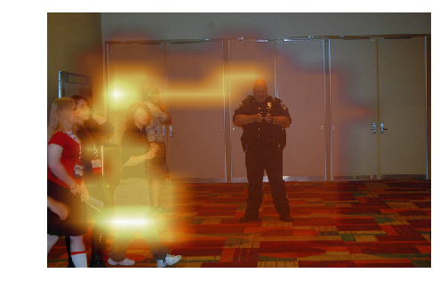

## Results with great score differences

    **********************************************************************
    ******************* Question type: WHAT IS THE PERSON *******************
    **********************************************************************
    ----------------------------------------------------------------------
    ----------> Questions answered CORRECTLY by model with kb <----------
    ----------------------------------------------------------------------
    ('Ans Score kb:', 0.86669248342514038)
    ('Ans Score no kb:', 0.14298234879970551)
    Question [10496013]: What is the person resting their shoe on?
    Correct Answer:  grass
    Incorrect Answer:  skis
    2663
    1.00002

    <matplotlib.figure.Figure at 0x7f105a6a0890>

    ('Ans Score kb:', 0.8799673318862915)
    ('Ans Score no kb:', 0.22587484121322632)
    Question [282830003]: What is the person looking at?
    Correct Answer:  frisbee
    Incorrect Answer:  man
    208
    1.0

    <matplotlib.figure.Figure at 0x7f105a153f10>

    ('Ans Score kb:', 0.24448710680007935)
    ('Ans Score no kb:', 0.64091885089874268)
    Question [156497019]: What is the person leaning against?
    Correct Answer:  couch
    Incorrect Answer:  wall
    1079
    1.0

    <matplotlib.figure.Figure at 0x7f1059d12e90>

    ('Ans Score kb:', 0.73296892642974854)
    ('Ans Score no kb:', 0.1452832818031311)
    Question [195863002]: What is the person carrying in the right hand?
    Correct Answer:  kite
    Incorrect Answer:  snowboard
    1356
    1.00002

    <matplotlib.figure.Figure at 0x7f1059d3c650>

    ('Ans Score kb:', 0.51780533790588379)
    ('Ans Score no kb:', 0.17523899674415588)
    Question [202231004]: What is the person holding?
    Correct Answer:  phone
    Incorrect Answer:  glass
    981
    1.00002

    <matplotlib.figure.Figure at 0x7f10589edf10>

    ('Ans Score kb:', 0.65607106685638428)
    ('Ans Score no kb:', 0.33841577172279358)
    Question [223241076]: What is the person doing?
    Correct Answer:  holding baby
    Incorrect Answer:  sleeping
    789
    1.0

    <matplotlib.figure.Figure at 0x7f1058630f50>

    ('Ans Score kb:', 0.47678965330123901)
    ('Ans Score no kb:', 0.15559731423854828)
    Question [4134000]: What is the person on the left doing with their hand?
    Correct Answer:  shaking hands
    Incorrect Answer:  talking
    2850
    1.00002

    <matplotlib.figure.Figure at 0x7f105809ef50>

    ----------------------------------------------------------------------
    ----------> Questions answered INCORRECTLY by model with kb <----------
    ----------------------------------------------------------------------
    **********************************************************************
    ******************* Question type: WHAT IS THE MAN *******************
    **********************************************************************
    ----------------------------------------------------------------------
    ----------> Questions answered CORRECTLY by model with kb <----------
    ----------------------------------------------------------------------
    ('Ans Score kb:', 0.55861419439315796)
    ('Ans Score no kb:', 0.22274462878704071)
    Question [476215007]: What is the man holding?
    Correct Answer:  plow
    Incorrect Answer:  poles
    312
    1.00001

    <matplotlib.figure.Figure at 0x7f10578e45d0>

    ('Ans Score kb:', 0.76691973209381104)
    ('Ans Score no kb:', 0.43438687920570374)
    Question [359020008]: What is the man teaching the child?
    Correct Answer:  kite flying
    Incorrect Answer:  frisbee
    3796
    1.00002

    <matplotlib.figure.Figure at 0x7f1056e32e90>

    ('Ans Score kb:', 0.82793742418289185)
    ('Ans Score no kb:', 0.48598265647888184)
    Question [207545001]: What is the man playing?
    Correct Answer:  soccer
    Incorrect Answer:  tennis
    119
    1.00003

    <matplotlib.figure.Figure at 0x7f10562b0590>

    ('Ans Score kb:', 0.33124297857284546)
    ('Ans Score no kb:', 0.69071865081787109)
    Question [67975001]: What is the man holding?
    Correct Answer:  kite
    Incorrect Answer:  umbrella
    312
    1.00001

    <matplotlib.figure.Figure at 0x7f10555615d0>

    ('Ans Score kb:', 0.28622427582740784)
    ('Ans Score no kb:', 0.63511097431182861)
    Question [353347015]: What is the man standing on?
    Correct Answer:  rug
    Incorrect Answer:  couch
    267
    1.00002

    <matplotlib.figure.Figure at 0x7f10544c9d50>

    ('Ans Score kb:', 0.70190328359603882)
    ('Ans Score no kb:', 0.3452809751033783)
    Question [550645002]: What is the man holding?
    Correct Answer:  hot dog
    Incorrect Answer:  sandwich
    312
    1.00001

    <matplotlib.figure.Figure at 0x7f10532bb450>

    ('Ans Score kb:', 0.84246951341629028)
    ('Ans Score no kb:', 0.47634163498878479)
    Question [289960007]: What is the man holding?
    Correct Answer:  kite
    Incorrect Answer:  surfboard
    312
    1.00001

    <matplotlib.figure.Figure at 0x7f10525e2fd0>

    ----------------------------------------------------------------------
    ----------> Questions answered INCORRECTLY by model with kb <----------
    ----------------------------------------------------------------------
    **********************************************************************
    ******************* Question type: IS THE PERSON *******************
    **********************************************************************
    ----------------------------------------------------------------------
    ----------> Questions answered CORRECTLY by model with kb <----------
    ----------------------------------------------------------------------
    ('Ans Score kb:', 0.29350495338439941)
    ('Ans Score no kb:', 0.89962339401245117)
    Question [77351010]: Is the person in pink , young or old?
    Correct Answer:  young
    Incorrect Answer:  old
    5
    1.00002

    <matplotlib.figure.Figure at 0x7f0f111f1f10>

    ('Ans Score kb:', 0.458219975233078)
    ('Ans Score no kb:', 0.14803186058998108)
    Question [302716000]: Is the person looking at a cabinet shelf or a refrigerator shelf?
    Correct Answer:  refrigerator
    Incorrect Answer:  kitchen
    5087
    1.00001

    <matplotlib.figure.Figure at 0x7f105a2d7d90>

    ----------------------------------------------------------------------
    ----------> Questions answered INCORRECTLY by model with kb <----------
    ----------------------------------------------------------------------
    ('Ans Score kb:', 0.2621338963508606)
    ('Ans Score no kb:', 0.71609926223754883)
    Question [404249001]: Is the person riding the skateboard child or adult?
    Correct Answer:  child
    Incorrect Answer:  adult
    11839
    1.00002

    <matplotlib.figure.Figure at 0x7f10596c5250>

    ('Ans Score kb:', 0.26546862721443176)
    ('Ans Score no kb:', 0.88009071350097656)
    Question [551944001]: Is the person moving toward or away from the photographer?
    Correct Answer:  away
    Incorrect Answer:  towards
    1048
    1.00001

    <matplotlib.figure.Figure at 0x7f1058f13d10>

    **********************************************************************
    ******************* Question type: ARE THEY *******************
    **********************************************************************
    ----------------------------------------------------------------------
    ----------> Questions answered CORRECTLY by model with kb <----------
    ----------------------------------------------------------------------
    ('Ans Score kb:', 0.3316437304019928)
    ('Ans Score no kb:', 0.73493784666061401)
    Question [495020003]: Are they on a river or the ocean?
    Correct Answer:  river
    Incorrect Answer:  lake
    156
    1.00002

    <matplotlib.figure.Figure at 0x7f1058063890>

    ----------------------------------------------------------------------
    ----------> Questions answered INCORRECTLY by model with kb <----------
    ----------------------------------------------------------------------
    ('Ans Score kb:', 0.50795555114746094)
    ('Ans Score no kb:', 0.85649371147155762)
    Question [559012009]: Are they marching?
    Correct Answer:  no
    Incorrect Answer:  yes
    11421
    1.00001

    <matplotlib.figure.Figure at 0x7f10570aac90>

    ('Ans Score kb:', 0.50442367792129517)
    ('Ans Score no kb:', 0.83788025379180908)
    Question [476903000]: Are they playing golf?
    Correct Answer:  no
    Incorrect Answer:  yes
    1014
    1.00002

    <matplotlib.figure.Figure at 0x7f10564a7650>

    ('Ans Score kb:', 0.65518605709075928)
    ('Ans Score no kb:', 0.099403306841850281)
    Question [540473001]: Are they playing golf or tennis?
    Correct Answer:  neither
    Incorrect Answer:  wii
    4783
    1.00002

    <matplotlib.figure.Figure at 0x7f1055548310>

    ('Ans Score kb:', 0.15658468008041382)
    ('Ans Score no kb:', 0.51400423049926758)
    Question [333095002]: Are they family or coworkers?
    Correct Answer:  family
    Incorrect Answer:  friends
    84
    1.00003

    <matplotlib.figure.Figure at 0x7f10574aa290>

    ('Ans Score kb:', 0.32419490814208984)
    ('Ans Score no kb:', 0.72552478313446045)
    Question [376209011]: Are they family or coworkers?
    Correct Answer:  family
    Incorrect Answer:  friends
    84
    1.00003

    <matplotlib.figure.Figure at 0x7f10568e47d0>

    ('Ans Score kb:', 0.18395502865314484)
    ('Ans Score no kb:', 0.97007542848587036)
    Question [358572003]: Are they playing couples or singles tennis?
    Correct Answer:  singles
    Incorrect Answer:  doubles
    231
    1.00002

    <matplotlib.figure.Figure at 0x7f112631f5d0>

    **********************************************************************
    ******************* Question type: WHAT ANIMAL IS *******************
    **********************************************************************
    ----------------------------------------------------------------------
    ----------> Questions answered CORRECTLY by model with kb <----------
    ----------------------------------------------------------------------
    ('Ans Score kb:', 0.15599776804447174)
    ('Ans Score no kb:', 0.68496948480606079)
    Question [452027006]: What animal is not part of the pack?
    Correct Answer:  buffalo
    Incorrect Answer:  giraffe
    6723
    1.00001

    <matplotlib.figure.Figure at 0x7f0eccccdb10>

    ('Ans Score kb:', 0.86863845586776733)
    ('Ans Score no kb:', 0.5312962532043457)
    Question [24805003]: What animal is this?
    Correct Answer:  panda
    Incorrect Answer:  bear
    1783
    1.00001

    <matplotlib.figure.Figure at 0x7f0edcf72890>

    ('Ans Score kb:', 0.30748090147972107)
    ('Ans Score no kb:', 0.71588701009750366)
    Question [150538008]: What animal is this?
    Correct Answer:  human
    Incorrect Answer:  dog
    1783
    1.00001

    <matplotlib.figure.Figure at 0x7f0e99c5e450>

    ('Ans Score kb:', 0.5821533203125)
    ('Ans Score no kb:', 0.91179013252258301)
    Question [87194004]: What animal is this?
    Correct Answer:  polar bear
    Incorrect Answer:  bear
    1783
    1.00001

    <matplotlib.figure.Figure at 0x7f0ee7143590>

    ('Ans Score kb:', 0.069505482912063599)
    ('Ans Score no kb:', 0.4018612802028656)
    Question [566975003]: What animal is the umbrella on the far left?
    Correct Answer:  pig
    Incorrect Answer:  cow
    9417
    1.00001

    <matplotlib.figure.Figure at 0x7f0eeb2824d0>

    ----------------------------------------------------------------------
    ----------> Questions answered INCORRECTLY by model with kb <----------
    ----------------------------------------------------------------------
    ('Ans Score kb:', 0.35420554876327515)
    ('Ans Score no kb:', 0.73895448446273804)
    Question [345848000]: What animal is in the picture?
    Correct Answer:  cow
    Incorrect Answer:  horse
    1783
    1.00001

    <matplotlib.figure.Figure at 0x7f0ebd4f6f90>

    ('Ans Score kb:', 0.40256977081298828)
    ('Ans Score no kb:', 0.83334344625473022)
    Question [543239002]: What animal is in the water?
    Correct Answer:  bear
    Incorrect Answer:  bears
    516
    1.00002

    <matplotlib.figure.Figure at 0x7f0e9fa0ce10>

    