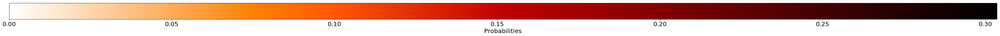

## Results with great score differences
		    **********************************************************************
    ******************* Question type: WHAT IS THE PERSON *******************
    **********************************************************************
    ----------------------------------------------------------------------
    ----------> Questions answered CORRECTLY by model with kb <----------
    ----------------------------------------------------------------------
    ('Ans Score kb:', 0.86669248342514038)
    ('Ans Score no kb:', 0.14298234879970551)
    Question [10496013]: What is the person resting their shoe on?
    Correct Answer:  grass
    Incorrect Answer:  skis
    2663
    1.00002

    ('Ans Score kb:', 0.51780533790588379)
    ('Ans Score no kb:', 0.17523899674415588)
    Question [202231004]: What is the person holding?
    Correct Answer:  phone
    Incorrect Answer:  glass
    981
    1.00002

    ('Ans Score kb:', 0.65607106685638428)
    ('Ans Score no kb:', 0.33841577172279358)
    Question [223241076]: What is the person doing?
    Correct Answer:  holding baby
    Incorrect Answer:  sleeping
    789
    1.0

    ('Ans Score kb:', 0.47678965330123901)
    ('Ans Score no kb:', 0.15559731423854828)
    Question [4134000]: What is the person on the left doing with their hand?
    Correct Answer:  shaking hands
    Incorrect Answer:  talking
    2850
    1.00002

    ----------------------------------------------------------------------
    ----------> Questions answered INCORRECTLY by model with kb <----------
    ----------------------------------------------------------------------
    **********************************************************************
    ******************* Question type: WHAT IS THE MAN *******************
    **********************************************************************
    ----------------------------------------------------------------------
    ----------> Questions answered CORRECTLY by model with kb <----------
    ----------------------------------------------------------------------

    ('Ans Score kb:', 0.82793742418289185)
    ('Ans Score no kb:', 0.48598265647888184)
    Question [207545001]: What is the man playing?
    Correct Answer:  soccer
    Incorrect Answer:  tennis
    119
    1.00003

    ('Ans Score kb:', 0.33124297857284546)
    ('Ans Score no kb:', 0.69071865081787109)
    Question [67975001]: What is the man holding?
    Correct Answer:  kite
    Incorrect Answer:  umbrella
    312
    1.00001

    <matplotlib.figure.Figure at 0x7f10555615d0>

    ('Ans Score kb:', 0.70190328359603882)
    ('Ans Score no kb:', 0.3452809751033783)
    Question [550645002]: What is the man holding?
    Correct Answer:  hot dog
    Incorrect Answer:  sandwich
    312
    1.00001

    <matplotlib.figure.Figure at 0x7f10532bb450>

    