```python
from matplotlib import pyplot as plt
import matplotlib as mpl
from caffe_model_train import *
from copy import deepcopy
import json, codecs

```


```python
def heatmap(data, row_labels, col_labels, ax=None, cbar_kw={}, cbarlabel="", **kwargs):
    fig, ax = plt.subplots(figsize=(50, 5))
    if not ax:
        ax = plt.gca()
    im = ax.imshow(data, **kwargs)
    ax.set_xticks(np.arange(data.shape[1]))
    ax.set_yticks(np.arange(data.shape[0]))
    ax.set_xticklabels(col_labels)
    ax.set_yticklabels(row_labels)
    ax.tick_params(top=True, bottom=False, labeltop=True, labelbottom=False)
    plt.setp(ax.get_xticklabels(), rotation=-30, ha="right", rotation_mode="anchor")
    ax.set_xticks(np.arange(data.shape[1]+1)-.5, minor=True)
    ax.set_yticks(np.arange(data.shape[0]+1)-.5, minor=True)
    ax.grid(which="minor", color="w", linestyle='-', linewidth=3)
    #ax.grid(b=False, which='major', color='0.2', linestyle='-')
    ax.grid(b=False, which='minor', color='0.2', linestyle='-')
    ax.tick_params(which="minor", bottom=False, left=False)
    for spine in plt.gca().spines.values():
        spine.set_visible(False) #Indentation updated..
    ax.xaxis.set_ticks_position('none')
    ax.yaxis.set_ticks_position('none') 
    return im
def color_bar(cmap,kb_att,title):
    fig = plt.figure(figsize=(50, 5))
    ax1 = fig.add_axes([0.05, 0.80, 0.9, 0.15])
    norm = mpl.colors.Normalize(vmin=0, vmax=kb_att.max())
    cb1 = mpl.colorbar.ColorbarBase(ax1, cmap=cmap, norm=norm, orientation='horizontal')
    cb1.set_label(title,)
    plt.show()
    plt.clf()
  
def plot_kb_attention_no_hop(top_relations_first_hop,kb_relations,title='',n=50):
    rel_names = lambda RelIdx: ' '.join(RelIdx[0][0]) + '[' +str(round(RelIdx[2][0],6))+']' +'['+str(RelIdx[1][0]) + ']'
    top_relations_idx_first_hop = top_relations_first_hop.argsort()[::-1][:n].reshape(-1,1)
    relations_hop_1 = map(rel_names, zip(kb_relations[top_relations_idx_first_hop],top_relations_idx_first_hop,top_relations_first_hop[top_relations_idx_first_hop]))
    mpl.rcParams.update({'font.size': 20})
    cmap = plt.cm.get_cmap('gist_heat_r')
    color_bar(cmap,top_relations_first_hop[top_relations_idx_first_hop],title)
    im = heatmap(top_relations_first_hop[top_relations_idx_first_hop].T,['First Hop'],relations_hop_1, cmap=cmap)
    plt.tight_layout()

def plot_question_summary_no_hop(question,correct_answer):
    if question == None:
      outputs = model.make_dataset_question_caffe(None)
    else:
      outputs = model.make_dataset_question_caffe(question['question_id'])
    question_vis={'image_url':'/mnt/nas2/GrimaRepo/datasets/visual_genome/VG_100K_2/' + str(question['image_id']) + '.jpg','question':question['question']}
    print 'Question [{}]: {}'.format(question['question_id'], question['question'])
    print 'Correct Answer: ', correct_answer
    print 'Prediction :',rev_adict[str(outputs[1].argmax())], 
    top_predictions_labels,top_predictions_labels,ans,image = model.visualize(question_vis, outputs[1], outputs[3], outputs[9],outputs[10], only_picture=True)
    plot_kb_attention_no_hop(outputs[4],kb_relations,title = 'Network KB Attention')
    plot_kb_attention_no_hop(outputs[11][0],kb_relations, title = 'KB Attention Labels')

    
    return outputs
  
def plot_custom_question_summary_no_hop(question,image_id):
    question = {'question':question,'image_id':image_id}
    outputs = model.make_new_question_caffe(question)
    question_vis={'image_url':'/mnt/nas2/GrimaRepo/datasets/mscoco/coco2014/{}2014/COCO_{}2014_'.format(split,split) + str(question['image_id']).zfill(12) + '.jpg','question':question['question']}
    top_predictions_labels,top_predictions_labels,ans,image = model.visualize(question_vis,outputs[1],outputs[3],only_picture=True)
    plot_kb_attention_no_hop(outputs[4],kb_relations,cmap)
    return outputs
```


```python
PATH_PREFIX = '/home/fariquelme/tesis/accuracy_analisys/'
# Model 1 has kb, model 2 has no kb
question_types_by_model_dict = json.load(open(PATH_PREFIX + 'question_types_by_model_dict.json','r'))
annotations_by_type_train = json.load(open(PATH_PREFIX + 'annotations_by_type_train.json','r'))
    
annotations_by_type_val = json.load(open(PATH_PREFIX + 'annotations_by_type_val.json','r'))
```


```python
#RELATIONSHIPS_PATH = '/home/fariquelme/tesis/top_relationships/ top_3000_region_object_relationships.npz'
#RELATIONSHIPS_PATH = '/home/fariquelme/tesis/top_3000_relationships.npz'
RELATIONSHIPS_PATH = '/home/fariquelme/tesis/top_relationships/top_3000_supervised_labels_relationships.npz'
kb_relations = np.load(RELATIONSHIPS_PATH)['relations']

split = 'genome'


model = VQA_KB('/mnt/nas2/GrimaRepo/fariquelme/KL_result/model_checkpts/qlstm_solver_iter_55000.caffemodel',split)
#model = VQA_KB('/mnt/nas2/GrimaRepo/fariquelme/KL_result/model_checkpts_kb_v2/test_200000_iters.caffemodel',split)
#model = VQA_KB('/mnt/nas2/GrimaRepo/fariquelme/KL_result/model_checkpts_kb_v1/test_200000_iters.caffemodel',split)

PATH_PREFIX = '/mnt/nas2/GrimaRepo/fariquelme/vqa_predictions_dict/'
rev_adict = json.load(open(PATH_PREFIX + 'rev_adict.json'))
```

    parsed 1026908 questions for genome
    Loaded adict and vdict
    reading:  /home/fariquelme/tesis/top_relationships/supervised_labels_top_3000_relationships_glove.npz
    1026908 total questions
    Model loaded: /mnt/nas2/GrimaRepo/fariquelme/KL_result/model_checkpts/qlstm_solver_iter_55000.caffemodel
    Image feature prefix: /mnt/nas2/GrimaRepo/fariquelme/cco_feats/resnet_res5c_bgrms_large/genome2014/COCO_genome2014_


```python
#model.dp.get_batch_vec()
#import config
#np.load(config.DATA_PATHS['genome']['features_prefix'] + str(2402715) + '.npz')['x']
#t_att_vec_obj, t_att_vec_region, have_or_not, have_or_not_r = model.dp.get_attn_map(2402715, 466553)

```


```python
def get_supervised_qa():
  q_with_kb_labels_andimg_labels = True
  while q_with_kb_labels_andimg_labels:
    qid = model.dp.getQuesIds()[np.random.choice(len(model.dp.getQuesIds()))]
    qiid = model.dp.getImgId(qid)
    if not model.dp.has_at_least_one_valid_answer(qid): continue
    kb_labels ,has_kb_labels = model.dp.get_kb_attention(str(qiid),qid.split('/')[1])
    if not has_kb_labels: continue
    att1,att2,have_qa_att,have_r_att = model.dp.get_attn_map(int(qiid),qid.split('/')[1])
    if not (have_qa_att and have_r_att): continue
    ans = model.dp.getAnsObj(qid)
    qstr = model.dp.getQuesStr(qid)
    q_with_kb_labels_andimg_labels = False
    return {'question_id':qid,'question':qstr,'image_id':qiid},ans[0]['answer']

```

## QA'S with Image and KB labels


```python
n_examples = 10
for i in range(n_examples):
  # Get question with KB labls and IMG ATT
  question,ans = get_supervised_qa()
  plot_question_summary_no_hop(question,ans)
  plt.show()
```

     Question [genome/998382]: What color is person hair?
    Correct Answer:  black
    Prediction : black


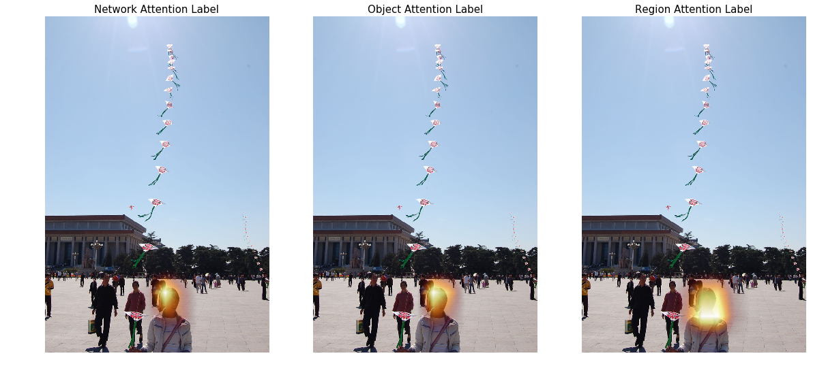


    <matplotlib.figure.Figure at 0x7fa7ed1ce1d0>


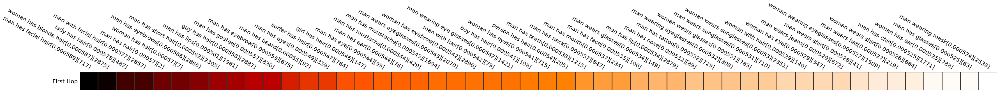


    <matplotlib.figure.Figure at 0x7fa7ed013250>


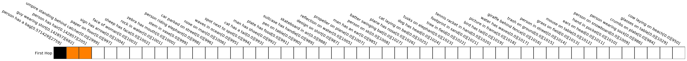


     Question [genome/1025510]: What is the cake trimmed with?
    Correct Answer:  ribbon
    Prediction : glass


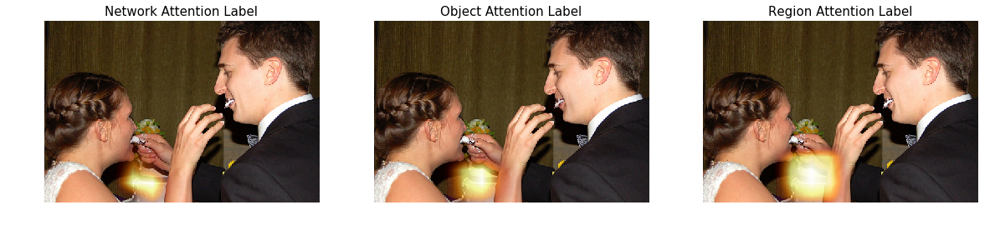


    <matplotlib.figure.Figure at 0x7fa7eccee590>


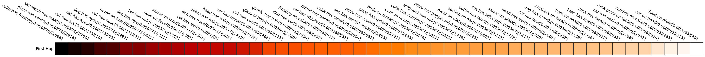


    <matplotlib.figure.Figure at 0x7fa7ecb16290>


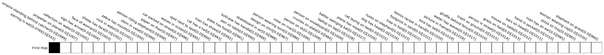


     Question [genome/1052586]: What color is table?
    Correct Answer:  brown
    Prediction : brown


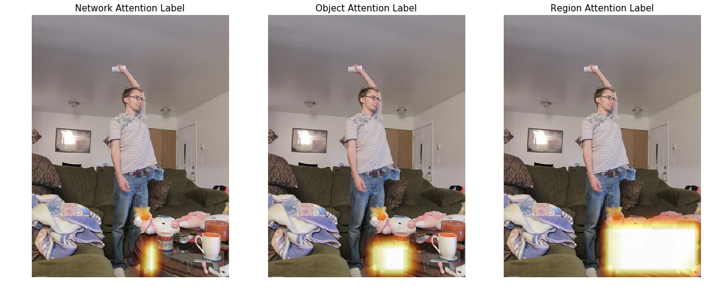


    <matplotlib.figure.Figure at 0x7fa7ec7e50d0>


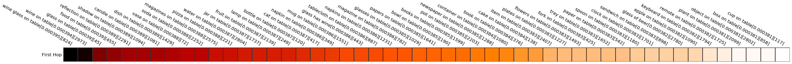


    <matplotlib.figure.Figure at 0x7fa7ec6250d0>


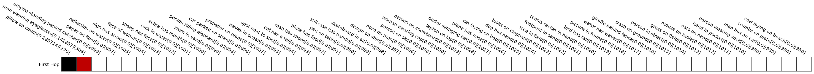


     Question [genome/1879783]: What is the car color?
    Correct Answer:  gold
    Prediction : black


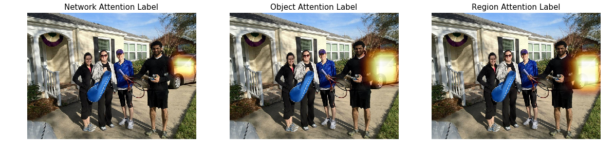


    <matplotlib.figure.Figure at 0x7fa7ec2de1d0>


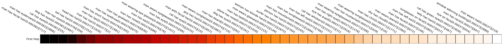


    <matplotlib.figure.Figure at 0x7fa7ec0cf2d0>


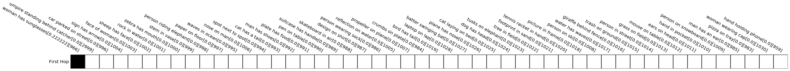


     Question [genome/1103258]: What is woman's left hand?
    Correct Answer:  bag
    Prediction : purse


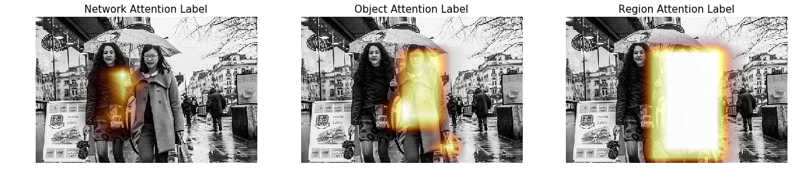


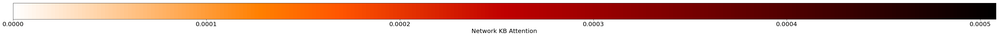


    <matplotlib.figure.Figure at 0x7fa7ebdf0e50>


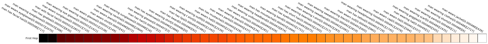


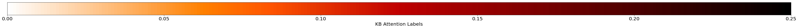


    <matplotlib.figure.Figure at 0x7fa7ebbd0b50>


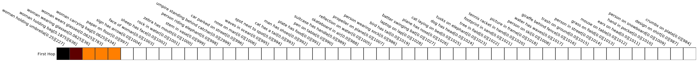


     Question [genome/1679619]: Where is the wood panel?
    Correct Answer:  wall
    Prediction : floor


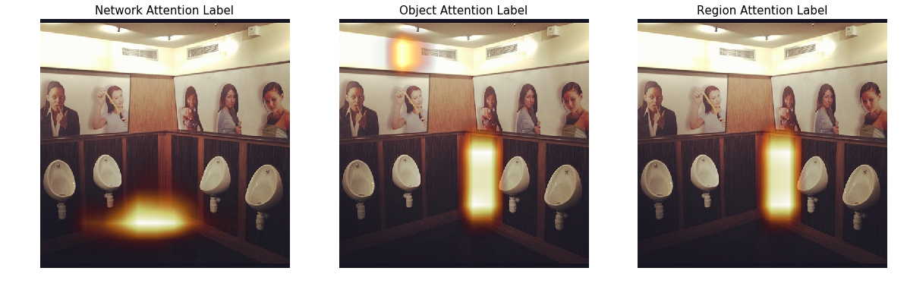


    <matplotlib.figure.Figure at 0x7fa7eb881090>


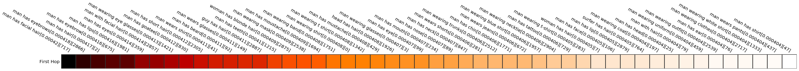


    <matplotlib.figure.Figure at 0x7fa7eb6dfd50>


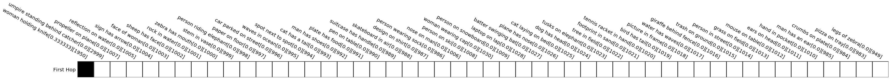


     Question [genome/1895177]: Who has blond hair?
    Correct Answer:  woman
    Prediction : woman


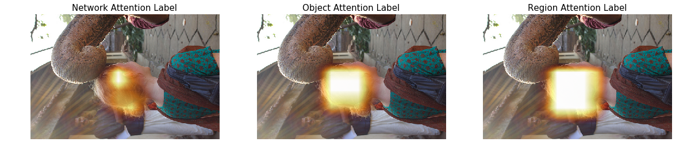


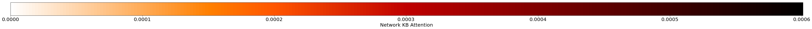


    <matplotlib.figure.Figure at 0x7fa7eb391850>


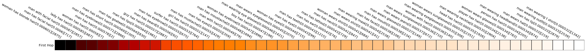


    <matplotlib.figure.Figure at 0x7fa7eb1e6e90>


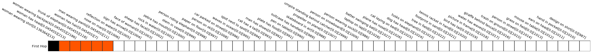


     Question [genome/1523613]: Where is girl walking?
    Correct Answer:  sidewalk
    Prediction : sidewalk


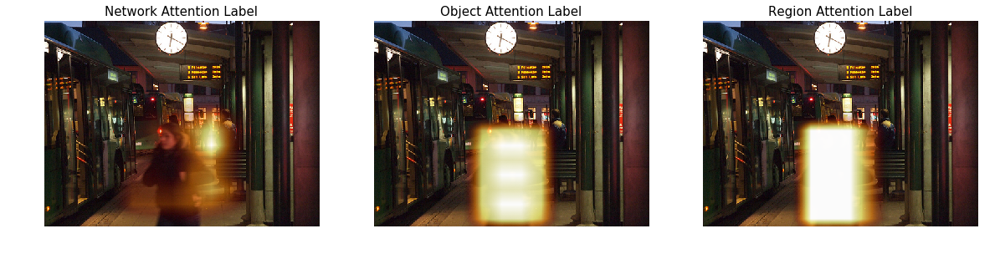


    <matplotlib.figure.Figure at 0x7fa7e8df8290>


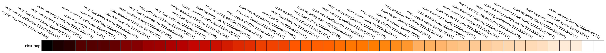


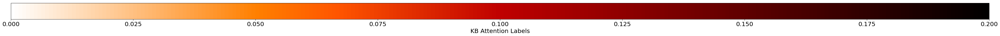


    <matplotlib.figure.Figure at 0x7fa7e8bc41d0>


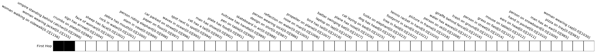


     Question [genome/1886570]: Where is the cake?
    Correct Answer:  plate
    Prediction : table


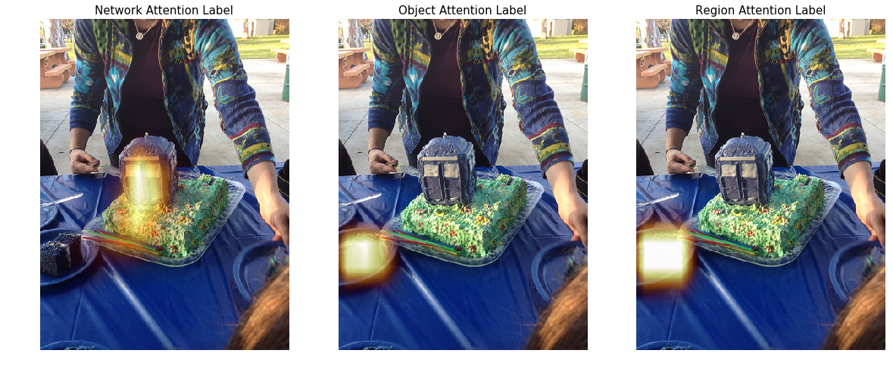


    <matplotlib.figure.Figure at 0x7fa7e6e33b10>


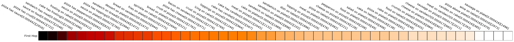


    <matplotlib.figure.Figure at 0x7fa7e63fefd0>


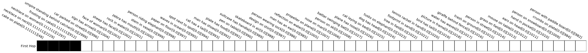


     Question [genome/1553404]: Where is the garage?
    Correct Answer:  background
    Prediction : background


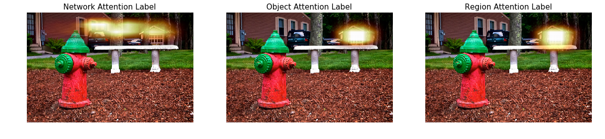


    <matplotlib.figure.Figure at 0x7fa7e50d2dd0>


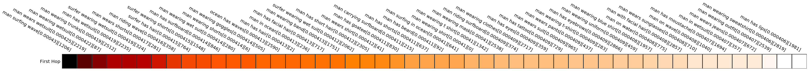


    <matplotlib.figure.Figure at 0x7fa7e49c7ed0>


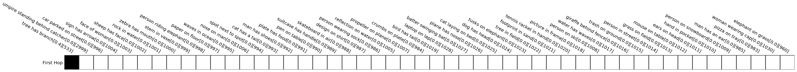


    


```python
def get_matching_relations(kb_relations,relation,subject=None,obj = None):
  matching = []

  if obj is None and subject is not None:
    for rel in kb_relations:
      if rel[1] == relation and rel[0] == subject:
        matching.append(' '.join(rel))
  elif subject is None and obj is not None: 
    for rel in kb_relations:
      if rel[1] == relation and rel[2] == obj:
        matching.append(' '.join(rel))
  else:
    for rel in kb_relations:
      if rel[1] == relation and rel[0] == subject and rel[2] == obj:
        matching.append(' '.join(rel))
  return matching
```
