## QA'S with Image and KB labels

    Question [genome/1424012]: What tall animal has brown and white spots?
    Correct Answer:  giraffe
    Prediction : giraffe

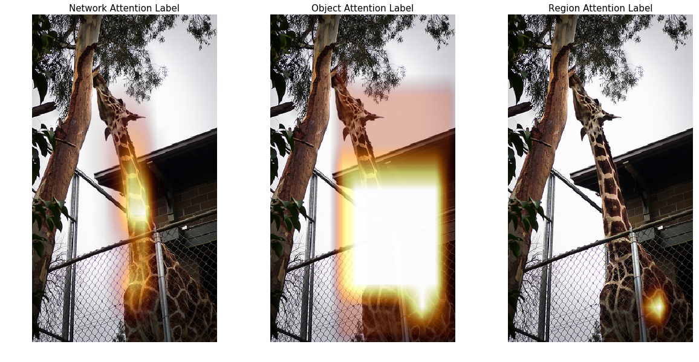

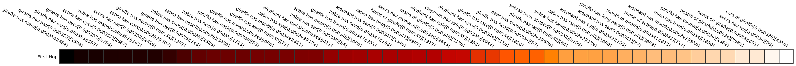

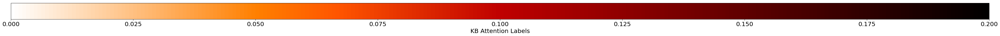

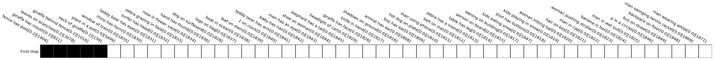

     Relveant Visual Genome relations

<table border="1" class="dataframe">
  <thead>
    <tr style="text-align: right;">
      <th>0</th>
      <th>1</th>
      <th>2</th>
      <th>3</th>
      <th>4</th>
      <th>5</th>
      <th>6</th>
      <th>7</th>
      <th>8</th>
      <th>9</th>
      <th>10</th>
      <th>11</th>
      <th>12</th>
      <th>13</th>
      <th>14</th>
      <th>15</th>
    </tr>
  </thead>
  <tbody>
    <tr>
      <td>giraffe reaches for th tree</td>
      <td>power lines in sky</td>
      <td>neck of giraffe</td>
      <td>fence has post</td>
      <td>giraffe in fence</td>
      <td>giraffe has mouth</td>
      <td>mouth touching branch</td>
      <td>leaves on branches</td>
      <td>giraffe's mouth on branch</td>
      <td>facility for giraffe</td>
      <td>building behind giraffe</td>
      <td>fence surrounding giraffe</td>
      <td>giraffe standing under tree branches</td>
      <td>giraffe behind fence</td>
      <td>powerlines behind fence</td>
      <td>bricks on building</td>
    </tr>
  </tbody>
</table>

    KB Labels vector

<table border="1" class="dataframe">
  <thead>
    <tr style="text-align: right;">
      <th>0</th>
      <th>1</th>
      <th>2</th>
      <th>3</th>
      <th>4</th>
      <th>5</th>
      <th>6</th>
      <th>7</th>
      <th>8</th>
      <th>9</th>
      <th>10</th>
      <th>11</th>
      <th>12</th>
      <th>13</th>
      <th>14</th>
      <th>15</th>
    </tr>
  </thead>
  <tbody>
    <tr>
      <td>giraffe has mouth</td>
      <td>mouth touching branch</td>
      <td>facility for giraffe</td>
      <td>giraffe's mouth on branch</td>
      <td>powerlines behind fence</td>
      <td>bricks on building</td>
      <td>giraffe behind fence</td>
      <td>fence surrounding giraffe</td>
      <td>giraffe standing under tree branches</td>
      <td>fence has post</td>
      <td>giraffe in fence</td>
      <td>power lines in sky</td>
      <td>giraffe reaches for th tree</td>
      <td>neck of giraffe</td>
      <td>leaves on branches</td>
      <td>building behind giraffe</td>
    </tr>
  </tbody>
</table>

    Question [genome/1001235]: What is reflected on the water?
    Correct Answer:  sunlight
    Prediction : sun

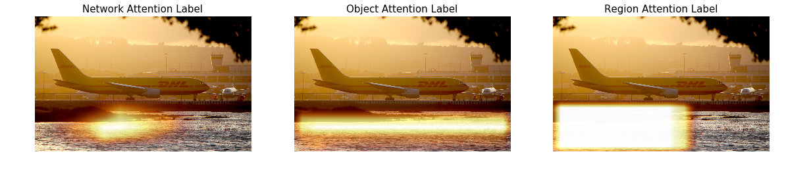

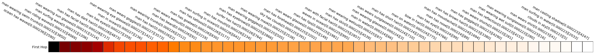

     Relveant Visual Genome relations

<table border="1" class="dataframe">
  <thead>
    <tr style="text-align: right;">
      <th>0</th>
      <th>1</th>
      <th>2</th>
      <th>3</th>
      <th>4</th>
      <th>5</th>
      <th>6</th>
      <th>7</th>
      <th>8</th>
      <th>9</th>
      <th>10</th>
      <th>11</th>
      <th>12</th>
      <th>13</th>
      <th>14</th>
      <th>15</th>
      <th>16</th>
      <th>17</th>
      <th>18</th>
      <th>19</th>
      <th>20</th>
      <th>21</th>
      <th>22</th>
      <th>23</th>
      <th>24</th>
      <th>25</th>
      <th>26</th>
      <th>27</th>
      <th>28</th>
      <th>29</th>
    </tr>
  </thead>
  <tbody>
    <tr>
      <td>plane on runway</td>
      <td>wheels on plane</td>
      <td>sunlight on water</td>
      <td>top fo building</td>
      <td>wing of plane</td>
      <td>grass along water</td>
      <td>lights of runway</td>
      <td>plane at airport</td>
      <td>plane at airport</td>
      <td>plane at airport</td>
      <td>plane at airport</td>
      <td>tower at airport</td>
      <td>plane by water</td>
      <td>grass by water</td>
      <td>logo on tail</td>
      <td>tail of plane</td>
      <td>wheels on plane</td>
      <td>water near airport</td>
      <td>logo on tail</td>
      <td>sign on plane</td>
      <td>tower of airport</td>
      <td>plane on runway</td>
      <td>tower of airport</td>
      <td>plane at airport</td>
      <td>fence surrounding airport</td>
      <td>grass in water</td>
      <td>water outside airport</td>
      <td>car at airport</td>
      <td>lights in airport</td>
      <td>airport with water</td>
    </tr>
  </tbody>
</table>

    KB Labels vector

<table border="1" class="dataframe">
  <thead>
    <tr style="text-align: right;">
      <th>0</th>
      <th>1</th>
      <th>2</th>
      <th>3</th>
    </tr>
  </thead>
  <tbody>
    <tr>
      <td>tower of airport</td>
      <td>tower of airport</td>
      <td>wheels on plane</td>
      <td>tower at airport</td>
    </tr>
  </tbody>
</table>

    Question [genome/1059580]: What color is the man jacket?
    Correct Answer:  black
    Prediction : black

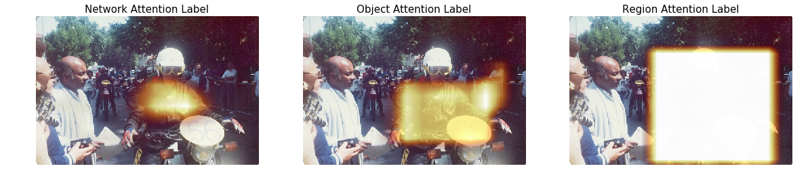

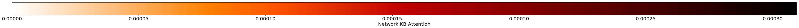

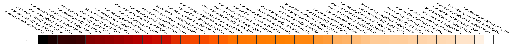

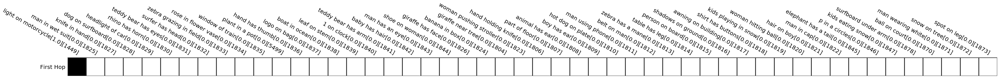

     Relveant Visual Genome relations

<table border="1" class="dataframe">
  <thead>
    <tr style="text-align: right;">
      <th>0</th>
      <th>1</th>
      <th>2</th>
      <th>3</th>
      <th>4</th>
      <th>5</th>
      <th>6</th>
      <th>7</th>
      <th>8</th>
      <th>9</th>
      <th>10</th>
      <th>11</th>
      <th>12</th>
      <th>13</th>
      <th>14</th>
      <th>15</th>
      <th>16</th>
      <th>17</th>
      <th>18</th>
      <th>19</th>
      <th>20</th>
      <th>21</th>
      <th>22</th>
      <th>23</th>
      <th>24</th>
      <th>25</th>
      <th>26</th>
      <th>27</th>
      <th>28</th>
      <th>29</th>
      <th>30</th>
      <th>31</th>
      <th>32</th>
      <th>33</th>
      <th>34</th>
      <th>35</th>
      <th>36</th>
      <th>37</th>
      <th>38</th>
      <th>39</th>
      <th>40</th>
    </tr>
  </thead>
  <tbody>
    <tr>
      <td>biker wears helmet</td>
      <td>biker on motorcycle</td>
      <td>man holding paper</td>
      <td>light on motorcycle</td>
      <td>person on bike</td>
      <td>tree touches sky</td>
      <td>man behind fence</td>
      <td>biker wears goggles</td>
      <td>biker wears glove</td>
      <td>bike has wheel</td>
      <td>biker wears jacket</td>
      <td>person on bike</td>
      <td>man wears shirt</td>
      <td>man holding paper</td>
      <td>circle on handlebars</td>
      <td>biker with helmet</td>
      <td>circle with 56</td>
      <td>59 on bike</td>
      <td>biker wears goggles</td>
      <td>man talking to biker</td>
      <td>biker wears jacket</td>
      <td>biker wears glove</td>
      <td>bike in shade</td>
      <td>biker wears goggles</td>
      <td>circle on motorcycle</td>
      <td>56 on circle</td>
      <td>light on motorcycle</td>
      <td>59 on bike</td>
      <td>biker wears helmet</td>
      <td>person wears helmet</td>
      <td>man wearing jacket</td>
      <td>man has ear</td>
      <td>man hold paper</td>
      <td>circle on motorcycle</td>
      <td>56 on circle</td>
      <td>biker wears glove</td>
      <td>biker wears glove</td>
      <td>light on motorcycle</td>
      <td>circle on motorcycle</td>
      <td>biker on motorcycle</td>
      <td>man next to motorcycle</td>
    </tr>
  </tbody>
</table>

    KB Labels vector

<table border="1" class="dataframe">
  <thead>
    <tr style="text-align: right;">
      <th>0</th>
      <th>1</th>
      <th>2</th>
      <th>3</th>
      <th>4</th>
      <th>5</th>
      <th>6</th>
      <th>7</th>
      <th>8</th>
      <th>9</th>
      <th>10</th>
      <th>11</th>
      <th>12</th>
      <th>13</th>
      <th>14</th>
      <th>15</th>
      <th>16</th>
      <th>17</th>
      <th>18</th>
      <th>19</th>
      <th>20</th>
      <th>21</th>
      <th>22</th>
      <th>23</th>
      <th>24</th>
      <th>25</th>
      <th>26</th>
    </tr>
  </thead>
  <tbody>
    <tr>
      <td>56 on circle</td>
      <td>circle on motorcycle</td>
      <td>light on motorcycle</td>
      <td>biker wears helmet</td>
      <td>circle on motorcycle</td>
      <td>man behind fence</td>
      <td>biker wears jacket</td>
      <td>biker wears glove</td>
      <td>biker with helmet</td>
      <td>light on motorcycle</td>
      <td>biker wears goggles</td>
      <td>circle with 56</td>
      <td>circle on handlebars</td>
      <td>biker on motorcycle</td>
      <td>biker wears jacket</td>
      <td>biker wears glove</td>
      <td>biker wears goggles</td>
      <td>man talking to biker</td>
      <td>biker wears helmet</td>
      <td>biker wears goggles</td>
      <td>56 on circle</td>
      <td>biker wears glove</td>
      <td>biker wears glove</td>
      <td>light on motorcycle</td>
      <td>circle on motorcycle</td>
      <td>biker on motorcycle</td>
      <td>man next to motorcycle</td>
    </tr>
  </tbody>
</table>

    Question [genome/1796286]: Where is the vase?
    Correct Answer:  stand
    Prediction : table

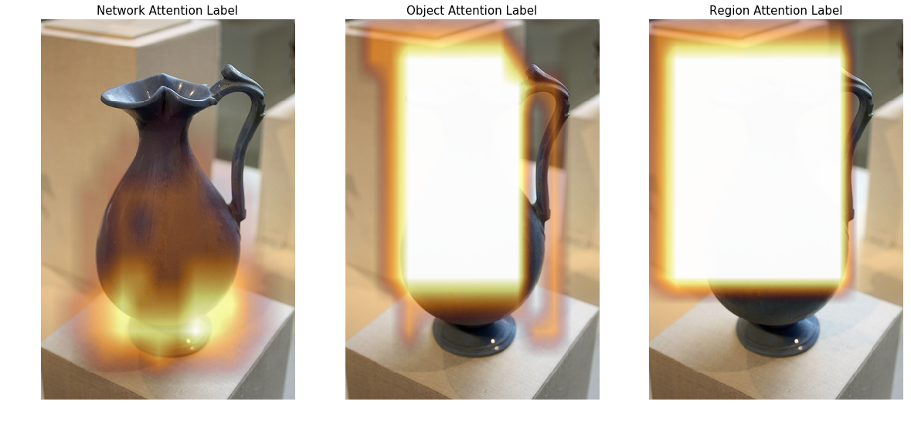

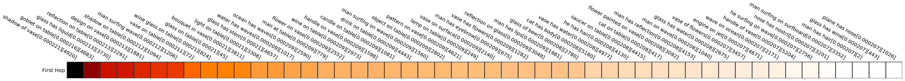

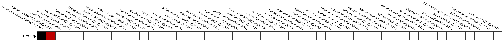

     Relveant Visual Genome relations

<table border="1" class="dataframe">
  <thead>
    <tr style="text-align: right;">
      <th>0</th>
      <th>1</th>
      <th>2</th>
      <th>3</th>
      <th>4</th>
      <th>5</th>
      <th>6</th>
      <th>7</th>
      <th>8</th>
      <th>9</th>
      <th>10</th>
      <th>11</th>
      <th>12</th>
    </tr>
  </thead>
  <tbody>
    <tr>
      <td>vase on display</td>
      <td>handle on vase</td>
      <td>mouth of vase</td>
      <td>base of blue pitcher</td>
      <td>light reflected off a pitcher</td>
      <td>light reflected off a pitcher</td>
      <td>light shining on vase</td>
      <td>handle on vase</td>
      <td>lip of vase</td>
      <td>neck of vase</td>
      <td>handle of vase</td>
      <td>top of vase</td>
      <td>stand behind vase</td>
    </tr>
  </tbody>
</table>

    KB Labels vector

<table border="1" class="dataframe">
  <thead>
    <tr style="text-align: right;">
      <th>0</th>
      <th>1</th>
      <th>2</th>
      <th>3</th>
      <th>4</th>
      <th>5</th>
      <th>6</th>
      <th>7</th>
      <th>8</th>
      <th>9</th>
      <th>10</th>
      <th>11</th>
      <th>12</th>
    </tr>
  </thead>
  <tbody>
    <tr>
      <td>lip of vase</td>
      <td>neck of vase</td>
      <td>light shining on vase</td>
      <td>handle on vase</td>
      <td>stand behind vase</td>
      <td>handle of vase</td>
      <td>top of vase</td>
      <td>light reflected off a pitcher</td>
      <td>light reflected off a pitcher</td>
      <td>mouth of vase</td>
      <td>base of blue pitcher</td>
      <td>vase on display</td>
      <td>handle on vase</td>
    </tr>
  </tbody>
</table>

    Question [genome/1100727]: What color is the car?
    Correct Answer:  black
    Prediction : black

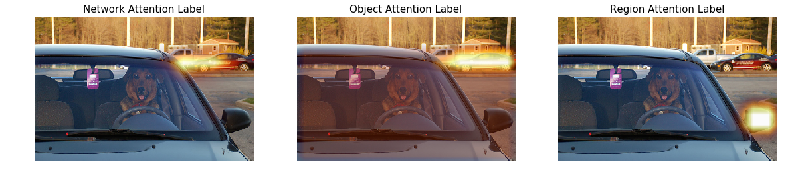

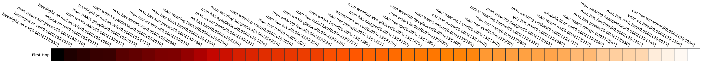

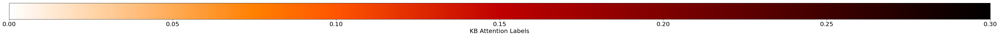

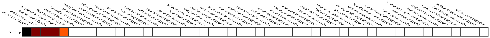

     Relveant Visual Genome relations

<table border="1" class="dataframe">
  <thead>
    <tr style="text-align: right;">
      <th>0</th>
      <th>1</th>
      <th>2</th>
      <th>3</th>
      <th>4</th>
      <th>5</th>
      <th>6</th>
      <th>7</th>
      <th>8</th>
      <th>9</th>
      <th>10</th>
      <th>11</th>
      <th>12</th>
      <th>13</th>
      <th>14</th>
      <th>15</th>
      <th>16</th>
      <th>17</th>
      <th>18</th>
      <th>19</th>
      <th>20</th>
      <th>21</th>
      <th>22</th>
      <th>23</th>
      <th>24</th>
      <th>25</th>
      <th>26</th>
      <th>27</th>
      <th>28</th>
      <th>29</th>
      <th>30</th>
      <th>31</th>
      <th>32</th>
      <th>33</th>
      <th>34</th>
      <th>35</th>
      <th>36</th>
      <th>37</th>
      <th>38</th>
    </tr>
  </thead>
  <tbody>
    <tr>
      <td>dog in seat</td>
      <td>dog wearing collar</td>
      <td>permit in car</td>
      <td>permit hanging on mirror</td>
      <td>car on road</td>
      <td>truck on road</td>
      <td>house beside road</td>
      <td>mirror on car</td>
      <td>wiper on car</td>
      <td>wiper on car</td>
      <td>dog wearing collar</td>
      <td>dog shows toungue</td>
      <td>dog behind steering wheel</td>
      <td>dog has eye</td>
      <td>dog has eye</td>
      <td>dog has ear</td>
      <td>dog has ear</td>
      <td>dog has nose</td>
      <td>permit on mirror</td>
      <td>dog sitting in car</td>
      <td>dog in seat</td>
      <td>steering wheel in car</td>
      <td>curb in road</td>
      <td>curb in road</td>
      <td>curb in road</td>
      <td>curb has grass</td>
      <td>permit hanging on mirror</td>
      <td>dog behind steering wheel</td>
      <td>dog in car</td>
      <td>dog in car</td>
      <td>tip on wiper</td>
      <td>mirror on windshield</td>
      <td>dog in car</td>
      <td>permit on mirror</td>
      <td>dog behind steering wheel</td>
      <td>car on road</td>
      <td>mirror holds permit</td>
      <td>mirror on car</td>
      <td>house behind car</td>
    </tr>
  </tbody>
</table>

    KB Labels vector

<table border="1" class="dataframe">
  <thead>
    <tr style="text-align: right;">
      <th>0</th>
      <th>1</th>
      <th>2</th>
      <th>3</th>
      <th>4</th>
      <th>5</th>
      <th>6</th>
      <th>7</th>
      <th>8</th>
      <th>9</th>
      <th>10</th>
      <th>11</th>
      <th>12</th>
      <th>13</th>
      <th>14</th>
      <th>15</th>
      <th>16</th>
      <th>17</th>
      <th>18</th>
    </tr>
  </thead>
  <tbody>
    <tr>
      <td>dog has nose</td>
      <td>dog has ear</td>
      <td>dog in seat</td>
      <td>dog wearing collar</td>
      <td>dog behind steering wheel</td>
      <td>dog sitting in car</td>
      <td>dog in seat</td>
      <td>dog behind steering wheel</td>
      <td>dog shows toungue</td>
      <td>dog in car</td>
      <td>dog has eye</td>
      <td>tip on wiper</td>
      <td>dog has ear</td>
      <td>dog has eye</td>
      <td>wiper on car</td>
      <td>dog in car</td>
      <td>dog wearing collar</td>
      <td>dog in car</td>
      <td>dog behind steering wheel</td>
    </tr>
  </tbody>
</table>

    Question [genome/1779529]: What are the animals close to?
    Correct Answer:  water
    Prediction : water

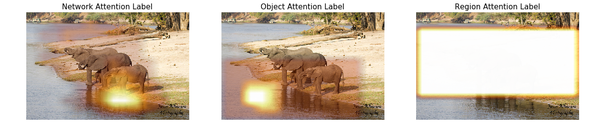

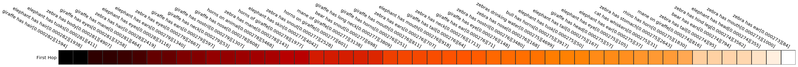

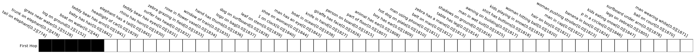

     Relveant Visual Genome relations

<table border="1" class="dataframe">
  <thead>
    <tr style="text-align: right;">
      <th>0</th>
      <th>1</th>
      <th>2</th>
      <th>3</th>
      <th>4</th>
      <th>5</th>
      <th>6</th>
      <th>7</th>
      <th>8</th>
      <th>9</th>
      <th>10</th>
      <th>11</th>
      <th>12</th>
      <th>13</th>
    </tr>
  </thead>
  <tbody>
    <tr>
      <td>elephant at water</td>
      <td>tail on elephant</td>
      <td>grass near water</td>
      <td>trunk on elephant</td>
      <td>elephants on hole</td>
      <td>elephants are by river</td>
      <td>grass along riverside</td>
      <td>log on ground</td>
      <td>boat on water</td>
      <td>elephants by water</td>
      <td>elephant next to water</td>
      <td>elephant next to water</td>
      <td>elephant next to water</td>
      <td>foliage next to water</td>
    </tr>
  </tbody>
</table>

    KB Labels vector

<table border="1" class="dataframe">
  <thead>
    <tr style="text-align: right;">
      <th>0</th>
      <th>1</th>
      <th>2</th>
      <th>3</th>
      <th>4</th>
      <th>5</th>
      <th>6</th>
      <th>7</th>
      <th>8</th>
      <th>9</th>
      <th>10</th>
      <th>11</th>
      <th>12</th>
      <th>13</th>
    </tr>
  </thead>
  <tbody>
    <tr>
      <td>tail on elephant</td>
      <td>elephant at water</td>
      <td>elephants are by river</td>
      <td>elephants by water</td>
      <td>elephant next to water</td>
      <td>grass along riverside</td>
      <td>elephant next to water</td>
      <td>foliage next to water</td>
      <td>boat on water</td>
      <td>elephants on hole</td>
      <td>trunk on elephant</td>
      <td>grass near water</td>
      <td>elephant next to water</td>
      <td>log on ground</td>
    </tr>
  </tbody>
</table>

    Question [genome/1803386]: What is near the table?
    Correct Answer:  wall
    Prediction : chair

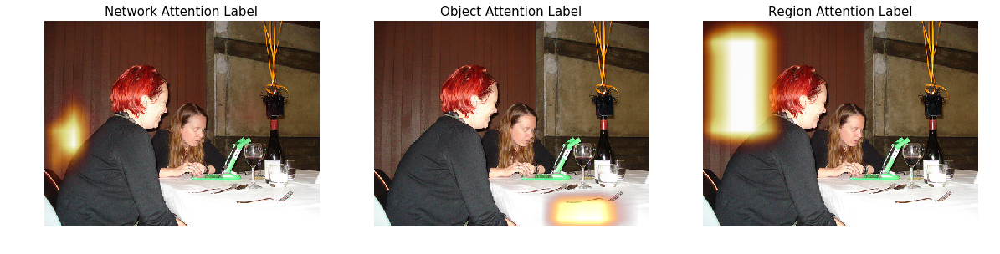

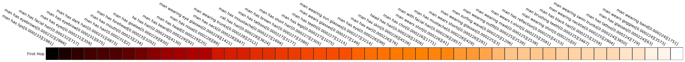

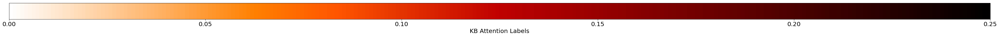

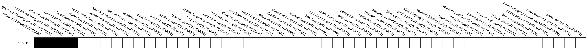

     Relveant Visual Genome relations

<table border="1" class="dataframe">
  <thead>
    <tr style="text-align: right;">
      <th>0</th>
      <th>1</th>
      <th>2</th>
      <th>3</th>
      <th>4</th>
      <th>5</th>
      <th>6</th>
      <th>7</th>
      <th>8</th>
      <th>9</th>
      <th>10</th>
      <th>11</th>
      <th>12</th>
      <th>13</th>
      <th>14</th>
      <th>15</th>
      <th>16</th>
      <th>17</th>
      <th>18</th>
      <th>19</th>
      <th>20</th>
      <th>21</th>
      <th>22</th>
      <th>23</th>
      <th>24</th>
      <th>25</th>
      <th>26</th>
      <th>27</th>
      <th>28</th>
      <th>29</th>
      <th>30</th>
      <th>31</th>
    </tr>
  </thead>
  <tbody>
    <tr>
      <td>woman wearing black shirt</td>
      <td>fork lying on top of table</td>
      <td>fork lying on top of table</td>
      <td>utensil lying on top of table</td>
      <td>utensil lying on top of table</td>
      <td>utensil lying on top of table</td>
      <td>utensil lying on top of table</td>
      <td>cup containing water</td>
      <td>cup sitting on top of table</td>
      <td>cup containing water</td>
      <td>cup sitting on top of table</td>
      <td>bottle containing wine</td>
      <td>bottle standing on top of table</td>
      <td>woman wearing watch</td>
      <td>hair belonging to woman</td>
      <td>red hair belonging to woman</td>
      <td>glass containing wine</td>
      <td>glass tumbler sitting on top of table</td>
      <td>bottle next to glass</td>
      <td>label on bottle</td>
      <td>lady with hair</td>
      <td>lady with hair</td>
      <td>laptop on table</td>
      <td>wine bottle on table</td>
      <td>wine glass on table</td>
      <td>glass contains water</td>
      <td>woman with red hair</td>
      <td>woman sitting at a table</td>
      <td>woman sitting at a table</td>
      <td>wall near table</td>
      <td>computer on table</td>
      <td>strings on table</td>
    </tr>
  </tbody>
</table>

    KB Labels vector

<table border="1" class="dataframe">
  <thead>
    <tr style="text-align: right;">
      <th>0</th>
      <th>1</th>
      <th>2</th>
      <th>3</th>
      <th>4</th>
      <th>5</th>
      <th>6</th>
      <th>7</th>
      <th>8</th>
      <th>9</th>
      <th>10</th>
      <th>11</th>
      <th>12</th>
      <th>13</th>
      <th>14</th>
      <th>15</th>
    </tr>
  </thead>
  <tbody>
    <tr>
      <td>woman wearing watch</td>
      <td>utensil lying on top of table</td>
      <td>glass contains water</td>
      <td>fork lying on top of table</td>
      <td>cup containing water</td>
      <td>cup containing water</td>
      <td>utensil lying on top of table</td>
      <td>utensil lying on top of table</td>
      <td>glass containing wine</td>
      <td>label on bottle</td>
      <td>cup sitting on top of table</td>
      <td>cup sitting on top of table</td>
      <td>wine glass on table</td>
      <td>fork lying on top of table</td>
      <td>glass tumbler sitting on top of table</td>
      <td>utensil lying on top of table</td>
    </tr>
  </tbody>
</table>

    Question [genome/992676]: What color are the man's pants?
    Correct Answer:  black
    Prediction : black

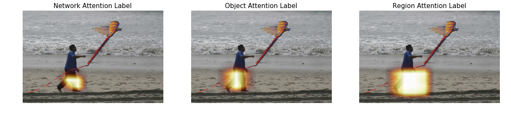

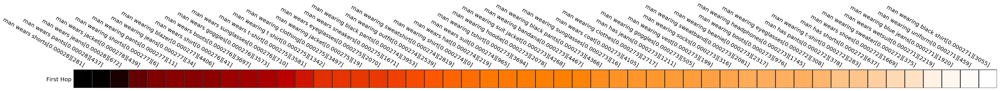

     Relveant Visual Genome relations

<table border="1" class="dataframe">
  <thead>
    <tr style="text-align: right;">
      <th>0</th>
      <th>1</th>
      <th>2</th>
      <th>3</th>
      <th>4</th>
      <th>5</th>
      <th>6</th>
      <th>7</th>
      <th>8</th>
      <th>9</th>
      <th>10</th>
      <th>11</th>
      <th>12</th>
      <th>13</th>
      <th>14</th>
      <th>15</th>
      <th>16</th>
      <th>17</th>
      <th>18</th>
    </tr>
  </thead>
  <tbody>
    <tr>
      <td>man flying kite</td>
      <td>man flying kite</td>
      <td>kite has tail</td>
      <td>man flying kite</td>
      <td>kite has colors</td>
      <td>man flying kite</td>
      <td>sand on beach</td>
      <td>kite has a ribbon</td>
      <td>man flying kite</td>
      <td>man has a beard</td>
      <td>sand has tracks</td>
      <td>kite has a tail</td>
      <td>sand has tracks</td>
      <td>wave on shore</td>
      <td>sand has footprints</td>
      <td>man has pants</td>
      <td>man has head</td>
      <td>water has ripples</td>
      <td>man flying kite</td>
    </tr>
  </tbody>
</table>

    KB Labels vector

<table border="1" class="dataframe">
  <thead>
    <tr style="text-align: right;">
      <th>0</th>
    </tr>
  </thead>
  <tbody>
    <tr>
      <td>man has pants</td>
    </tr>
  </tbody>
</table>

    Question [genome/1620526]: How the sand looks like?
    Correct Answer:  brown
    Prediction : wet

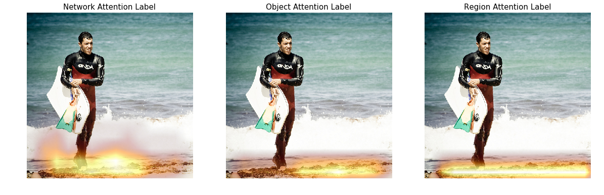

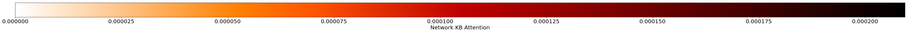

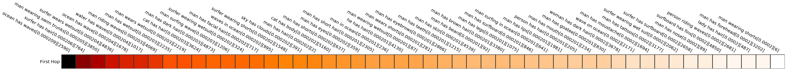

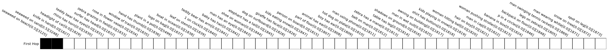

     Relveant Visual Genome relations

<table border="1" class="dataframe">
  <thead>
    <tr style="text-align: right;">
      <th>0</th>
      <th>1</th>
      <th>2</th>
      <th>3</th>
      <th>4</th>
      <th>5</th>
      <th>6</th>
      <th>7</th>
      <th>8</th>
      <th>9</th>
      <th>10</th>
      <th>11</th>
      <th>12</th>
      <th>13</th>
      <th>14</th>
      <th>15</th>
      <th>16</th>
      <th>17</th>
      <th>18</th>
      <th>19</th>
      <th>20</th>
      <th>21</th>
      <th>22</th>
      <th>23</th>
    </tr>
  </thead>
  <tbody>
    <tr>
      <td>man holding surfboard</td>
      <td>surfboarder on beach</td>
      <td>name on wet suit</td>
      <td>sand on beach</td>
      <td>man wearing wetsuit</td>
      <td>man walking out of water</td>
      <td>waves hitting beach</td>
      <td>man holding surfboard</td>
      <td>man wearing wetsuit</td>
      <td>man on beach</td>
      <td>man bare foot</td>
      <td>surfboard in arm</td>
      <td>feet walking in sand</td>
      <td>guy holding board</td>
      <td>guy wearing wetsuit</td>
      <td>guy wearing wetsuit</td>
      <td>seaweed on sand</td>
      <td>seaweed on beach</td>
      <td>board attached to arm</td>
      <td>two hands of man</td>
      <td>man's head has black hair</td>
      <td>man carrying flippers</td>
      <td>man walking on sand</td>
      <td>hand of a man</td>
    </tr>
  </tbody>
</table>

    KB Labels vector

<table border="1" class="dataframe">
  <thead>
    <tr style="text-align: right;">
      <th>0</th>
      <th>1</th>
    </tr>
  </thead>
  <tbody>
    <tr>
      <td>seaweed on sand</td>
      <td>seaweed on beach</td>
    </tr>
  </tbody>
</table>

    Question [genome/1700323]: Who has facial hair?
    Correct Answer:  man
    Prediction : man

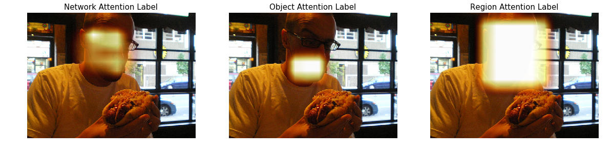

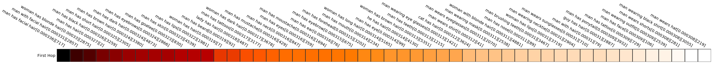

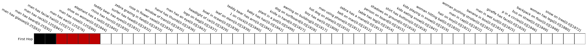

     Relveant Visual Genome relations

<table border="1" class="dataframe">
  <thead>
    <tr style="text-align: right;">
      <th>0</th>
      <th>1</th>
      <th>2</th>
      <th>3</th>
      <th>4</th>
      <th>5</th>
      <th>6</th>
      <th>7</th>
      <th>8</th>
      <th>9</th>
      <th>10</th>
      <th>11</th>
      <th>12</th>
      <th>13</th>
      <th>14</th>
      <th>15</th>
      <th>16</th>
      <th>17</th>
      <th>18</th>
      <th>19</th>
      <th>20</th>
      <th>21</th>
    </tr>
  </thead>
  <tbody>
    <tr>
      <td>man makes face</td>
      <td>man has glasses</td>
      <td>man has beard</td>
      <td>man holds hot dog</td>
      <td>ketchup on hot dog</td>
      <td>man has nose</td>
      <td>man has ear</td>
      <td>ketchup on hot dog</td>
      <td>man has neck</td>
      <td>man has glasses</td>
      <td>cheese on hot dog</td>
      <td>car has front wheel</td>
      <td>man has beard</td>
      <td>hot dog on roll</td>
      <td>road outside window</td>
      <td>man has finger</td>
      <td>man has shirt</td>
      <td>man has collar</td>
      <td>cheese in hot dog</td>
      <td>man holds hot dog</td>
      <td>man wears shirt</td>
      <td>man has facial hair</td>
    </tr>
  </tbody>
</table>

    KB Labels vector

<table border="1" class="dataframe">
  <thead>
    <tr style="text-align: right;">
      <th>0</th>
      <th>1</th>
      <th>2</th>
      <th>3</th>
      <th>4</th>
      <th>5</th>
      <th>6</th>
      <th>7</th>
      <th>8</th>
      <th>9</th>
      <th>10</th>
    </tr>
  </thead>
  <tbody>
    <tr>
      <td>man has collar</td>
      <td>man has neck</td>
      <td>man has glasses</td>
      <td>man has beard</td>
      <td>car has front wheel</td>
      <td>man has beard</td>
      <td>man has glasses</td>
      <td>man makes face</td>
      <td>man has facial hair</td>
      <td>man has nose</td>
      <td>man has ear</td>
    </tr>
  </tbody>
</table>
