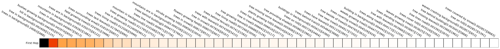
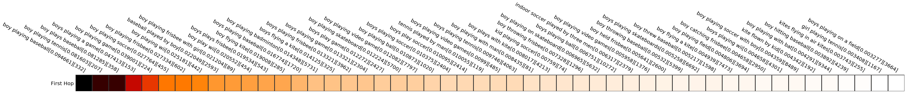
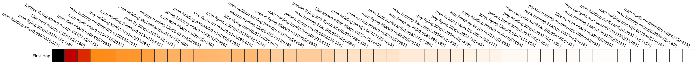
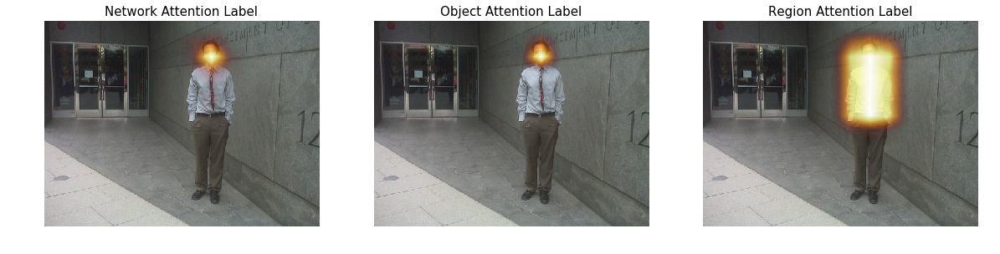
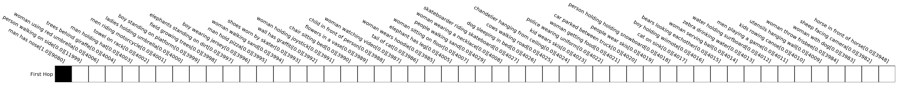
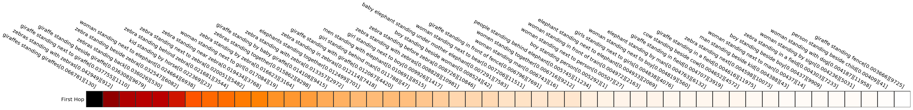

    Question [genome/1877503]: What is the boat in?
    Correct Answer:  water
    Prediction : water

 


     Relveant Visual Genome relations


<table border="1" class="dataframe">
  <thead>
    <tr style="text-align: right;">
      <th>0</th>
      <th>1</th>
      <th>2</th>
      <th>3</th>
      <th>4</th>
      <th>5</th>
      <th>6</th>
      <th>7</th>
      <th>8</th>
      <th>9</th>
      <th>10</th>
      <th>11</th>
      <th>12</th>
      <th>13</th>
      <th>14</th>
      <th>15</th>
      <th>16</th>
      <th>17</th>
    </tr>
  </thead>
  <tbody>
    <tr>
      <td>boat on water</td>
      <td>man standing on back of boat</td>
      <td>man holding oar</td>
      <td>gondola in water</td>
      <td>man steering a gondola</td>
      <td>man wearing a cap</td>
      <td>man wearing hat</td>
      <td>person rowing a boat</td>
      <td>gondola traveling waterway</td>
      <td>people sitting on gondola</td>
      <td>person holding handle</td>
      <td>spire above building</td>
      <td>spire above building</td>
      <td>gondola traveling bridge</td>
      <td>man wearing shirt</td>
      <td>man wearing hat</td>
      <td>passengers in gondola</td>
      <td>flags on front building</td>
    </tr>
  </tbody>
</table>


    KB Labels


<table border="1" class="dataframe">
  <thead>
    <tr style="text-align: right;">
      <th>0</th>
    </tr>
  </thead>
  <tbody>
    <tr>
      <td>boat on water</td>
    </tr>
  </tbody>
</table>


    Question [genome/994789]: What is on the grass?
    Correct Answer:  leaves
    Prediction : leaves


    <matplotlib.figure.Figure at 0x7f6e140e0250>


     Relveant Visual Genome relations


<table border="1" class="dataframe">
  <thead>
    <tr style="text-align: right;">
      <th>0</th>
      <th>1</th>
      <th>2</th>
      <th>3</th>
      <th>4</th>
      <th>5</th>
      <th>6</th>
      <th>7</th>
      <th>8</th>
      <th>9</th>
      <th>10</th>
      <th>11</th>
      <th>12</th>
      <th>13</th>
      <th>14</th>
      <th>15</th>
      <th>16</th>
      <th>17</th>
      <th>18</th>
      <th>19</th>
      <th>20</th>
      <th>21</th>
      <th>22</th>
      <th>23</th>
    </tr>
  </thead>
  <tbody>
    <tr>
      <td>row of stones</td>
      <td>bench on concrete</td>
      <td>black park bench</td>
      <td>grass on ground</td>
      <td>bench sitting on ground</td>
      <td>fence separating yards</td>
      <td>posts with wires</td>
      <td>bushes behind rocks</td>
      <td>sidewalk has rocks</td>
      <td>bench under a tree</td>
      <td>telephone has wires</td>
      <td>the green grass</td>
      <td>bench at park</td>
      <td>an area of shadows</td>
      <td>poles with power lines</td>
      <td>an attic vent</td>
      <td>leaves on grass</td>
      <td>rusty building structure</td>
      <td>stones side by side</td>
      <td>telephone has wires</td>
      <td>shadows on grass</td>
      <td>bench near a tree</td>
      <td>bench on cement</td>
      <td>leaves scattered on ground</td>
    </tr>
  </tbody>
</table>


    KB Labels


<table border="1" class="dataframe">
  <thead>
    <tr style="text-align: right;">
      <th>0</th>
    </tr>
  </thead>
  <tbody>
    <tr>
      <td>leaves on grass</td>
    </tr>
  </tbody>
</table>


    Question [genome/1419194]: Where is the plane flying?
    Correct Answer:  sky
    Prediction : sky


     Relveant Visual Genome relations


<table border="1" class="dataframe">
  <thead>
    <tr style="text-align: right;">
      <th>0</th>
      <th>1</th>
      <th>2</th>
      <th>3</th>
      <th>4</th>
      <th>5</th>
      <th>6</th>
      <th>7</th>
      <th>8</th>
      <th>9</th>
      <th>10</th>
      <th>11</th>
      <th>12</th>
      <th>13</th>
      <th>14</th>
      <th>15</th>
      <th>16</th>
      <th>17</th>
      <th>18</th>
      <th>19</th>
      <th>20</th>
      <th>21</th>
      <th>22</th>
      <th>23</th>
      <th>24</th>
      <th>25</th>
      <th>26</th>
      <th>27</th>
      <th>28</th>
      <th>29</th>
      <th>30</th>
      <th>31</th>
      <th>32</th>
      <th>33</th>
      <th>34</th>
      <th>35</th>
      <th>36</th>
      <th>37</th>
      <th>38</th>
      <th>39</th>
      <th>40</th>
      <th>41</th>
      <th>42</th>
      <th>43</th>
      <th>44</th>
      <th>45</th>
      <th>46</th>
      <th>47</th>
      <th>48</th>
      <th>49</th>
      <th>50</th>
      <th>51</th>
      <th>52</th>
      <th>53</th>
      <th>54</th>
      <th>55</th>
      <th>56</th>
      <th>57</th>
      <th>58</th>
      <th>59</th>
      <th>60</th>
      <th>61</th>
      <th>62</th>
    </tr>
  </thead>
  <tbody>
    <tr>
      <td>airplane has tail</td>
      <td>airplane has nose</td>
      <td>airplane has window</td>
      <td>airplane has window</td>
      <td>airplane has window</td>
      <td>airplane has window</td>
      <td>airplane has window</td>
      <td>airplane has bottom</td>
      <td>airplane has tail</td>
      <td>airplane has wing</td>
      <td>airplane has wing</td>
      <td>airplane has bottom</td>
      <td>airplane has nose</td>
      <td>engine in back of airplane</td>
      <td>engine in back of airplane</td>
      <td>airplane has window</td>
      <td>airplane has window</td>
      <td>airplane has window</td>
      <td>airplane has window</td>
      <td>airplane has window</td>
      <td>sky behind airplane</td>
      <td>airplane in sky</td>
      <td>airplane has wing</td>
      <td>airplane has wing</td>
      <td>airplane has tail</td>
      <td>airplane has tail</td>
      <td>design on tail</td>
      <td>airplane has wing</td>
      <td>airplane has wing</td>
      <td>window on side of airplane</td>
      <td>window on side of airplane</td>
      <td>window on side of airplane</td>
      <td>window on side of airplane</td>
      <td>window on side of airplane</td>
      <td>airplane has nose</td>
      <td>engine has ending</td>
      <td>engine has tip</td>
      <td>sky above airplane</td>
      <td>airplane in sky</td>
      <td>airplane has wing</td>
      <td>airplane has wing</td>
      <td>airplane has engine</td>
      <td>airplane has engine</td>
      <td>airplane has tail</td>
      <td>airplane has nose</td>
      <td>window on airplane</td>
      <td>window on airplane</td>
      <td>window on airplane</td>
      <td>window on airplane</td>
      <td>window on airplane</td>
      <td>airplane has bottom</td>
      <td>airplane has wing</td>
      <td>airplane has wing</td>
      <td>airplane has engine</td>
      <td>airplane has engine</td>
      <td>airplane has engine</td>
      <td>airplane has engine</td>
      <td>airplane has tail</td>
      <td>airplane has wing</td>
      <td>airplane has wing</td>
      <td>airplane has wing</td>
      <td>airplane has wing</td>
      <td>airplane has fuselage</td>
    </tr>
  </tbody>
</table>


    KB Labels


<table border="1" class="dataframe">
  <thead>
    <tr style="text-align: right;">
      <th>0</th>
      <th>1</th>
    </tr>
  </thead>
  <tbody>
    <tr>
      <td>plane flying high in sky</td>
      <td>plane flying sky</td>
    </tr>
  </tbody>
</table>


    Creating Batch
    batch created
    loading blobs
    blobs loaded
    running forward pass
    Question [genome/1866873]: What is on top of table?
    Correct Answer:  pizza
    Prediction : pizza


    <matplotlib.figure.Figure at 0x7f6dc13935d0>


    <matplotlib.figure.Figure at 0x7f6dc119cad0>


     Relveant Visual Genome relations


<table border="1" class="dataframe">
  <thead>
    <tr style="text-align: right;">
      <th>0</th>
      <th>1</th>
      <th>2</th>
      <th>3</th>
      <th>4</th>
      <th>5</th>
      <th>6</th>
      <th>7</th>
      <th>8</th>
      <th>9</th>
      <th>10</th>
      <th>11</th>
      <th>12</th>
      <th>13</th>
      <th>14</th>
      <th>15</th>
      <th>16</th>
      <th>17</th>
      <th>18</th>
      <th>19</th>
      <th>20</th>
      <th>21</th>
      <th>22</th>
      <th>23</th>
      <th>24</th>
    </tr>
  </thead>
  <tbody>
    <tr>
      <td>pizza on table</td>
      <td>slice on plate</td>
      <td>spinach on pizza</td>
      <td>sauce on pizza</td>
      <td>crust on pizza</td>
      <td>crumb on table</td>
      <td>cheese on pizza</td>
      <td>pizza on table</td>
      <td>spinach on pizza</td>
      <td>cheese on pizza</td>
      <td>sauce on pizza</td>
      <td>spinach on pizza</td>
      <td>glass on table</td>
      <td>sauce on pizza</td>
      <td>cheese on pizza</td>
      <td>spinach on pizza</td>
      <td>crust of pizza</td>
      <td>glass on table</td>
      <td>slice of pizza</td>
      <td>pizza on table</td>
      <td>pizza on plate</td>
      <td>pizza on table</td>
      <td>cheese on pizza</td>
      <td>spinach on pizza</td>
      <td>sauce on pizza</td>
    </tr>
  </tbody>
</table>


    KB Labels


<table border="1" class="dataframe">
  <thead>
    <tr style="text-align: right;">
      <th>0</th>
    </tr>
  </thead>
  <tbody>
    <tr>
      <td>pizza on table</td>
    </tr>
  </tbody>
</table>


    Creating Batch
    batch created
    loading blobs
    blobs loaded
    running forward pass
    Question [genome/1026007]: Who is riding the skateboard?
    Correct Answer:  boy
    Prediction : boy


    <matplotlib.figure.Figure at 0x7f6dc0e95950>


    <matplotlib.figure.Figure at 0x7f6dc0cfe3d0>


     Relveant Visual Genome relations


<table border="1" class="dataframe">
  <thead>
    <tr style="text-align: right;">
      <th>0</th>
      <th>1</th>
      <th>2</th>
      <th>3</th>
      <th>4</th>
      <th>5</th>
      <th>6</th>
      <th>7</th>
      <th>8</th>
      <th>9</th>
      <th>10</th>
      <th>11</th>
      <th>12</th>
      <th>13</th>
      <th>14</th>
      <th>15</th>
      <th>16</th>
      <th>17</th>
      <th>18</th>
      <th>19</th>
      <th>20</th>
      <th>21</th>
      <th>22</th>
      <th>23</th>
      <th>24</th>
      <th>25</th>
      <th>26</th>
      <th>27</th>
      <th>28</th>
      <th>29</th>
      <th>30</th>
      <th>31</th>
      <th>32</th>
      <th>33</th>
      <th>34</th>
      <th>35</th>
      <th>36</th>
      <th>37</th>
      <th>38</th>
      <th>39</th>
      <th>40</th>
      <th>41</th>
    </tr>
  </thead>
  <tbody>
    <tr>
      <td>skateboarder performing a jump trick</td>
      <td>custom skateboard preference of skateboarder</td>
      <td>skateboarder doing a kick out trick</td>
      <td>skate park kept clean with a trash can</td>
      <td>skateboard park has many types of skateboarders</td>
      <td>skate park outdoors and cold so dress warm</td>
      <td>skateboarders wear skate board shoes</td>
      <td>skateboarder dressed in a warm jacket</td>
      <td>skate park has a concrete floor</td>
      <td>chain link fence boarders skateboard park</td>
      <td>skateboarder wearing white tennis shoes</td>
      <td>skateboarder customized his skateboard</td>
      <td>trees will lose there leaves in the winter</td>
      <td>skateboarder with practice can skate safely</td>
      <td>skate park equipment made of aluminum</td>
      <td>skateboard has strong polyurethane wheels</td>
      <td>custom skateboard used by most skateboarders</td>
      <td>skate park has many ramps</td>
      <td>wool knit cap keeps you warm in the winter</td>
      <td>skate park cold in winter</td>
      <td>skateboarder wearing a red winter jacket</td>
      <td>skateboarder waiting h turn on the ramp</td>
      <td>skateboarder made a jump from ramp</td>
      <td>skateboarder performed a trick off of the ramp</td>
      <td>skateboarder mad a kick out move off of the ramp</td>
      <td>skateboarder waiting to try his skateboard</td>
      <td>custom skateboard designed by skateboarder</td>
      <td>skateboarders style long hair</td>
      <td>skate park has an oil drum for trash can</td>
      <td>most skateboarders skate with skateboard shoes</td>
      <td>skateboarder dresses in baggy clothes</td>
      <td>skatepark boardered by a chain link fence</td>
      <td>skateboard durable like skateboarder</td>
      <td>skateboarder catapulted from the ramp</td>
      <td>skateboard catapulted off of sktaeboard ramp</td>
      <td>skateboarder dressed for cold outdoor skate park</td>
      <td>skateboarder prepared to skate</td>
      <td>skate park has a oil barrel trash</td>
      <td>skateboarder prepared to skate</td>
      <td>white shoes are mot skate board shoes</td>
      <td>skateboarder wearing a red jacket</td>
      <td>hoodie extra large for skateboarder</td>
    </tr>
  </tbody>
</table>


    KB Labels


<table border="1" class="dataframe">
  <thead>
    <tr style="text-align: right;">
      <th>0</th>
      <th>1</th>
      <th>2</th>
    </tr>
  </thead>
  <tbody>
    <tr>
      <td>boy riding skateboard</td>
      <td>boy riding skateboard</td>
      <td>boy riding skateboard</td>
    </tr>
  </tbody>
</table>


    Creating Batch
    batch created
    loading blobs
    blobs loaded
    running forward pass
    Question [genome/1778390]: Who is in the water wearing a bikini?
    Correct Answer:  girl
    Prediction : woman


    <matplotlib.figure.Figure at 0x7f6dc09badd0>


    <matplotlib.figure.Figure at 0x7f6dc07a3950>


     Relveant Visual Genome relations


<table border="1" class="dataframe">
  <thead>
    <tr style="text-align: right;">
      <th>0</th>
      <th>1</th>
      <th>2</th>
      <th>3</th>
      <th>4</th>
      <th>5</th>
      <th>6</th>
      <th>7</th>
      <th>8</th>
      <th>9</th>
      <th>10</th>
      <th>11</th>
      <th>12</th>
      <th>13</th>
      <th>14</th>
      <th>15</th>
      <th>16</th>
      <th>17</th>
      <th>18</th>
      <th>19</th>
      <th>20</th>
    </tr>
  </thead>
  <tbody>
    <tr>
      <td>humans in ocean</td>
      <td>dog in ocean</td>
      <td>hair on man</td>
      <td>dog on surfborad</td>
      <td>arm under water</td>
      <td>string hanging down back</td>
      <td>dog surfing on board</td>
      <td>people watching dog</td>
      <td>woman in water</td>
      <td>dog on surfboard</td>
      <td>dog on surfboard</td>
      <td>people in water</td>
      <td>man has reflection</td>
      <td>woman swimming in water</td>
      <td>hair on woman</td>
      <td>string on bathing suit</td>
      <td>string on woman's</td>
      <td>waves in water</td>
      <td>hair on man</td>
      <td>paw on dog</td>
      <td>man in water</td>
    </tr>
  </tbody>
</table>


    KB Labels


<table border="1" class="dataframe">
  <thead>
    <tr style="text-align: right;">
      <th>0</th>
      <th>1</th>
    </tr>
  </thead>
  <tbody>
    <tr>
      <td>girl wearing bikini</td>
      <td>girl wearing bikini</td>
    </tr>
  </tbody>
</table>


    Creating Batch
    batch created
    loading blobs
    blobs loaded
    running forward pass
    Question [genome/1346559]: What type of shoes is the woman wearing?
    Correct Answer:  boots
    Prediction : sneakers


    <matplotlib.figure.Figure at 0x7f6dc049d6d0>


    <matplotlib.figure.Figure at 0x7f6dc0285110>


     Relveant Visual Genome relations


<table border="1" class="dataframe">
  <thead>
    <tr style="text-align: right;">
      <th>0</th>
      <th>1</th>
      <th>2</th>
      <th>3</th>
      <th>4</th>
      <th>5</th>
      <th>6</th>
      <th>7</th>
      <th>8</th>
      <th>9</th>
      <th>10</th>
      <th>11</th>
      <th>12</th>
      <th>13</th>
      <th>14</th>
      <th>15</th>
      <th>16</th>
      <th>17</th>
      <th>18</th>
      <th>19</th>
      <th>20</th>
      <th>21</th>
      <th>22</th>
      <th>23</th>
      <th>24</th>
      <th>25</th>
      <th>26</th>
      <th>27</th>
      <th>28</th>
      <th>29</th>
      <th>30</th>
      <th>31</th>
      <th>32</th>
      <th>33</th>
      <th>34</th>
      <th>35</th>
      <th>36</th>
      <th>37</th>
      <th>38</th>
      <th>39</th>
      <th>40</th>
      <th>41</th>
      <th>42</th>
      <th>43</th>
      <th>44</th>
      <th>45</th>
    </tr>
  </thead>
  <tbody>
    <tr>
      <td>woman sitting on bench</td>
      <td>woman sitting on bench</td>
      <td>woman sitting on bench</td>
      <td>woman sitting on bench</td>
      <td>woman sitting on bench</td>
      <td>woman sitting on bench</td>
      <td>woman sitting on bench</td>
      <td>woman sitting on bench</td>
      <td>woman wearing boot</td>
      <td>woman wearing boot</td>
      <td>woman sitting on bench</td>
      <td>woman wearing glasses</td>
      <td>woman holding cellphone</td>
      <td>woman wearing hoodie</td>
      <td>woman wearing pants</td>
      <td>grafitti on bench</td>
      <td>bench has rail</td>
      <td>bench has rail</td>
      <td>woman has hair</td>
      <td>woman wearing hoodie</td>
      <td>grafitti on bench</td>
      <td>rail on bench</td>
      <td>hand holding cellphone</td>
      <td>woman has hair</td>
      <td>woman sitting on bench</td>
      <td>pavement under bench</td>
      <td>woman wearing boot</td>
      <td>woman wearing boot</td>
      <td>woman wearing boot</td>
      <td>woman wearing boot</td>
      <td>woman wearing boot</td>
      <td>woman wearing boot</td>
      <td>woman wearing boot</td>
      <td>woman wearing boot</td>
      <td>woman wearing boot</td>
      <td>woman wearing boot</td>
      <td>woman sitting on bench</td>
      <td>hand holding cellphone</td>
      <td>woman has hand</td>
      <td>pavement under bench</td>
      <td>sidewalk next to grass</td>
      <td>sidewalk next to tree</td>
      <td>sidewalk next to tree</td>
      <td>rail on bench</td>
      <td>rail on bench</td>
      <td>grafitti on bench</td>
    </tr>
  </tbody>
</table>


    KB Labels


<table border="1" class="dataframe">
  <thead>
    <tr style="text-align: right;">
      <th>0</th>
    </tr>
  </thead>
  <tbody>
    <tr>
      <td>woman wearing boot</td>
    </tr>
  </tbody>
</table>


    Creating Batch
    batch created
    loading blobs
    blobs loaded
    running forward pass
    Question [genome/1464547]: Who is wearing a black hat?
    Correct Answer:  man
    Prediction : man


    <matplotlib.figure.Figure at 0x7f6dbbff2f90>


    <matplotlib.figure.Figure at 0x7f6dbbdf0890>


     Relveant Visual Genome relations


<table border="1" class="dataframe">
  <thead>
    <tr style="text-align: right;">
      <th>0</th>
      <th>1</th>
      <th>2</th>
      <th>3</th>
      <th>4</th>
      <th>5</th>
      <th>6</th>
      <th>7</th>
      <th>8</th>
      <th>9</th>
      <th>10</th>
      <th>11</th>
      <th>12</th>
      <th>13</th>
      <th>14</th>
      <th>15</th>
      <th>16</th>
      <th>17</th>
      <th>18</th>
      <th>19</th>
      <th>20</th>
      <th>21</th>
      <th>22</th>
      <th>23</th>
      <th>24</th>
      <th>25</th>
      <th>26</th>
      <th>27</th>
      <th>28</th>
      <th>29</th>
      <th>30</th>
      <th>31</th>
      <th>32</th>
      <th>33</th>
      <th>34</th>
      <th>35</th>
      <th>36</th>
      <th>37</th>
      <th>38</th>
      <th>39</th>
      <th>40</th>
      <th>41</th>
      <th>42</th>
      <th>43</th>
      <th>44</th>
      <th>45</th>
      <th>46</th>
      <th>47</th>
      <th>48</th>
      <th>49</th>
      <th>50</th>
      <th>51</th>
      <th>52</th>
      <th>53</th>
      <th>54</th>
      <th>55</th>
      <th>56</th>
      <th>57</th>
      <th>58</th>
      <th>59</th>
      <th>60</th>
      <th>61</th>
      <th>62</th>
      <th>63</th>
      <th>64</th>
      <th>65</th>
      <th>66</th>
      <th>67</th>
      <th>68</th>
      <th>69</th>
      <th>70</th>
      <th>71</th>
      <th>72</th>
      <th>73</th>
      <th>74</th>
      <th>75</th>
      <th>76</th>
      <th>77</th>
    </tr>
  </thead>
  <tbody>
    <tr>
      <td>head has hat</td>
      <td>man has head</td>
      <td>pizza spatula in hand</td>
      <td>pizza spatula in hand</td>
      <td>pizza in oven</td>
      <td>pizza in oven</td>
      <td>pizza in oven</td>
      <td>pizza in oven</td>
      <td>pizza in oven</td>
      <td>pizza in oven</td>
      <td>pizza has sauce</td>
      <td>pizza has sauce</td>
      <td>pizza has sauce</td>
      <td>man wearing clothing</td>
      <td>man has ear</td>
      <td>clothing has collar</td>
      <td>man wearing clothing</td>
      <td>hat has logo</td>
      <td>man near oven</td>
      <td>man holding pizza spatula</td>
      <td>pizza inside oven</td>
      <td>pizza inside oven</td>
      <td>pizza inside oven</td>
      <td>oven has door</td>
      <td>flame inside oven</td>
      <td>man has ear</td>
      <td>man has arm</td>
      <td>man has arm</td>
      <td>man has head</td>
      <td>head has hat</td>
      <td>word in oven</td>
      <td>pizza inside oven</td>
      <td>pizza inside oven</td>
      <td>pizza inside oven</td>
      <td>rag in front of oven</td>
      <td>man wearing clothing</td>
      <td>word on oven</td>
      <td>word on oven</td>
      <td>flame inside oven</td>
      <td>pizza has crust</td>
      <td>pizza has crust</td>
      <td>pizza has crust</td>
      <td>hand on pizza spatula</td>
      <td>hand on pizza spatula</td>
      <td>reflection from pizza spatula</td>
      <td>man has head</td>
      <td>head has hat</td>
      <td>shelf in front of oven</td>
      <td>oven has shelf</td>
      <td>man cooking pizza</td>
      <td>man cooking pizza</td>
      <td>man cooking pizza</td>
      <td>man wearing hat</td>
      <td>man wearing clothing</td>
      <td>rag on side of oven</td>
      <td>light in oven</td>
      <td>shelf before oven</td>
      <td>man looking pizza</td>
      <td>man looking pizza</td>
      <td>man looking pizza</td>
      <td>man has hair</td>
      <td>pizza in oven</td>
      <td>pizza in oven</td>
      <td>pizza in oven</td>
      <td>pizza in oven</td>
      <td>pizza in oven</td>
      <td>pizza in oven</td>
      <td>pizza inside oven</td>
      <td>pizza inside oven</td>
      <td>pizza inside oven</td>
      <td>man cooking pizza</td>
      <td>man cooking pizza</td>
      <td>man cooking pizza</td>
      <td>man wearing hat</td>
      <td>man grabbing pizza</td>
      <td>man grabbing pizza</td>
      <td>man grabbing pizza</td>
      <td>man wearing clothing</td>
    </tr>
  </tbody>
</table>


    KB Labels


<table border="1" class="dataframe">
  <thead>
    <tr style="text-align: right;">
      <th>0</th>
    </tr>
  </thead>
  <tbody>
    <tr>
      <td>man wearing clothing</td>
    </tr>
  </tbody>
</table>


    Creating Batch
    batch created
    loading blobs
    blobs loaded
    running forward pass
    Question [genome/1931335]: What is on the giraffe's back end?
    Correct Answer:  tail
    Prediction : tail


    <matplotlib.figure.Figure at 0x7f6dbbaa1f50>


    <matplotlib.figure.Figure at 0x7f6dbb8f9350>


     Relveant Visual Genome relations


<table border="1" class="dataframe">
  <thead>
    <tr style="text-align: right;">
      <th>0</th>
      <th>1</th>
      <th>2</th>
      <th>3</th>
      <th>4</th>
      <th>5</th>
      <th>6</th>
    </tr>
  </thead>
  <tbody>
    <tr>
      <td>giraffe has ears</td>
      <td>hair along neck</td>
      <td>giraffe has neck</td>
      <td>hair along neck</td>
      <td>spots on face</td>
      <td>giraffe has tail</td>
      <td>giraffe has neck</td>
    </tr>
  </tbody>
</table>


    KB Labels


<table border="1" class="dataframe">
  <thead>
    <tr style="text-align: right;">
      <th>0</th>
    </tr>
  </thead>
  <tbody>
    <tr>
      <td>giraffe has tail</td>
    </tr>
  </tbody>
</table>


    Creating Batch
    batch created
    loading blobs
    blobs loaded
    running forward pass
    Question [genome/1278324]: Who has brown hair?
    Correct Answer:  man
    Prediction : man


    <matplotlib.figure.Figure at 0x7f6dbb599b10>


    <matplotlib.figure.Figure at 0x7f6dbb3845d0>


     Relveant Visual Genome relations


<table border="1" class="dataframe">
  <thead>
    <tr style="text-align: right;">
      <th>0</th>
      <th>1</th>
      <th>2</th>
      <th>3</th>
      <th>4</th>
      <th>5</th>
      <th>6</th>
      <th>7</th>
      <th>8</th>
      <th>9</th>
      <th>10</th>
      <th>11</th>
      <th>12</th>
      <th>13</th>
      <th>14</th>
      <th>15</th>
      <th>16</th>
      <th>17</th>
      <th>18</th>
      <th>19</th>
      <th>20</th>
      <th>21</th>
      <th>22</th>
    </tr>
  </thead>
  <tbody>
    <tr>
      <td>kite in sky</td>
      <td>man in jeans</td>
      <td>man in shirt</td>
      <td>man flying kite</td>
      <td>trees in background</td>
      <td>man with hair</td>
      <td>man in field</td>
      <td>kite above tree line</td>
      <td>man with hair</td>
      <td>man in jacket</td>
      <td>man in sneakers</td>
      <td>man flying kite</td>
      <td>sky with clouds</td>
      <td>shoe on man</td>
      <td>leaf on ground</td>
      <td>shadow on ground</td>
      <td>kite in sky</td>
      <td>leg of man</td>
      <td>ear of man</td>
      <td>hair of man</td>
      <td>kite in sky</td>
      <td>man wearing jeans</td>
      <td>shirt of man</td>
    </tr>
  </tbody>
</table>


    KB Labels


<table border="1" class="dataframe">
  <thead>
    <tr style="text-align: right;">
      <th>0</th>
    </tr>
  </thead>
  <tbody>
    <tr>
      <td>hair of man</td>
    </tr>
  </tbody>
</table>


    Creating Batch
    batch created
    loading blobs
    blobs loaded
    running forward pass
    Question [genome/1697228]: Who is wearing a black and white jacket?
    Correct Answer:  woman
    Prediction : woman


    <matplotlib.figure.Figure at 0x7f6dbb0ade90>


    <matplotlib.figure.Figure at 0x7f6dbae9d650>


     Relveant Visual Genome relations


<table border="1" class="dataframe">
  <thead>
    <tr style="text-align: right;">
      <th>0</th>
      <th>1</th>
      <th>2</th>
      <th>3</th>
      <th>4</th>
      <th>5</th>
      <th>6</th>
      <th>7</th>
      <th>8</th>
      <th>9</th>
      <th>10</th>
      <th>11</th>
      <th>12</th>
      <th>13</th>
      <th>14</th>
      <th>15</th>
      <th>16</th>
      <th>17</th>
      <th>18</th>
      <th>19</th>
      <th>20</th>
      <th>21</th>
      <th>22</th>
      <th>23</th>
      <th>24</th>
      <th>25</th>
      <th>26</th>
      <th>27</th>
      <th>28</th>
      <th>29</th>
      <th>30</th>
      <th>31</th>
      <th>32</th>
      <th>33</th>
      <th>34</th>
      <th>35</th>
      <th>36</th>
      <th>37</th>
      <th>38</th>
      <th>39</th>
      <th>40</th>
      <th>41</th>
      <th>42</th>
      <th>43</th>
      <th>44</th>
      <th>45</th>
      <th>46</th>
      <th>47</th>
      <th>48</th>
      <th>49</th>
      <th>50</th>
      <th>51</th>
      <th>52</th>
      <th>53</th>
      <th>54</th>
      <th>55</th>
      <th>56</th>
      <th>57</th>
      <th>58</th>
      <th>59</th>
      <th>60</th>
      <th>61</th>
      <th>62</th>
      <th>63</th>
    </tr>
  </thead>
  <tbody>
    <tr>
      <td>window on a building</td>
      <td>window on a building</td>
      <td>mask on a statue</td>
      <td>cap on a statue</td>
      <td>woman holding bat</td>
      <td>woman wearing shoe</td>
      <td>woman wearing shoe</td>
      <td>grass next to brick</td>
      <td>grass next to brick</td>
      <td>grass next to brick</td>
      <td>grass next to brick</td>
      <td>grass next to brick</td>
      <td>ground made of brick</td>
      <td>ground made of brick</td>
      <td>ground made of brick</td>
      <td>ground made of brick</td>
      <td>ground made of brick</td>
      <td>woman wearing pants</td>
      <td>windows on building</td>
      <td>windows on building</td>
      <td>woman holding bat</td>
      <td>brick in area</td>
      <td>brick in area</td>
      <td>brick in area</td>
      <td>brick in area</td>
      <td>brick in area</td>
      <td>hand of a woman</td>
      <td>hand of a woman</td>
      <td>shoe on a woman</td>
      <td>shoe on a woman</td>
      <td>woman wearing jacket</td>
      <td>woman's leg on a woman</td>
      <td>woman's leg on a woman</td>
      <td>statue of catcher</td>
      <td>plaque in front of statue</td>
      <td>building made of stones</td>
      <td>building made of stones</td>
      <td>building made of stones</td>
      <td>building made of stones</td>
      <td>building made of stones</td>
      <td>shrubs next to benches</td>
      <td>shrubs next to benches</td>
      <td>shrubs next to bench</td>
      <td>woman wearing shoes</td>
      <td>woman has up her hair</td>
      <td>grass in front of benches</td>
      <td>grass in front of benches</td>
      <td>grass in front of benches</td>
      <td>statue of a catcher</td>
      <td>catcher of a plaque</td>
      <td>brick under woman</td>
      <td>brick under catcher</td>
      <td>brick under woman</td>
      <td>brick under catcher</td>
      <td>brick under woman</td>
      <td>brick under catcher</td>
      <td>brick under woman</td>
      <td>brick under catcher</td>
      <td>brick under catcher</td>
      <td>brick under woman</td>
      <td>wood bench behind woman</td>
      <td>wood bench behind woman</td>
      <td>wood bench behind woman</td>
      <td>grassy behind woman</td>
    </tr>
  </tbody>
</table>


    KB Labels


<table border="1" class="dataframe">
  <thead>
    <tr style="text-align: right;">
      <th>0</th>
    </tr>
  </thead>
  <tbody>
    <tr>
      <td>woman wearing shoes</td>
    </tr>
  </tbody>
</table>


    Creating Batch
    batch created
    loading blobs
    blobs loaded
    running forward pass
    Question [genome/1217905]: What is on the woman's head?
    Correct Answer:  hair
    Prediction : sunglasses


    <matplotlib.figure.Figure at 0x7f6dbabb2610>


    <matplotlib.figure.Figure at 0x7f6dba9800d0>


     Relveant Visual Genome relations


<table border="1" class="dataframe">
  <thead>
    <tr style="text-align: right;">
      <th>0</th>
      <th>1</th>
      <th>2</th>
      <th>3</th>
      <th>4</th>
      <th>5</th>
      <th>6</th>
      <th>7</th>
      <th>8</th>
      <th>9</th>
      <th>10</th>
      <th>11</th>
      <th>12</th>
      <th>13</th>
      <th>14</th>
      <th>15</th>
      <th>16</th>
      <th>17</th>
      <th>18</th>
      <th>19</th>
      <th>20</th>
      <th>21</th>
      <th>22</th>
      <th>23</th>
      <th>24</th>
      <th>25</th>
      <th>26</th>
      <th>27</th>
    </tr>
  </thead>
  <tbody>
    <tr>
      <td>woman at zoo</td>
      <td>trees behind woman</td>
      <td>zoo has grass</td>
      <td>trees have leaves</td>
      <td>strap on shoulder</td>
      <td>purse has strap</td>
      <td>woman wearing earrings</td>
      <td>woman wearing necklace</td>
      <td>giraffe has legs</td>
      <td>woman has hair</td>
      <td>necklace on woman</td>
      <td>earrings are on woman</td>
      <td>woman in front of giraffe</td>
      <td>enclosure has grass</td>
      <td>necklace around neck</td>
      <td>left ear has earring</td>
      <td>strap on shoulder</td>
      <td>woman has tanktop</td>
      <td>trees have trunks</td>
      <td>woman has smile</td>
      <td>rocks are behind woman</td>
      <td>giraffe near rock</td>
      <td>shirt on woman</td>
      <td>woman wearing earrings</td>
      <td>necklace on girl</td>
      <td>giraffe behind woman</td>
      <td>bag on woman</td>
      <td>bag on shoulder</td>
    </tr>
  </tbody>
</table>


    KB Labels


<table border="1" class="dataframe">
  <thead>
    <tr style="text-align: right;">
      <th>0</th>
    </tr>
  </thead>
  <tbody>
    <tr>
      <td>woman has hair</td>
    </tr>
  </tbody>
</table>


    Creating Batch
    batch created
    loading blobs
    blobs loaded
    running forward pass
    Question [genome/1868684]: Where is the dog?
    Correct Answer:  carpet
    Prediction : floor


    <matplotlib.figure.Figure at 0x7f6dba6bc2d0>


    <matplotlib.figure.Figure at 0x7f6dba489250>


     Relveant Visual Genome relations


<table border="1" class="dataframe">
  <thead>
    <tr style="text-align: right;">
      <th>0</th>
      <th>1</th>
      <th>2</th>
      <th>3</th>
      <th>4</th>
      <th>5</th>
      <th>6</th>
      <th>7</th>
      <th>8</th>
      <th>9</th>
      <th>10</th>
      <th>11</th>
      <th>12</th>
      <th>13</th>
      <th>14</th>
      <th>15</th>
      <th>16</th>
      <th>17</th>
      <th>18</th>
      <th>19</th>
      <th>20</th>
      <th>21</th>
      <th>22</th>
      <th>23</th>
    </tr>
  </thead>
  <tbody>
    <tr>
      <td>ear on animal</td>
      <td>animal has ear</td>
      <td>plant has leaf</td>
      <td>carpet has patch</td>
      <td>carpet has patch</td>
      <td>dog has nose</td>
      <td>dog has paw</td>
      <td>paw has claw</td>
      <td>dog has paw</td>
      <td>dog has paw</td>
      <td>paw has claw</td>
      <td>paw has claw</td>
      <td>dog has paw</td>
      <td>dog on carpet</td>
      <td>toenail on dog</td>
      <td>toenail on dog</td>
      <td>toenail of dog</td>
      <td>toenail of dog</td>
      <td>toenail of dog</td>
      <td>toenail of dog</td>
      <td>nose of dog</td>
      <td>eye of dog</td>
      <td>eye of dog</td>
      <td>dog on floor</td>
    </tr>
  </tbody>
</table>


    KB Labels


<table border="1" class="dataframe">
  <thead>
    <tr style="text-align: right;">
      <th>0</th>
    </tr>
  </thead>
  <tbody>
    <tr>
      <td>dog on carpet</td>
    </tr>
  </tbody>
</table>


    Creating Batch
    batch created
    loading blobs
    blobs loaded
    running forward pass
    Question [genome/1783853]: Where are the people sitting?
    Correct Answer:  table
    Prediction : table


    <matplotlib.figure.Figure at 0x7f6dba19be10>


    <matplotlib.figure.Figure at 0x7f6db9f920d0>


     Relveant Visual Genome relations


<table border="1" class="dataframe">
  <thead>
    <tr style="text-align: right;">
      <th>0</th>
      <th>1</th>
      <th>2</th>
      <th>3</th>
      <th>4</th>
      <th>5</th>
      <th>6</th>
      <th>7</th>
      <th>8</th>
      <th>9</th>
      <th>10</th>
      <th>11</th>
      <th>12</th>
      <th>13</th>
      <th>14</th>
      <th>15</th>
      <th>16</th>
      <th>17</th>
      <th>18</th>
      <th>19</th>
      <th>20</th>
      <th>21</th>
      <th>22</th>
      <th>23</th>
      <th>24</th>
      <th>25</th>
      <th>26</th>
      <th>27</th>
    </tr>
  </thead>
  <tbody>
    <tr>
      <td>soup in bowl</td>
      <td>juice in glass</td>
      <td>herbs in cup</td>
      <td>woman drinking coconut water</td>
      <td>woman holding cup</td>
      <td>jam in jars</td>
      <td>drink in coconut</td>
      <td>people sitting table</td>
      <td>people sitting table</td>
      <td>people sitting table</td>
      <td>people holding drink</td>
      <td>people holding drink</td>
      <td>people holding drink</td>
      <td>bacon on plate</td>
      <td>fork on table</td>
      <td>spoon on table</td>
      <td>coffee in cup</td>
      <td>newspaper on table</td>
      <td>women wearing bracelet</td>
      <td>fork on table</td>
      <td>jar on table</td>
      <td>jar on table</td>
      <td>jar on table</td>
      <td>jar on table</td>
      <td>jar on table</td>
      <td>jar on table</td>
      <td>fork on table</td>
      <td>chop stick on bowl</td>
    </tr>
  </tbody>
</table>


    KB Labels


<table border="1" class="dataframe">
  <thead>
    <tr style="text-align: right;">
      <th>0</th>
    </tr>
  </thead>
  <tbody>
    <tr>
      <td>people sitting table</td>
    </tr>
  </tbody>
</table>


    Creating Batch
    batch created
    loading blobs
    blobs loaded
    running forward pass
    Question [genome/1648667]: What is the girl holding?
    Correct Answer:  remote
    Prediction : controller


    <matplotlib.figure.Figure at 0x7f6db9c4a410>


    <matplotlib.figure.Figure at 0x7f6db9ab2910>


     Relveant Visual Genome relations


<table border="1" class="dataframe">
  <thead>
    <tr style="text-align: right;">
      <th>0</th>
      <th>1</th>
      <th>2</th>
      <th>3</th>
      <th>4</th>
      <th>5</th>
      <th>6</th>
      <th>7</th>
      <th>8</th>
      <th>9</th>
    </tr>
  </thead>
  <tbody>
    <tr>
      <td>woman wearing jacket</td>
      <td>hand holding remote</td>
      <td>woman in room</td>
      <td>woman has hair</td>
      <td>hand holding remote</td>
      <td>finger has ring</td>
      <td>woman wearing earring</td>
      <td>woman has nose</td>
      <td>woman has eye</td>
      <td>woman has eye</td>
    </tr>
  </tbody>
</table>


    KB Labels


<table border="1" class="dataframe">
  <thead>
    <tr style="text-align: right;">
      <th>0</th>
    </tr>
  </thead>
  <tbody>
    <tr>
      <td>hand holding remote</td>
    </tr>
  </tbody>
</table>


    Creating Batch
    batch created
    loading blobs
    blobs loaded
    running forward pass
    Question [genome/1558175]: What is laying on the laptop?
    Correct Answer:  cat
    Prediction : cat


    <matplotlib.figure.Figure at 0x7f6db97ab790>


    <matplotlib.figure.Figure at 0x7f6db95bc550>


     Relveant Visual Genome relations


<table border="1" class="dataframe">
  <thead>
    <tr style="text-align: right;">
      <th>0</th>
      <th>1</th>
      <th>2</th>
      <th>3</th>
      <th>4</th>
      <th>5</th>
      <th>6</th>
      <th>7</th>
      <th>8</th>
      <th>9</th>
      <th>10</th>
      <th>11</th>
      <th>12</th>
      <th>13</th>
      <th>14</th>
      <th>15</th>
      <th>16</th>
      <th>17</th>
      <th>18</th>
      <th>19</th>
      <th>20</th>
      <th>21</th>
      <th>22</th>
      <th>23</th>
      <th>24</th>
      <th>25</th>
      <th>26</th>
    </tr>
  </thead>
  <tbody>
    <tr>
      <td>ring on finger</td>
      <td>phone on bed</td>
      <td>laptop on pillow</td>
      <td>cat on laptop</td>
      <td>woman wears necklace</td>
      <td>phone on bed</td>
      <td>cat on lap</td>
      <td>pillow under cat</td>
      <td>ring on finger</td>
      <td>necklace has pendent</td>
      <td>woman wearing necklace</td>
      <td>cat on laptop</td>
      <td>woman wears ring</td>
      <td>woman wearing shirt</td>
      <td>tissues in box</td>
      <td>woman wearing shirt</td>
      <td>woman petting cat</td>
      <td>writing on shirt</td>
      <td>ring on finger</td>
      <td>finger on woman</td>
      <td>pillow on bed</td>
      <td>woman wearing necklace</td>
      <td>laptop on pillow</td>
      <td>woman wearing necklace</td>
      <td>cat on laptop</td>
      <td>woman wearing ring</td>
      <td>writing on shirt</td>
    </tr>
  </tbody>
</table>


    KB Labels


<table border="1" class="dataframe">
  <thead>
    <tr style="text-align: right;">
      <th>0</th>
    </tr>
  </thead>
  <tbody>
    <tr>
      <td>cat on laptop</td>
    </tr>
  </tbody>
</table>


    Creating Batch
    batch created
    loading blobs
    blobs loaded
    running forward pass
    Question [genome/1105469]: What are the elephants standing on?
    Correct Answer:  dirt
    Prediction : dirt


    <matplotlib.figure.Figure at 0x7f6db92546d0>


    <matplotlib.figure.Figure at 0x7f6db90a05d0>


     Relveant Visual Genome relations


<table border="1" class="dataframe">
  <thead>
    <tr style="text-align: right;">
      <th>0</th>
      <th>1</th>
      <th>2</th>
      <th>3</th>
      <th>4</th>
      <th>5</th>
      <th>6</th>
      <th>7</th>
      <th>8</th>
      <th>9</th>
      <th>10</th>
      <th>11</th>
      <th>12</th>
      <th>13</th>
      <th>14</th>
      <th>15</th>
      <th>16</th>
      <th>17</th>
      <th>18</th>
      <th>19</th>
      <th>20</th>
      <th>21</th>
      <th>22</th>
      <th>23</th>
      <th>24</th>
      <th>25</th>
      <th>26</th>
      <th>27</th>
      <th>28</th>
    </tr>
  </thead>
  <tbody>
    <tr>
      <td>branch on ground</td>
      <td>elephant eating hay</td>
      <td>hay in feeder</td>
      <td>hay on elephant</td>
      <td>dung on ground</td>
      <td>fence behind elephant</td>
      <td>hay on ground</td>
      <td>branch near elephant</td>
      <td>branch near elephant</td>
      <td>elephant has leg</td>
      <td>elephant has tail</td>
      <td>elephant right of elephant</td>
      <td>elephant left of elephant</td>
      <td>elephant has trunk</td>
      <td>tree behind elephant</td>
      <td>elephant has tail</td>
      <td>elephant has hind leg</td>
      <td>dung on ground</td>
      <td>dung on ground</td>
      <td>tree behind fence</td>
      <td>elephant on ground</td>
      <td>elephant on ground</td>
      <td>trunk on elephant</td>
      <td>foot on ground</td>
      <td>fence behind elephant</td>
      <td>elephant has tail</td>
      <td>pole next to elephant</td>
      <td>dung on ground</td>
      <td>hay on elephant</td>
    </tr>
  </tbody>
</table>


    KB Labels


<table border="1" class="dataframe">
  <thead>
    <tr style="text-align: right;">
      <th>0</th>
    </tr>
  </thead>
  <tbody>
    <tr>
      <td>elephant left of elephant</td>
    </tr>
  </tbody>
</table>


    Creating Batch
    batch created
    loading blobs
    blobs loaded
    running forward pass
    Question [genome/1878305]: What is the wall made of?
    Correct Answer:  tiles
    Prediction : tiles


    <matplotlib.figure.Figure at 0x7f6db8d5a6d0>


    <matplotlib.figure.Figure at 0x7f6db8ba80d0>


     Relveant Visual Genome relations


<table border="1" class="dataframe">
  <thead>
    <tr style="text-align: right;">
      <th>0</th>
      <th>1</th>
      <th>2</th>
      <th>3</th>
      <th>4</th>
      <th>5</th>
      <th>6</th>
      <th>7</th>
      <th>8</th>
      <th>9</th>
      <th>10</th>
      <th>11</th>
      <th>12</th>
      <th>13</th>
      <th>14</th>
      <th>15</th>
      <th>16</th>
      <th>17</th>
      <th>18</th>
      <th>19</th>
      <th>20</th>
      <th>21</th>
      <th>22</th>
      <th>23</th>
      <th>24</th>
      <th>25</th>
      <th>26</th>
      <th>27</th>
      <th>28</th>
      <th>29</th>
      <th>30</th>
      <th>31</th>
      <th>32</th>
      <th>33</th>
      <th>34</th>
      <th>35</th>
      <th>36</th>
      <th>37</th>
      <th>38</th>
      <th>39</th>
      <th>40</th>
      <th>41</th>
      <th>42</th>
      <th>43</th>
      <th>44</th>
      <th>45</th>
      <th>46</th>
      <th>47</th>
    </tr>
  </thead>
  <tbody>
    <tr>
      <td>urinals in bathroom</td>
      <td>tile of bathroom</td>
      <td>tile of bathroom</td>
      <td>tile for bathroom</td>
      <td>tile for floor</td>
      <td>divider between urinals</td>
      <td>sensor on urinal</td>
      <td>flushing apparatus of urinal</td>
      <td>tile on wall</td>
      <td>tile on wall</td>
      <td>tile on wall</td>
      <td>tile on wall</td>
      <td>tile on wall</td>
      <td>tile on wall</td>
      <td>tile on wall</td>
      <td>tile on wall</td>
      <td>tile on wall</td>
      <td>tile on wall</td>
      <td>divider between urinals</td>
      <td>motion censor on urinal</td>
      <td>water in urinal</td>
      <td>tile on wall</td>
      <td>urinals in bathroom</td>
      <td>water pipe into urinal</td>
      <td>water pipe into wall</td>
      <td>water pipe for urinal</td>
      <td>divider between urinals</td>
      <td>urinal attached to wall</td>
      <td>pipes on urinal</td>
      <td>tile in bathroom</td>
      <td>tile on floor</td>
      <td>floor in bathroom</td>
      <td>urinal attached to wall</td>
      <td>pipes attached to urinal</td>
      <td>pipes in bathroom</td>
      <td>tiles around wall</td>
      <td>screws attach divider</td>
      <td>divider attached to wall</td>
      <td>toilet on wall</td>
      <td>pipes attached to wall</td>
      <td>tile on floor</td>
      <td>hole in toilet</td>
      <td>toilet on wall</td>
      <td>divider between toilets</td>
      <td>tiles on wall</td>
      <td>light on silver</td>
      <td>water in toilet</td>
      <td>tile on wall</td>
    </tr>
  </tbody>
</table>


    KB Labels


<table border="1" class="dataframe">
  <thead>
    <tr style="text-align: right;">
      <th>0</th>
    </tr>
  </thead>
  <tbody>
    <tr>
      <td>tile on wall</td>
    </tr>
  </tbody>
</table>


    Creating Batch
    batch created
    loading blobs
    blobs loaded
    running forward pass
    Question [genome/1515970]: Why are people walking barefoot?
    Correct Answer:  sand
    Prediction : yes


    <matplotlib.figure.Figure at 0x7f6db88790d0>


    <matplotlib.figure.Figure at 0x7f6db86ba350>


     Relveant Visual Genome relations


<table border="1" class="dataframe">
  <thead>
    <tr style="text-align: right;">
      <th>0</th>
      <th>1</th>
      <th>2</th>
      <th>3</th>
      <th>4</th>
      <th>5</th>
      <th>6</th>
      <th>7</th>
      <th>8</th>
      <th>9</th>
      <th>10</th>
      <th>11</th>
      <th>12</th>
      <th>13</th>
      <th>14</th>
      <th>15</th>
      <th>16</th>
      <th>17</th>
      <th>18</th>
      <th>19</th>
      <th>20</th>
      <th>21</th>
      <th>22</th>
      <th>23</th>
      <th>24</th>
      <th>25</th>
      <th>26</th>
      <th>27</th>
    </tr>
  </thead>
  <tbody>
    <tr>
      <td>boy climbing on rope</td>
      <td>man standing in sand</td>
      <td>man standing in sand</td>
      <td>man wearing tank top</td>
      <td>shadow cast on sand</td>
      <td>shadow cast on sand</td>
      <td>shadow cast on sand</td>
      <td>shadow cast on sand</td>
      <td>woman wearing hose</td>
      <td>woman wearing pants</td>
      <td>boy hanging from rope</td>
      <td>man wearing cap</td>
      <td>woman wearing shirt</td>
      <td>shadow cast on sand</td>
      <td>shadow cast on sand</td>
      <td>shadow cast on sand</td>
      <td>shadow cast on sand</td>
      <td>man wearing tank top</td>
      <td>woman wearing shoes</td>
      <td>boy wearing shorts</td>
      <td>boy climbing rope</td>
      <td>couple casting shadow</td>
      <td>couple standing in sand</td>
      <td>woman has hair</td>
      <td>woman wearing shirt</td>
      <td>woman wearing sunglasses</td>
      <td>man wearing tank top</td>
      <td>woman holding umbrella</td>
    </tr>
  </tbody>
</table>


    KB Labels


<table border="1" class="dataframe">
  <thead>
    <tr style="text-align: right;">
      <th>0</th>
    </tr>
  </thead>
  <tbody>
    <tr>
      <td>man standing in sand</td>
    </tr>
  </tbody>
</table>


    Creating Batch
    batch created
    loading blobs
    blobs loaded
    running forward pass
    Question [genome/1662269]: What is man looking at?
    Correct Answer:  phone
    Prediction : camera


    <matplotlib.figure.Figure at 0x7f6db83750d0>


    <matplotlib.figure.Figure at 0x7f6db81b3290>


     Relveant Visual Genome relations


<table border="1" class="dataframe">
  <thead>
    <tr style="text-align: right;">
      <th>0</th>
      <th>1</th>
      <th>2</th>
      <th>3</th>
      <th>4</th>
      <th>5</th>
      <th>6</th>
      <th>7</th>
      <th>8</th>
      <th>9</th>
      <th>10</th>
      <th>11</th>
      <th>12</th>
      <th>13</th>
      <th>14</th>
      <th>15</th>
      <th>16</th>
      <th>17</th>
      <th>18</th>
      <th>19</th>
      <th>20</th>
      <th>21</th>
      <th>22</th>
    </tr>
  </thead>
  <tbody>
    <tr>
      <td>pilot on sidewalk</td>
      <td>pilot on sidewalk</td>
      <td>pilot on sidewalk</td>
      <td>pilot on sidewalk</td>
      <td>pilot on sidewalk</td>
      <td>airplane wings on suit jacket</td>
      <td>airplane wings on suit jacket</td>
      <td>woman with purse</td>
      <td>taxi on street</td>
      <td>building lining city street</td>
      <td>lines on street</td>
      <td>taxi on street</td>
      <td>light on taxi</td>
      <td>man wearing outfit</td>
      <td>man wearing outfit</td>
      <td>man wearing outfit</td>
      <td>woman carrying bags</td>
      <td>men walking on sidewalk</td>
      <td>man wearing suit</td>
      <td>man wearing tie</td>
      <td>base on pole</td>
      <td>man on phone</td>
      <td>line on street</td>
    </tr>
  </tbody>
</table>


    KB Labels


<table border="1" class="dataframe">
  <thead>
    <tr style="text-align: right;">
      <th>0</th>
    </tr>
  </thead>
  <tbody>
    <tr>
      <td>man on phone</td>
    </tr>
  </tbody>
</table>


    Creating Batch
    batch created
    loading blobs
    blobs loaded
    running forward pass
    Question [genome/1545333]: Where is the clock?
    Correct Answer:  tower
    Prediction : tower


    <matplotlib.figure.Figure at 0x7f6db7e09f10>


    <matplotlib.figure.Figure at 0x7f6db7c40210>


     Relveant Visual Genome relations


<table border="1" class="dataframe">
  <thead>
    <tr style="text-align: right;">
      <th>0</th>
      <th>1</th>
      <th>2</th>
      <th>3</th>
      <th>4</th>
      <th>5</th>
      <th>6</th>
      <th>7</th>
      <th>8</th>
      <th>9</th>
      <th>10</th>
      <th>11</th>
      <th>12</th>
      <th>13</th>
      <th>14</th>
      <th>15</th>
      <th>16</th>
      <th>17</th>
      <th>18</th>
    </tr>
  </thead>
  <tbody>
    <tr>
      <td>clock with numerals</td>
      <td>face of clock</td>
      <td>clock on building</td>
      <td>building made of brick</td>
      <td>clock on building</td>
      <td>clock on building</td>
      <td>window in building</td>
      <td>building has a clock</td>
      <td>statue on right side of tower</td>
      <td>statue on left side of tower</td>
      <td>windows on tower</td>
      <td>bricks on a building</td>
      <td>window on tower</td>
      <td>statue on building</td>
      <td>clock at top of tower</td>
      <td>design on top</td>
      <td>window with screens</td>
      <td>side piece of building</td>
      <td>carvings on side of tower</td>
    </tr>
  </tbody>
</table>


    KB Labels


<table border="1" class="dataframe">
  <thead>
    <tr style="text-align: right;">
      <th>0</th>
    </tr>
  </thead>
  <tbody>
    <tr>
      <td>clock at top of tower</td>
    </tr>
  </tbody>
</table>


    Creating Batch
    batch created
    loading blobs
    blobs loaded
    running forward pass
    Question [genome/1807897]: What greenery is in the distance?
    Correct Answer:  trees
    Prediction : trees


    <matplotlib.figure.Figure at 0x7f6db7962790>





    <matplotlib.figure.Figure at 0x7f6db775a950>


     Relveant Visual Genome relations


<table border="1" class="dataframe">
  <thead>
    <tr style="text-align: right;">
      <th>0</th>
      <th>1</th>
      <th>2</th>
      <th>3</th>
      <th>4</th>
      <th>5</th>
      <th>6</th>
      <th>7</th>
      <th>8</th>
    </tr>
  </thead>
  <tbody>
    <tr>
      <td>bench on boat</td>
      <td>sign on a boat</td>
      <td>cover over boat</td>
      <td>boat in harbor</td>
      <td>pier beside boat</td>
      <td>rope tying boat</td>
      <td>boat with maroon cover</td>
      <td>trees in distance</td>
      <td>tgi painted on boat</td>
    </tr>
  </tbody>
</table>


    KB Labels


<table border="1" class="dataframe">
  <thead>
    <tr style="text-align: right;">
      <th>0</th>
    </tr>
  </thead>
  <tbody>
    <tr>
      <td>trees in distance</td>
    </tr>
  </tbody>
</table>


    Creating Batch
    batch created
    loading blobs
    blobs loaded
    running forward pass
    Question [genome/1880926]: What is the yellow fruit on table?
    Correct Answer:  bananas
    Prediction : bananas


    <matplotlib.figure.Figure at 0x7f6db747dd90>


    <matplotlib.figure.Figure at 0x7f6db72b95d0>


     Relveant Visual Genome relations


<table border="1" class="dataframe">
  <thead>
    <tr style="text-align: right;">
      <th>0</th>
      <th>1</th>
      <th>2</th>
      <th>3</th>
      <th>4</th>
      <th>5</th>
      <th>6</th>
      <th>7</th>
      <th>8</th>
    </tr>
  </thead>
  <tbody>
    <tr>
      <td>banana laying on table</td>
      <td>banana laying on table</td>
      <td>banana laying on table</td>
      <td>banana laying on table</td>
      <td>banana laying on table</td>
      <td>red wire running down table</td>
      <td>man wearing watch</td>
      <td>wires plugged into board</td>
      <td>bananas on table</td>
    </tr>
  </tbody>
</table>


    KB Labels


<table border="1" class="dataframe">
  <thead>
    <tr style="text-align: right;">
      <th>0</th>
    </tr>
  </thead>
  <tbody>
    <tr>
      <td>bananas on table</td>
    </tr>
  </tbody>
</table>


    Creating Batch
    batch created
    loading blobs
    blobs loaded
    running forward pass
    Question [genome/1740684]: What is girl riding?
    Correct Answer:  horse
    Prediction : horse


    <matplotlib.figure.Figure at 0x7f6db6f7df90>


    <matplotlib.figure.Figure at 0x7f6db6d49250>


     Relveant Visual Genome relations


<table border="1" class="dataframe">
  <thead>
    <tr style="text-align: right;">
      <th>0</th>
      <th>1</th>
      <th>2</th>
      <th>3</th>
      <th>4</th>
      <th>5</th>
      <th>6</th>
      <th>7</th>
      <th>8</th>
      <th>9</th>
      <th>10</th>
      <th>11</th>
      <th>12</th>
      <th>13</th>
      <th>14</th>
      <th>15</th>
      <th>16</th>
      <th>17</th>
      <th>18</th>
      <th>19</th>
      <th>20</th>
      <th>21</th>
      <th>22</th>
      <th>23</th>
      <th>24</th>
      <th>25</th>
      <th>26</th>
      <th>27</th>
      <th>28</th>
      <th>29</th>
      <th>30</th>
    </tr>
  </thead>
  <tbody>
    <tr>
      <td>girl riding on horse</td>
      <td>girl in cowboy hat</td>
      <td>line on ground</td>
      <td>boot on girl</td>
      <td>firetruck behind girl</td>
      <td>awning on building</td>
      <td>coffin by door</td>
      <td>ladder on firetruck</td>
      <td>light on top of firetruck</td>
      <td>shadow of horse</td>
      <td>girl sitting on horse</td>
      <td>hat on head of girl</td>
      <td>tree behind building</td>
      <td>chair in front of building</td>
      <td>table in from of window</td>
      <td>door and chair</td>
      <td>girl riding on horse</td>
      <td>spot on head</td>
      <td>line on ground</td>
      <td>shadow of horse</td>
      <td>saddle on horse</td>
      <td>ladder on firetruck</td>
      <td>hat on girl</td>
      <td>hoof on horse</td>
      <td>girl on back of horse</td>
      <td>building behind girl</td>
      <td>girl on horse</td>
      <td>girl wearing hat</td>
      <td>boot on girl</td>
      <td>ladder hanging on firetruck</td>
      <td>window on building</td>
    </tr>
  </tbody>
</table>


    KB Labels


<table border="1" class="dataframe">
  <thead>
    <tr style="text-align: right;">
      <th>0</th>
    </tr>
  </thead>
  <tbody>
    <tr>
      <td>girl on horse</td>
    </tr>
  </tbody>
</table>


    Creating Batch
    batch created
    loading blobs
    blobs loaded
    running forward pass
    Question [genome/1639870]: What is on the roof?
    Correct Answer:  snow
    Prediction : snow


    <matplotlib.figure.Figure at 0x7f6db6a02050>


    <matplotlib.figure.Figure at 0x7f6db6848a90>


     Relveant Visual Genome relations


<table border="1" class="dataframe">
  <thead>
    <tr style="text-align: right;">
      <th>0</th>
      <th>1</th>
      <th>2</th>
      <th>3</th>
      <th>4</th>
      <th>5</th>
      <th>6</th>
      <th>7</th>
      <th>8</th>
      <th>9</th>
      <th>10</th>
      <th>11</th>
      <th>12</th>
      <th>13</th>
      <th>14</th>
      <th>15</th>
      <th>16</th>
      <th>17</th>
      <th>18</th>
      <th>19</th>
      <th>20</th>
      <th>21</th>
      <th>22</th>
      <th>23</th>
      <th>24</th>
      <th>25</th>
      <th>26</th>
      <th>27</th>
      <th>28</th>
      <th>29</th>
      <th>30</th>
      <th>31</th>
      <th>32</th>
      <th>33</th>
      <th>34</th>
      <th>35</th>
      <th>36</th>
      <th>37</th>
      <th>38</th>
      <th>39</th>
      <th>40</th>
      <th>41</th>
      <th>42</th>
      <th>43</th>
      <th>44</th>
      <th>45</th>
      <th>46</th>
      <th>47</th>
      <th>48</th>
      <th>49</th>
      <th>50</th>
      <th>51</th>
      <th>52</th>
      <th>53</th>
      <th>54</th>
      <th>55</th>
    </tr>
  </thead>
  <tbody>
    <tr>
      <td>roof has snow</td>
      <td>roof has snow</td>
      <td>roof has snow</td>
      <td>roof has snow</td>
      <td>roof has snow</td>
      <td>roof has snow</td>
      <td>roof has snow</td>
      <td>roof has snow</td>
      <td>sign in sky</td>
      <td>sign above roof</td>
      <td>clock on side of building</td>
      <td>clock on side of building</td>
      <td>ball on top of steeple</td>
      <td>steeple on top of building</td>
      <td>chimney on top of roof</td>
      <td>bird in tree</td>
      <td>bird in tree</td>
      <td>bird in tree</td>
      <td>bird in tree</td>
      <td>bird in tree</td>
      <td>snow on chimney</td>
      <td>snow on roof</td>
      <td>clock on building</td>
      <td>steeple on building</td>
      <td>snow on roof</td>
      <td>bird on roof</td>
      <td>bird on roof</td>
      <td>bird on roof</td>
      <td>bird on roof</td>
      <td>bird on roof</td>
      <td>window in row</td>
      <td>window in row</td>
      <td>window in row</td>
      <td>building has steeple</td>
      <td>snow on roof</td>
      <td>snow on roof</td>
      <td>clock on building</td>
      <td>clock on building</td>
      <td>snow on chimney</td>
      <td>chimney on roof</td>
      <td>tree in front of building</td>
      <td>bird in tree</td>
      <td>bird in tree</td>
      <td>bird in tree</td>
      <td>bird in tree</td>
      <td>bird in tree</td>
      <td>ball on top of steeple</td>
      <td>sign has light</td>
      <td>clock on building</td>
      <td>clock on side of building</td>
      <td>tree has branch</td>
      <td>tree has branch</td>
      <td>tree has branch</td>
      <td>tree has branch</td>
      <td>house has chimney</td>
      <td>house has roof</td>
    </tr>
  </tbody>
</table>


    KB Labels


<table border="1" class="dataframe">
  <thead>
    <tr style="text-align: right;">
      <th>0</th>
    </tr>
  </thead>
  <tbody>
    <tr>
      <td>snow on roof</td>
    </tr>
  </tbody>
</table>


    Creating Batch
    batch created
    loading blobs
    blobs loaded
    running forward pass
    Question [genome/1860084]: What sport is the boy playing?
    Correct Answer:  tennis
    Prediction : tennis


    <matplotlib.figure.Figure at 0x7f6db6579910>





    <matplotlib.figure.Figure at 0x7f6db6348350>


     Relveant Visual Genome relations


<table border="1" class="dataframe">
  <thead>
    <tr style="text-align: right;">
      <th>0</th>
      <th>1</th>
      <th>2</th>
      <th>3</th>
      <th>4</th>
      <th>5</th>
      <th>6</th>
      <th>7</th>
      <th>8</th>
      <th>9</th>
      <th>10</th>
      <th>11</th>
      <th>12</th>
      <th>13</th>
      <th>14</th>
      <th>15</th>
      <th>16</th>
      <th>17</th>
      <th>18</th>
    </tr>
  </thead>
  <tbody>
    <tr>
      <td>boy playing tennis</td>
      <td>door on house</td>
      <td>fence surrounding court</td>
      <td>boy wearing shorts</td>
      <td>man wearing black watch</td>
      <td>man wearing shirt</td>
      <td>chain link fence lining ten court</td>
      <td>young man in mid swing with tennis racket</td>
      <td>clothes hanging on clothes line</td>
      <td>clothes hanging on clothes line</td>
      <td>dirt on boarder of court</td>
      <td>boy wearing shorts</td>
      <td>boy wearing shirt</td>
      <td>boy holding tennis racket</td>
      <td>lines painted on a tennis court</td>
      <td>boy swinging a tennis racket</td>
      <td>fence on side of a court</td>
      <td>the ball in air</td>
      <td>this player looking upward</td>
    </tr>
  </tbody>
</table>


    KB Labels


<table border="1" class="dataframe">
  <thead>
    <tr style="text-align: right;">
      <th>0</th>
    </tr>
  </thead>
  <tbody>
    <tr>
      <td>boy playing tennis</td>
    </tr>
  </tbody>
</table>


    Creating Batch
    batch created
    loading blobs
    blobs loaded
    running forward pass
    Question [genome/1226020]: What is on the ground between the train tracks?
    Correct Answer:  gravel
    Prediction : gravel


    <matplotlib.figure.Figure at 0x7f6db60040d0>


    <matplotlib.figure.Figure at 0x7f6db5ebd290>


     Relveant Visual Genome relations


<table border="1" class="dataframe">
  <thead>
    <tr style="text-align: right;">
      <th>0</th>
      <th>1</th>
      <th>2</th>
      <th>3</th>
      <th>4</th>
      <th>5</th>
      <th>6</th>
      <th>7</th>
      <th>8</th>
      <th>9</th>
      <th>10</th>
      <th>11</th>
      <th>12</th>
      <th>13</th>
      <th>14</th>
      <th>15</th>
      <th>16</th>
      <th>17</th>
      <th>18</th>
      <th>19</th>
      <th>20</th>
      <th>21</th>
      <th>22</th>
    </tr>
  </thead>
  <tbody>
    <tr>
      <td>building behind train</td>
      <td>gravel under tracks</td>
      <td>train on tracks</td>
      <td>gravel in between tracks</td>
      <td>cloud in sky</td>
      <td>cloud in sky</td>
      <td>train has window</td>
      <td>train has window</td>
      <td>train has window</td>
      <td>train has window</td>
      <td>train has window</td>
      <td>front window on train</td>
      <td>front window on train</td>
      <td>tracks are covered with gravel</td>
      <td>headlight of train</td>
      <td>headlight of train</td>
      <td>window on train</td>
      <td>train on tracks</td>
      <td>cloud covering sky</td>
      <td>cloud covering sky</td>
      <td>train on tracks</td>
      <td>window on train</td>
      <td>gravel between tracks</td>
    </tr>
  </tbody>
</table>


    KB Labels


<table border="1" class="dataframe">
  <thead>
    <tr style="text-align: right;">
      <th>0</th>
    </tr>
  </thead>
  <tbody>
    <tr>
      <td>gravel between tracks</td>
    </tr>
  </tbody>
</table>


    Creating Batch
    batch created
    loading blobs
    blobs loaded
    running forward pass
    Question [genome/1069218]: What is the man wearing?
    Correct Answer:  sunglasses
    Prediction : jacket


    <matplotlib.figure.Figure at 0x7f6db5b15890>


    <matplotlib.figure.Figure at 0x7f6db5968650>


     Relveant Visual Genome relations


<table border="1" class="dataframe">
  <thead>
    <tr style="text-align: right;">
      <th>0</th>
      <th>1</th>
      <th>2</th>
      <th>3</th>
      <th>4</th>
      <th>5</th>
      <th>6</th>
      <th>7</th>
      <th>8</th>
      <th>9</th>
      <th>10</th>
      <th>11</th>
    </tr>
  </thead>
  <tbody>
    <tr>
      <td>man has sunglasses</td>
      <td>woman has phone</td>
      <td>suitcase has wheels</td>
      <td>suitcase has wheels</td>
      <td>suitcase has wheels</td>
      <td>suitcase has wheels</td>
      <td>suitcase has wheels</td>
      <td>woman on phone</td>
      <td>woman on phone</td>
      <td>woman on phone</td>
      <td>woman on phone</td>
      <td>woman on phone</td>
    </tr>
  </tbody>
</table>


    KB Labels


<table border="1" class="dataframe">
  <thead>
    <tr style="text-align: right;">
      <th>0</th>
    </tr>
  </thead>
  <tbody>
    <tr>
      <td>man has sunglasses</td>
    </tr>
  </tbody>
</table>


    Creating Batch
    batch created
    loading blobs
    blobs loaded
    running forward pass
    Question [genome/1924906]: What is the man riding?
    Correct Answer:  skateboard
    Prediction : bike


    <matplotlib.figure.Figure at 0x7f6db567ffd0>


    <matplotlib.figure.Figure at 0x7f6db5441250>


     Relveant Visual Genome relations


<table border="1" class="dataframe">
  <thead>
    <tr style="text-align: right;">
      <th>0</th>
      <th>1</th>
      <th>2</th>
      <th>3</th>
      <th>4</th>
      <th>5</th>
      <th>6</th>
      <th>7</th>
      <th>8</th>
      <th>9</th>
      <th>10</th>
      <th>11</th>
      <th>12</th>
      <th>13</th>
      <th>14</th>
      <th>15</th>
      <th>16</th>
      <th>17</th>
      <th>18</th>
      <th>19</th>
    </tr>
  </thead>
  <tbody>
    <tr>
      <td>boy riding a bike</td>
      <td>man standing behind boy</td>
      <td>man wearing shirt</td>
      <td>man wearing shorts</td>
      <td>boy wearing helmet</td>
      <td>boy riding bike</td>
      <td>man riding skateboard</td>
      <td>person in park</td>
      <td>person in park</td>
      <td>person on sidewalk</td>
      <td>person on sidewalk</td>
      <td>boy riding bike</td>
      <td>child riding bike</td>
      <td>boy wearing helmet</td>
      <td>boy wearing helmet</td>
      <td>boy riding bike</td>
      <td>bike on sidewalk</td>
      <td>skateboard with wheels</td>
      <td>dirt on ground</td>
      <td>building beyond trees</td>
    </tr>
  </tbody>
</table>


    KB Labels


<table border="1" class="dataframe">
  <thead>
    <tr style="text-align: right;">
      <th>0</th>
    </tr>
  </thead>
  <tbody>
    <tr>
      <td>man riding skateboard</td>
    </tr>
  </tbody>
</table>


    Creating Batch
    batch created
    loading blobs
    blobs loaded
    running forward pass
    Question [genome/1352665]: Who is cutting the cake?
    Correct Answer:  bride
    Prediction : woman


    <matplotlib.figure.Figure at 0x7f6db515fbd0>


    <matplotlib.figure.Figure at 0x7f6db4f4a390>


     Relveant Visual Genome relations


<table border="1" class="dataframe">
  <thead>
    <tr style="text-align: right;">
      <th>0</th>
      <th>1</th>
      <th>2</th>
      <th>3</th>
      <th>4</th>
      <th>5</th>
      <th>6</th>
      <th>7</th>
      <th>8</th>
      <th>9</th>
      <th>10</th>
      <th>11</th>
      <th>12</th>
      <th>13</th>
      <th>14</th>
      <th>15</th>
      <th>16</th>
      <th>17</th>
      <th>18</th>
      <th>19</th>
      <th>20</th>
      <th>21</th>
      <th>22</th>
      <th>23</th>
      <th>24</th>
      <th>25</th>
      <th>26</th>
    </tr>
  </thead>
  <tbody>
    <tr>
      <td>woman has hair</td>
      <td>cake sitting on stand</td>
      <td>woman cutting cake</td>
      <td>glass has drink</td>
      <td>woman has knife</td>
      <td>rose on middle of bouquet</td>
      <td>glass to left of woman</td>
      <td>flower around bottom of cake</td>
      <td>gift box sitting on table</td>
      <td>cake sitting on table</td>
      <td>table has table cloth</td>
      <td>knife held in left hand</td>
      <td>woman cutting cake</td>
      <td>woman wearing bridal gown</td>
      <td>bridal gown has lace</td>
      <td>cake sitting on stand</td>
      <td>cake has layer</td>
      <td>bouquet sitting on table</td>
      <td>bouquet has rose</td>
      <td>table with table cloth</td>
      <td>woman cutting cake</td>
      <td>bouquet sitting on table</td>
      <td>cake sitting on table</td>
      <td>woman wearing bridal gown</td>
      <td>person to right of woman</td>
      <td>leaf decorating cake</td>
      <td>wall behind woman</td>
    </tr>
  </tbody>
</table>


    KB Labels


<table border="1" class="dataframe">
  <thead>
    <tr style="text-align: right;">
      <th>0</th>
    </tr>
  </thead>
  <tbody>
    <tr>
      <td>woman cutting cake</td>
    </tr>
  </tbody>
</table>


    Creating Batch
    batch created
    loading blobs
    blobs loaded
    running forward pass
    Question [genome/1310952]: What are the sheep eating?
    Correct Answer:  grass
    Prediction : grass


    <matplotlib.figure.Figure at 0x7f6db4c4ff10>


    <matplotlib.figure.Figure at 0x7f6db4a65590>


     Relveant Visual Genome relations


<table border="1" class="dataframe">
  <thead>
    <tr style="text-align: right;">
      <th>0</th>
      <th>1</th>
      <th>2</th>
      <th>3</th>
      <th>4</th>
      <th>5</th>
      <th>6</th>
      <th>7</th>
      <th>8</th>
      <th>9</th>
      <th>10</th>
      <th>11</th>
      <th>12</th>
      <th>13</th>
      <th>14</th>
      <th>15</th>
      <th>16</th>
      <th>17</th>
      <th>18</th>
      <th>19</th>
      <th>20</th>
      <th>21</th>
      <th>22</th>
      <th>23</th>
      <th>24</th>
      <th>25</th>
      <th>26</th>
      <th>27</th>
      <th>28</th>
      <th>29</th>
      <th>30</th>
      <th>31</th>
      <th>32</th>
      <th>33</th>
      <th>34</th>
      <th>35</th>
      <th>36</th>
      <th>37</th>
      <th>38</th>
      <th>39</th>
      <th>40</th>
      <th>41</th>
      <th>42</th>
      <th>43</th>
      <th>44</th>
      <th>45</th>
      <th>46</th>
      <th>47</th>
      <th>48</th>
      <th>49</th>
      <th>50</th>
      <th>51</th>
      <th>52</th>
      <th>53</th>
      <th>54</th>
      <th>55</th>
      <th>56</th>
      <th>57</th>
      <th>58</th>
      <th>59</th>
      <th>60</th>
      <th>61</th>
      <th>62</th>
      <th>63</th>
      <th>64</th>
      <th>65</th>
      <th>66</th>
      <th>67</th>
      <th>68</th>
      <th>69</th>
    </tr>
  </thead>
  <tbody>
    <tr>
      <td>tag on sheep</td>
      <td>tag on ear</td>
      <td>ear on sheep</td>
      <td>tail on sheep</td>
      <td>tail on sheep</td>
      <td>tail on sheep</td>
      <td>grass in pasture</td>
      <td>sheep has face</td>
      <td>sheep has nose</td>
      <td>foot in grass</td>
      <td>foot in grass</td>
      <td>foot in grass</td>
      <td>rear of sheep</td>
      <td>rear of sheep</td>
      <td>rear of sheep</td>
      <td>stalk of grass</td>
      <td>stalk in pasture</td>
      <td>grass in pasture</td>
      <td>grass on pasture</td>
      <td>grass around sheep</td>
      <td>grass around sheep</td>
      <td>grass around sheep</td>
      <td>grass around sheep</td>
      <td>sheep has nose</td>
      <td>sheep has ear</td>
      <td>sheep has ear</td>
      <td>sheep has wool</td>
      <td>sheep has wool</td>
      <td>sheep has wool</td>
      <td>sheep eating grass</td>
      <td>sheep has eye</td>
      <td>sheep has eye</td>
      <td>sheep in herd</td>
      <td>sheep i herd</td>
      <td>sheep in herd</td>
      <td>sheep in herd</td>
      <td>sheep in herd</td>
      <td>sheep has wool</td>
      <td>sheep has wool</td>
      <td>sheep has wool</td>
      <td>sheep in pasture</td>
      <td>sheep in pasture</td>
      <td>sheep in pasture</td>
      <td>sheep has head</td>
      <td>sheep has tail</td>
      <td>sheep has tail</td>
      <td>sheep has tail</td>
      <td>grass in pasture</td>
      <td>ear of sheep</td>
      <td>ear of sheep</td>
      <td>rear of sheep</td>
      <td>rear of sheep</td>
      <td>rear of sheep</td>
      <td>leg of sheep</td>
      <td>leg of sheep</td>
      <td>leg of sheep</td>
      <td>sheep with face</td>
      <td>sheep on grass</td>
      <td>back of sheep</td>
      <td>back of sheep</td>
      <td>sheep in pasture</td>
      <td>sheep in pasture</td>
      <td>sheep in pasture</td>
      <td>sheep eating grass</td>
      <td>sheep has wool</td>
      <td>sheep has wool</td>
      <td>sheep has wool</td>
      <td>sheep has tail</td>
      <td>sheep has tail</td>
      <td>sheep has tail</td>
    </tr>
  </tbody>
</table>


    KB Labels


<table border="1" class="dataframe">
  <thead>
    <tr style="text-align: right;">
      <th>0</th>
    </tr>
  </thead>
  <tbody>
    <tr>
      <td>sheep eating grass</td>
    </tr>
  </tbody>
</table>


    Creating Batch
    batch created
    loading blobs
    blobs loaded
    running forward pass
    Question [genome/1574951]: What is on the plate?
    Correct Answer:  pastry
    Prediction : pastry


    <matplotlib.figure.Figure at 0x7f6db477a590>


    <matplotlib.figure.Figure at 0x7f6db45493d0>


     Relveant Visual Genome relations


<table border="1" class="dataframe">
  <thead>
    <tr style="text-align: right;">
      <th>0</th>
      <th>1</th>
      <th>2</th>
      <th>3</th>
      <th>4</th>
      <th>5</th>
      <th>6</th>
      <th>7</th>
      <th>8</th>
      <th>9</th>
      <th>10</th>
      <th>11</th>
      <th>12</th>
      <th>13</th>
      <th>14</th>
      <th>15</th>
      <th>16</th>
      <th>17</th>
      <th>18</th>
      <th>19</th>
      <th>20</th>
      <th>21</th>
      <th>22</th>
      <th>23</th>
      <th>24</th>
      <th>25</th>
    </tr>
  </thead>
  <tbody>
    <tr>
      <td>cinnamon roll on plate</td>
      <td>plate on table</td>
      <td>raisin on cinnamon bun</td>
      <td>swirls in bun</td>
      <td>apple chunk in cinnamon roll</td>
      <td>plate with roll</td>
      <td>roll sitting on top of plate</td>
      <td>cinnamon roll sitting on top of plate</td>
      <td>light reflecting on plate</td>
      <td>pastry casting shadow</td>
      <td>pastry sitting on top of plate</td>
      <td>plate on top of table</td>
      <td>cinnamon bun sitting on top of plate</td>
      <td>section belonging to table</td>
      <td>left side belonging to plate</td>
      <td>plate sitting on top of table</td>
      <td>filling baked inside cinnamon roll</td>
      <td>section belonging to plate</td>
      <td>plate on table</td>
      <td>plate on table</td>
      <td>seam on table</td>
      <td>filling in cinnamon bun</td>
      <td>cinnamon roll on plate</td>
      <td>pastry on plate</td>
      <td>pastry on plate</td>
      <td>plate on table</td>
    </tr>
  </tbody>
</table>


    KB Labels


<table border="1" class="dataframe">
  <thead>
    <tr style="text-align: right;">
      <th>0</th>
    </tr>
  </thead>
  <tbody>
    <tr>
      <td>pastry on plate</td>
    </tr>
  </tbody>
</table>


    Creating Batch
    batch created
    loading blobs
    blobs loaded
    running forward pass
    Question [genome/1069982]: Where is the gravel?
    Correct Answer:  ground
    Prediction : ground


    <matplotlib.figure.Figure at 0x7f6db4202dd0>


    <matplotlib.figure.Figure at 0x7f6db406b950>


     Relveant Visual Genome relations


<table border="1" class="dataframe">
  <thead>
    <tr style="text-align: right;">
      <th>0</th>
      <th>1</th>
      <th>2</th>
      <th>3</th>
      <th>4</th>
      <th>5</th>
      <th>6</th>
      <th>7</th>
      <th>8</th>
      <th>9</th>
      <th>10</th>
      <th>11</th>
      <th>12</th>
      <th>13</th>
      <th>14</th>
      <th>15</th>
      <th>16</th>
      <th>17</th>
      <th>18</th>
      <th>19</th>
      <th>20</th>
      <th>21</th>
      <th>22</th>
      <th>23</th>
      <th>24</th>
      <th>25</th>
      <th>26</th>
    </tr>
  </thead>
  <tbody>
    <tr>
      <td>train on track</td>
      <td>headlights on train</td>
      <td>advertiser on train</td>
      <td>gravel on ground</td>
      <td>gravel on ground</td>
      <td>wheels on track</td>
      <td>trees in background</td>
      <td>posts in building</td>
      <td>words on train</td>
      <td>clouds in sky</td>
      <td>building next to train</td>
      <td>clouds above train</td>
      <td>ground next to track</td>
      <td>trees behind train</td>
      <td>grill below train</td>
      <td>advertiser in windows</td>
      <td>door on train</td>
      <td>michelin on window</td>
      <td>grill on front</td>
      <td>headlights on front</td>
      <td>wheels on front</td>
      <td>light on top</td>
      <td>posts holds roof</td>
      <td>michelin on windows</td>
      <td>engine on track</td>
      <td>lights in front</td>
      <td>shadow on ground</td>
    </tr>
  </tbody>
</table>


    KB Labels


<table border="1" class="dataframe">
  <thead>
    <tr style="text-align: right;">
      <th>0</th>
    </tr>
  </thead>
  <tbody>
    <tr>
      <td>gravel on ground</td>
    </tr>
  </tbody>
</table>


    Creating Batch
    batch created
    loading blobs
    blobs loaded
    running forward pass
    Question [genome/1862250]: What is wading in the water?
    Correct Answer:  bird
    Prediction : bird


    <matplotlib.figure.Figure at 0x7f6db3d6efd0>


    <matplotlib.figure.Figure at 0x7f6db3b435d0>


     Relveant Visual Genome relations


<table border="1" class="dataframe">
  <thead>
    <tr style="text-align: right;">
      <th>0</th>
      <th>1</th>
      <th>2</th>
      <th>3</th>
      <th>4</th>
      <th>5</th>
      <th>6</th>
      <th>7</th>
      <th>8</th>
      <th>9</th>
      <th>10</th>
      <th>11</th>
      <th>12</th>
      <th>13</th>
    </tr>
  </thead>
  <tbody>
    <tr>
      <td>reflection in water</td>
      <td>ripples on surface of water</td>
      <td>reflection on water</td>
      <td>bird has reflection</td>
      <td>bird has legs</td>
      <td>reflection in water</td>
      <td>grass growing in water</td>
      <td>bird has a neck</td>
      <td>legs on bird</td>
      <td>bird in water</td>
      <td>reflection in water</td>
      <td>reflection in water</td>
      <td>bird standing next to grass</td>
      <td>body of bird</td>
    </tr>
  </tbody>
</table>


    KB Labels


<table border="1" class="dataframe">
  <thead>
    <tr style="text-align: right;">
      <th>0</th>
    </tr>
  </thead>
  <tbody>
    <tr>
      <td>bird in water</td>
    </tr>
  </tbody>
</table>


    Creating Batch
    batch created
    loading blobs
    blobs loaded
    running forward pass
    Question [genome/1865585]: What is the dog wearing?
    Correct Answer:  collar
    Prediction : collar


    <matplotlib.figure.Figure at 0x7f6db387f050>


    <matplotlib.figure.Figure at 0x7f6db364f110>


     Relveant Visual Genome relations


<table border="1" class="dataframe">
  <thead>
    <tr style="text-align: right;">
      <th>0</th>
      <th>1</th>
      <th>2</th>
      <th>3</th>
      <th>4</th>
      <th>5</th>
      <th>6</th>
      <th>7</th>
      <th>8</th>
      <th>9</th>
      <th>10</th>
    </tr>
  </thead>
  <tbody>
    <tr>
      <td>eye on cat</td>
      <td>eye on cat</td>
      <td>dog wearing collar</td>
      <td>cat sharing bench with dog</td>
      <td>cat on bench</td>
      <td>dog on bench</td>
      <td>leg of table</td>
      <td>railing of staircase</td>
      <td>furniture against railing</td>
      <td>rug under table</td>
      <td>device on table</td>
    </tr>
  </tbody>
</table>


    KB Labels


<table border="1" class="dataframe">
  <thead>
    <tr style="text-align: right;">
      <th>0</th>
    </tr>
  </thead>
  <tbody>
    <tr>
      <td>dog wearing collar</td>
    </tr>
  </tbody>
</table>


    Creating Batch
    batch created
    loading blobs
    blobs loaded
    running forward pass
    Question [genome/1019821]: Where is the bag?
    Correct Answer:  cat
    Prediction : suitcase


    <matplotlib.figure.Figure at 0x7f6db331d110>


    <matplotlib.figure.Figure at 0x7f6db31532d0>


     Relveant Visual Genome relations


<table border="1" class="dataframe">
  <thead>
    <tr style="text-align: right;">
      <th>0</th>
      <th>1</th>
      <th>2</th>
      <th>3</th>
      <th>4</th>
      <th>5</th>
      <th>6</th>
      <th>7</th>
      <th>8</th>
      <th>9</th>
      <th>10</th>
      <th>11</th>
      <th>12</th>
      <th>13</th>
      <th>14</th>
      <th>15</th>
      <th>16</th>
      <th>17</th>
      <th>18</th>
      <th>19</th>
      <th>20</th>
    </tr>
  </thead>
  <tbody>
    <tr>
      <td>cat has ear</td>
      <td>cat has ear</td>
      <td>shirt in suitcase</td>
      <td>top of bag</td>
      <td>tag on suitcase</td>
      <td>tag on suitcase</td>
      <td>plastic bag in suitcase</td>
      <td>nose on cat</td>
      <td>screw on suitcase</td>
      <td>mesh in suitcase</td>
      <td>whisker on cat</td>
      <td>whisker on cat</td>
      <td>whisker on cat</td>
      <td>whisker on cat</td>
      <td>handle on suitcase</td>
      <td>bag has "b"</td>
      <td>medicine on table</td>
      <td>medicine on table</td>
      <td>medicine on table</td>
      <td>window behind table</td>
      <td>cat in suitcase</td>
    </tr>
  </tbody>
</table>


    KB Labels


<table border="1" class="dataframe">
  <thead>
    <tr style="text-align: right;">
      <th>0</th>
    </tr>
  </thead>
  <tbody>
    <tr>
      <td>cat in suitcase</td>
    </tr>
  </tbody>
</table>


    Creating Batch
    batch created
    loading blobs
    blobs loaded
    running forward pass
    Question [genome/1882907]: Where is the giraffe?
    Correct Answer:  grass
    Prediction : field


    <matplotlib.figure.Figure at 0x7f6db2e0fe10>


    <matplotlib.figure.Figure at 0x7f6db2c49290>


     Relveant Visual Genome relations


<table border="1" class="dataframe">
  <thead>
    <tr style="text-align: right;">
      <th>0</th>
      <th>1</th>
      <th>2</th>
      <th>3</th>
      <th>4</th>
      <th>5</th>
      <th>6</th>
      <th>7</th>
      <th>8</th>
      <th>9</th>
      <th>10</th>
      <th>11</th>
      <th>12</th>
      <th>13</th>
      <th>14</th>
      <th>15</th>
      <th>16</th>
      <th>17</th>
      <th>18</th>
      <th>19</th>
      <th>20</th>
      <th>21</th>
      <th>22</th>
      <th>23</th>
      <th>24</th>
      <th>25</th>
      <th>26</th>
      <th>27</th>
      <th>28</th>
    </tr>
  </thead>
  <tbody>
    <tr>
      <td>giraffe standing field</td>
      <td>hillside covered grass</td>
      <td>hillside covered trees</td>
      <td>spots on giraffe</td>
      <td>zebra in field</td>
      <td>giraffe with its head</td>
      <td>giraffe standing grass</td>
      <td>zebras standing grass</td>
      <td>grass on ground</td>
      <td>horns on head</td>
      <td>giraffe on field</td>
      <td>clouds in sky</td>
      <td>head on giraffe</td>
      <td>spot on giraffe</td>
      <td>spot on giraffe</td>
      <td>spot on giraffe</td>
      <td>spot on giraffe</td>
      <td>spot on giraffe</td>
      <td>animals in field</td>
      <td>zebra group behind giraffe</td>
      <td>brown spots on giraffe</td>
      <td>grass on ground</td>
      <td>leg on giraffe</td>
      <td>zebra with stripes</td>
      <td>tree behind zebra</td>
      <td>tree behind zebra</td>
      <td>tree behind zebra</td>
      <td>tree behind zebra</td>
      <td>tree behind zebra</td>
    </tr>
  </tbody>
</table>


    KB Labels


<table border="1" class="dataframe">
  <thead>
    <tr style="text-align: right;">
      <th>0</th>
    </tr>
  </thead>
  <tbody>
    <tr>
      <td>giraffe standing grass</td>
    </tr>
  </tbody>
</table>


    Creating Batch
    batch created
    loading blobs
    blobs loaded
    running forward pass
    Question [genome/1942671]: What is common on the sides of the building?
    Correct Answer:  windows
    Prediction : windows


    <matplotlib.figure.Figure at 0x7f6db2915790>


    <matplotlib.figure.Figure at 0x7f6db29fc190>


     Relveant Visual Genome relations


<table border="1" class="dataframe">
  <thead>
    <tr style="text-align: right;">
      <th>0</th>
      <th>1</th>
      <th>2</th>
      <th>3</th>
      <th>4</th>
      <th>5</th>
      <th>6</th>
      <th>7</th>
      <th>8</th>
      <th>9</th>
      <th>10</th>
      <th>11</th>
      <th>12</th>
      <th>13</th>
      <th>14</th>
      <th>15</th>
      <th>16</th>
      <th>17</th>
      <th>18</th>
      <th>19</th>
      <th>20</th>
      <th>21</th>
      <th>22</th>
      <th>23</th>
    </tr>
  </thead>
  <tbody>
    <tr>
      <td>windows on building</td>
      <td>clock on building</td>
      <td>antenna on building</td>
      <td>blue object on building</td>
      <td>2:35 on clock</td>
      <td>hour hand on clock</td>
      <td>black hand on clock face</td>
      <td>black hand on clock face</td>
      <td>windows on building</td>
      <td>shade on window</td>
      <td>lightning rod on top of clock</td>
      <td>building against sky</td>
      <td>windows building on building</td>
      <td>hand on clock</td>
      <td>window of building</td>
      <td>window on building</td>
      <td>window on building</td>
      <td>window on building</td>
      <td>window on building</td>
      <td>window on building</td>
      <td>window on building</td>
      <td>window on building</td>
      <td>window on building</td>
      <td>window on building</td>
    </tr>
  </tbody>
</table>


    KB Labels


<table border="1" class="dataframe">
  <thead>
    <tr style="text-align: right;">
      <th>0</th>
    </tr>
  </thead>
  <tbody>
    <tr>
      <td>window on building</td>
    </tr>
  </tbody>
</table>


    Creating Batch
    batch created
    loading blobs
    blobs loaded
    running forward pass
    Question [genome/1066596]: What is man doing?
    Correct Answer:  surfing
    Prediction : surfing


    <matplotlib.figure.Figure at 0x7f6db29e0450>


    <matplotlib.figure.Figure at 0x7f6db2a625d0>


     Relveant Visual Genome relations


<table border="1" class="dataframe">
  <thead>
    <tr style="text-align: right;">
      <th>0</th>
      <th>1</th>
      <th>2</th>
      <th>3</th>
      <th>4</th>
      <th>5</th>
      <th>6</th>
      <th>7</th>
      <th>8</th>
      <th>9</th>
      <th>10</th>
      <th>11</th>
      <th>12</th>
      <th>13</th>
      <th>14</th>
      <th>15</th>
      <th>16</th>
      <th>17</th>
    </tr>
  </thead>
  <tbody>
    <tr>
      <td>man has hair</td>
      <td>man wearing bracelet</td>
      <td>man in water</td>
      <td>shirt on man</td>
      <td>shorts on man</td>
      <td>man has hands</td>
      <td>man has feet</td>
      <td>man surfing in water</td>
      <td>board over water</td>
      <td>water behind man</td>
      <td>water white and foaming</td>
      <td>foaming in water</td>
      <td>man in water</td>
      <td>man has hair</td>
      <td>shirt on man</td>
      <td>shorts are on man</td>
      <td>man in water</td>
      <td>board under man white</td>
    </tr>
  </tbody>
</table>


    KB Labels


<table border="1" class="dataframe">
  <thead>
    <tr style="text-align: right;">
      <th>0</th>
    </tr>
  </thead>
  <tbody>
    <tr>
      <td>man surfing in water</td>
    </tr>
  </tbody>
</table>


    Creating Batch
    batch created
    loading blobs
    blobs loaded
    running forward pass
    Question [genome/1992117]: Where is the man?
    Correct Answer:  bench
    Prediction : park


    <matplotlib.figure.Figure at 0x7f6dc11132d0>


    <matplotlib.figure.Figure at 0x7f6db2b221d0>


     Relveant Visual Genome relations


<table border="1" class="dataframe">
  <thead>
    <tr style="text-align: right;">
      <th>0</th>
      <th>1</th>
      <th>2</th>
      <th>3</th>
      <th>4</th>
      <th>5</th>
      <th>6</th>
      <th>7</th>
      <th>8</th>
      <th>9</th>
      <th>10</th>
      <th>11</th>
      <th>12</th>
      <th>13</th>
      <th>14</th>
      <th>15</th>
      <th>16</th>
      <th>17</th>
      <th>18</th>
      <th>19</th>
      <th>20</th>
      <th>21</th>
    </tr>
  </thead>
  <tbody>
    <tr>
      <td>man on bench</td>
      <td>man on phone</td>
      <td>man walking dog</td>
      <td>man wearing hat</td>
      <td>waste bin beside man</td>
      <td>plants behind bench</td>
      <td>man siting on bench</td>
      <td>man texting on cellphone</td>
      <td>man sitting on bench</td>
      <td>man wearing a hat</td>
      <td>man holding cellphone</td>
      <td>black bag in garbage can</td>
      <td>people sitting on bench</td>
      <td>man sitting on bench</td>
      <td>bench with supports</td>
      <td>cellphone in hand</td>
      <td>watch on wrist</td>
      <td>shrubbery behind man</td>
      <td>trees behind man</td>
      <td>man looking down at cellphone</td>
      <td>man holding dog leash</td>
      <td>man wearing wristwatch</td>
    </tr>
  </tbody>
</table>


    KB Labels


<table border="1" class="dataframe">
  <thead>
    <tr style="text-align: right;">
      <th>0</th>
    </tr>
  </thead>
  <tbody>
    <tr>
      <td>man sitting on bench</td>
    </tr>
  </tbody>
</table>


    Creating Batch
    batch created
    loading blobs
    blobs loaded
    running forward pass
    Question [genome/1280476]: What kind of kite is the man holding?
    Correct Answer:  dragon
    Prediction : dragon


    <matplotlib.figure.Figure at 0x7f6e17597a90>





    <matplotlib.figure.Figure at 0x7f6db6bd0390>


     Relveant Visual Genome relations


<table border="1" class="dataframe">
  <thead>
    <tr style="text-align: right;">
      <th>0</th>
      <th>1</th>
      <th>2</th>
      <th>3</th>
      <th>4</th>
      <th>5</th>
      <th>6</th>
      <th>7</th>
      <th>8</th>
      <th>9</th>
      <th>10</th>
      <th>11</th>
      <th>12</th>
      <th>13</th>
      <th>14</th>
      <th>15</th>
      <th>16</th>
      <th>17</th>
      <th>18</th>
      <th>19</th>
      <th>20</th>
      <th>21</th>
      <th>22</th>
      <th>23</th>
      <th>24</th>
      <th>25</th>
      <th>26</th>
      <th>27</th>
      <th>28</th>
    </tr>
  </thead>
  <tbody>
    <tr>
      <td>woman wears sweater</td>
      <td>people watch kites</td>
      <td>families with kites</td>
      <td>people stare at kites</td>
      <td>man watches kites</td>
      <td>woman wears belt</td>
      <td>people flying kites</td>
      <td>kite shaped dragon</td>
      <td>woman has brown hair</td>
      <td>kites in a park</td>
      <td>man holding strings</td>
      <td>man flying kite</td>
      <td>woman wears jeans</td>
      <td>strings on dragon</td>
      <td>man has white hair</td>
      <td>child in outfit</td>
      <td>man wears red with black</td>
      <td>buckle on belt</td>
      <td>kite in sky</td>
      <td>man has white hair</td>
      <td>man with camera</td>
      <td>kite has many strings</td>
      <td>woman in pockets</td>
      <td>woman wears jeans</td>
      <td>woman wears long sleeves</td>
      <td>man holding kite</td>
      <td>man wears black and red</td>
      <td>woman wears blue sweater</td>
      <td>kite in sky</td>
    </tr>
  </tbody>
</table>


    KB Labels


<table border="1" class="dataframe">
  <thead>
    <tr style="text-align: right;">
      <th>0</th>
    </tr>
  </thead>
  <tbody>
    <tr>
      <td>man holding kite</td>
    </tr>
  </tbody>
</table>


    Creating Batch
    batch created
    loading blobs
    blobs loaded
    running forward pass
    Question [genome/1707331]: Who is wearing glasses?
    Correct Answer:  man
    Prediction : man





    <matplotlib.figure.Figure at 0x7f6db2bc5d90>


    <matplotlib.figure.Figure at 0x7f6dc05cbad0>


     Relveant Visual Genome relations


<table border="1" class="dataframe">
  <thead>
    <tr style="text-align: right;">
      <th>0</th>
      <th>1</th>
      <th>2</th>
      <th>3</th>
      <th>4</th>
      <th>5</th>
      <th>6</th>
      <th>7</th>
      <th>8</th>
      <th>9</th>
      <th>10</th>
      <th>11</th>
      <th>12</th>
      <th>13</th>
      <th>14</th>
      <th>15</th>
      <th>16</th>
      <th>17</th>
      <th>18</th>
      <th>19</th>
      <th>20</th>
      <th>21</th>
      <th>22</th>
      <th>23</th>
    </tr>
  </thead>
  <tbody>
    <tr>
      <td>man wearing eye glasses</td>
      <td>man wearing tie</td>
      <td>man wearing glasses</td>
      <td>door on front of building</td>
      <td>man with hair</td>
      <td>glasses sitting on face</td>
      <td>rails on door</td>
      <td>rail behind glass</td>
      <td>grate on top of ground</td>
      <td>alarm on side of building</td>
      <td>man outside of building</td>
      <td>sign hanging on door</td>
      <td>doors on building</td>
      <td>stones on building</td>
      <td>man standing next to office</td>
      <td>man in front of office</td>
      <td>man wearing eyeglasses</td>
      <td>door on building</td>
      <td>door on building</td>
      <td>number on wall</td>
      <td>man standing by wall</td>
      <td>reflection in door</td>
      <td>reflection in door</td>
      <td>writing on wall</td>
    </tr>
  </tbody>
</table>


    KB Labels


<table border="1" class="dataframe">
  <thead>
    <tr style="text-align: right;">
      <th>0</th>
    </tr>
  </thead>
  <tbody>
    <tr>
      <td>man wearing eyeglasses</td>
    </tr>
  </tbody>
</table>


    Creating Batch
    batch created
    loading blobs
    blobs loaded
    running forward pass
    Question [genome/1419372]: Where are the windows?
    Correct Answer:  bus
    Prediction : bus


    <matplotlib.figure.Figure at 0x7f6db6a09710>


    <matplotlib.figure.Figure at 0x7f6db3640110>


     Relveant Visual Genome relations


<table border="1" class="dataframe">
  <thead>
    <tr style="text-align: right;">
      <th>0</th>
      <th>1</th>
      <th>2</th>
      <th>3</th>
      <th>4</th>
      <th>5</th>
      <th>6</th>
      <th>7</th>
      <th>8</th>
      <th>9</th>
      <th>10</th>
    </tr>
  </thead>
  <tbody>
    <tr>
      <td>people on sidewalk</td>
      <td>poles on sidewalk</td>
      <td>lamp has lights</td>
      <td>balcony on building</td>
      <td>lettering on building</td>
      <td>sign on building</td>
      <td>headlight on bus</td>
      <td>bus behind bus</td>
      <td>balony over bus</td>
      <td>person walking past bus</td>
      <td>lamp near building</td>
    </tr>
  </tbody>
</table>


    KB Labels


<table border="1" class="dataframe">
  <thead>
    <tr style="text-align: right;">
      <th>0</th>
    </tr>
  </thead>
  <tbody>
    <tr>
      <td>bus behind bus</td>
    </tr>
  </tbody>
</table>


    Creating Batch
    batch created
    loading blobs
    blobs loaded
    running forward pass
    Question [genome/1704824]: What is under the dog?
    Correct Answer:  sand
    Prediction : sand


    <matplotlib.figure.Figure at 0x7f6db8179910>


    <matplotlib.figure.Figure at 0x7f6e7a9b2b10>


     Relveant Visual Genome relations


<table border="1" class="dataframe">
  <thead>
    <tr style="text-align: right;">
      <th>0</th>
      <th>1</th>
      <th>2</th>
      <th>3</th>
      <th>4</th>
      <th>5</th>
      <th>6</th>
      <th>7</th>
      <th>8</th>
      <th>9</th>
      <th>10</th>
      <th>11</th>
      <th>12</th>
      <th>13</th>
      <th>14</th>
      <th>15</th>
      <th>16</th>
      <th>17</th>
      <th>18</th>
      <th>19</th>
      <th>20</th>
      <th>21</th>
      <th>22</th>
      <th>23</th>
      <th>24</th>
      <th>25</th>
      <th>26</th>
      <th>27</th>
      <th>28</th>
      <th>29</th>
      <th>30</th>
      <th>31</th>
      <th>32</th>
    </tr>
  </thead>
  <tbody>
    <tr>
      <td>rock in sand</td>
      <td>dog in sand</td>
      <td>dog has leg</td>
      <td>dog has leg</td>
      <td>dog has fur</td>
      <td>puppy has leg</td>
      <td>puppy has leg</td>
      <td>puppy has leg</td>
      <td>puppy has leg</td>
      <td>puppy has paw</td>
      <td>puppy has paw</td>
      <td>puppy has paw</td>
      <td>puppy has paw</td>
      <td>puppy running on beach</td>
      <td>rock on ground</td>
      <td>puppy has nose</td>
      <td>puppy has mouth</td>
      <td>puppy has head</td>
      <td>dog has hair</td>
      <td>stone in sand</td>
      <td>dog in sand</td>
      <td>dog playing in sand</td>
      <td>dog at beach</td>
      <td>dog running on beach</td>
      <td>rocks in sand</td>
      <td>dog on beach</td>
      <td>dog on beach</td>
      <td>dog on sand</td>
      <td>dog running on sand</td>
      <td>dog has nose</td>
      <td>dog has teeth</td>
      <td>dog has eye</td>
      <td>eye of dog</td>
    </tr>
  </tbody>
</table>


    KB Labels


<table border="1" class="dataframe">
  <thead>
    <tr style="text-align: right;">
      <th>0</th>
    </tr>
  </thead>
  <tbody>
    <tr>
      <td>dog running on sand</td>
    </tr>
  </tbody>
</table>


    Creating Batch
    batch created
    loading blobs
    blobs loaded
    running forward pass
    Question [genome/1340057]: What is the person carrying?
    Correct Answer:  umbrella
    Prediction : umbrella


    <matplotlib.figure.Figure at 0x7f6db3209710>


    <matplotlib.figure.Figure at 0x7f6db3d27a90>


     Relveant Visual Genome relations


<table border="1" class="dataframe">
  <thead>
    <tr style="text-align: right;">
      <th>0</th>
      <th>1</th>
      <th>2</th>
      <th>3</th>
      <th>4</th>
      <th>5</th>
      <th>6</th>
      <th>7</th>
      <th>8</th>
      <th>9</th>
      <th>10</th>
      <th>11</th>
      <th>12</th>
      <th>13</th>
      <th>14</th>
      <th>15</th>
      <th>16</th>
      <th>17</th>
      <th>18</th>
      <th>19</th>
      <th>20</th>
      <th>21</th>
    </tr>
  </thead>
  <tbody>
    <tr>
      <td>umbrella over man</td>
      <td>car on road</td>
      <td>railing by bikes</td>
      <td>light for traffic</td>
      <td>car on road</td>
      <td>man has umbrella</td>
      <td>railing for parking</td>
      <td>light at intersection</td>
      <td>person holds umbrella</td>
      <td>reflection of person</td>
      <td>sign directs traffic</td>
      <td>light at top</td>
      <td>car behind bus</td>
      <td>window in back</td>
      <td>puddle on sidewalk</td>
      <td>person has umbrella</td>
      <td>end of bus</td>
      <td>building by street</td>
      <td>bike by bike</td>
      <td>lettering has lettering</td>
      <td>sign reads king street</td>
      <td>sign reads china town</td>
    </tr>
  </tbody>
</table>


    KB Labels


<table border="1" class="dataframe">
  <thead>
    <tr style="text-align: right;">
      <th>0</th>
      <th>1</th>
    </tr>
  </thead>
  <tbody>
    <tr>
      <td>person carry umbrella</td>
      <td>person carrying umbrella</td>
    </tr>
  </tbody>
</table>


    Creating Batch
    batch created
    loading blobs
    blobs loaded
    running forward pass
    Question [genome/1798819]: What is the boy wearing?
    Correct Answer:  helmet
    Prediction : jacket


    <matplotlib.figure.Figure at 0x7f6db5ea2110>


    <matplotlib.figure.Figure at 0x7f6db5306910>


     Relveant Visual Genome relations


<table border="1" class="dataframe">
  <thead>
    <tr style="text-align: right;">
      <th>0</th>
      <th>1</th>
      <th>2</th>
      <th>3</th>
      <th>4</th>
      <th>5</th>
      <th>6</th>
      <th>7</th>
      <th>8</th>
      <th>9</th>
      <th>10</th>
      <th>11</th>
      <th>12</th>
      <th>13</th>
      <th>14</th>
      <th>15</th>
      <th>16</th>
      <th>17</th>
      <th>18</th>
      <th>19</th>
      <th>20</th>
      <th>21</th>
    </tr>
  </thead>
  <tbody>
    <tr>
      <td>boy has skis</td>
      <td>boy has pants</td>
      <td>boy has jacket</td>
      <td>boy wearing mitten</td>
      <td>boy has goggles</td>
      <td>boy has helmet</td>
      <td>boy has feet</td>
      <td>boy has goggles</td>
      <td>boy has foot</td>
      <td>boy has jacket</td>
      <td>boy has ski</td>
      <td>boy has helmet</td>
      <td>boy has mitten</td>
      <td>boy has goggles</td>
      <td>boy has helmet</td>
      <td>boy has ski boot</td>
      <td>child on skis</td>
      <td>child wearing glove</td>
      <td>child wearing glove</td>
      <td>boy has goggles</td>
      <td>boy has helmet</td>
      <td>skis in snow</td>
    </tr>
  </tbody>
</table>


    KB Labels


<table border="1" class="dataframe">
  <thead>
    <tr style="text-align: right;">
      <th>0</th>
    </tr>
  </thead>
  <tbody>
    <tr>
      <td>boy has helmet</td>
    </tr>
  </tbody>
</table>


    Creating Batch
    batch created
    loading blobs
    blobs loaded
    running forward pass
    Question [genome/938325]: What is on the man's head?
    Correct Answer:  hat
    Prediction : hat


    <matplotlib.figure.Figure at 0x7f6db6201850>


    <matplotlib.figure.Figure at 0x7f6db789ead0>





     Relveant Visual Genome relations


<table border="1" class="dataframe">
  <thead>
    <tr style="text-align: right;">
      <th>0</th>
      <th>1</th>
      <th>2</th>
      <th>3</th>
      <th>4</th>
      <th>5</th>
      <th>6</th>
      <th>7</th>
      <th>8</th>
      <th>9</th>
      <th>10</th>
      <th>11</th>
      <th>12</th>
      <th>13</th>
      <th>14</th>
      <th>15</th>
      <th>16</th>
      <th>17</th>
      <th>18</th>
      <th>19</th>
      <th>20</th>
      <th>21</th>
      <th>22</th>
      <th>23</th>
      <th>24</th>
      <th>25</th>
      <th>26</th>
      <th>27</th>
    </tr>
  </thead>
  <tbody>
    <tr>
      <td>emblem on hat</td>
      <td>fingers on bat</td>
      <td>letters on shirt</td>
      <td>door on wall</td>
      <td>emblem on shirt</td>
      <td>eye of man</td>
      <td>beard of man</td>
      <td>red b on baseball cap</td>
      <td>man wearing t-shirt</td>
      <td>man has shadow</td>
      <td>shadow on wall</td>
      <td>letter on t-shirt</td>
      <td>letter on t-shirt</td>
      <td>letter on t-shirt</td>
      <td>letter on t-shirt</td>
      <td>letter on t-shirt</td>
      <td>man in cap</td>
      <td>man holding baseball bat</td>
      <td>man has nose</td>
      <td>white letters spell green</td>
      <td>reflection in background</td>
      <td>man has reflection</td>
      <td>letter on cap</td>
      <td>hair on man</td>
      <td>man has mouth</td>
      <td>shadow on wall</td>
      <td>shadow on wall</td>
      <td>man has eyes</td>
    </tr>
  </tbody>
</table>


    KB Labels


<table border="1" class="dataframe">
  <thead>
    <tr style="text-align: right;">
      <th>0</th>
    </tr>
  </thead>
  <tbody>
    <tr>
      <td>man has nose</td>
    </tr>
  </tbody>
</table>


    Creating Batch
    batch created
    loading blobs
    blobs loaded
    running forward pass
    Question [genome/1915608]: What is man holding?
    Correct Answer:  racket
    Prediction : racket


    <matplotlib.figure.Figure at 0x7f6dba14e6d0>


    <matplotlib.figure.Figure at 0x7f6dba6aba90>


     Relveant Visual Genome relations


<table border="1" class="dataframe">
  <thead>
    <tr style="text-align: right;">
      <th>0</th>
      <th>1</th>
      <th>2</th>
      <th>3</th>
      <th>4</th>
      <th>5</th>
      <th>6</th>
      <th>7</th>
      <th>8</th>
      <th>9</th>
      <th>10</th>
      <th>11</th>
      <th>12</th>
      <th>13</th>
      <th>14</th>
      <th>15</th>
      <th>16</th>
      <th>17</th>
      <th>18</th>
      <th>19</th>
      <th>20</th>
      <th>21</th>
      <th>22</th>
      <th>23</th>
      <th>24</th>
      <th>25</th>
      <th>26</th>
      <th>27</th>
      <th>28</th>
      <th>29</th>
      <th>30</th>
      <th>31</th>
      <th>32</th>
      <th>33</th>
      <th>34</th>
      <th>35</th>
      <th>36</th>
    </tr>
  </thead>
  <tbody>
    <tr>
      <td>man wears hat</td>
      <td>wristband has a red dot</td>
      <td>logo says atp</td>
      <td>man has a left ear</td>
      <td>racket has a handle</td>
      <td>man wears hat</td>
      <td>ballboy stands by wall</td>
      <td>man holds racket</td>
      <td>man stands on court</td>
      <td>ballboy stands by wall</td>
      <td>racket held by man</td>
      <td>wall behind ballboy</td>
      <td>hat on head</td>
      <td>man has head</td>
      <td>logo on wall</td>
      <td>logo on wall</td>
      <td>logo on wall</td>
      <td>sign has a crown</td>
      <td>man holds racket</td>
      <td>man wears hat</td>
      <td>wristband has a red dot</td>
      <td>man wears shirt</td>
      <td>racket has a handle</td>
      <td>ballboy wears shirt</td>
      <td>wall has logo</td>
      <td>wall has logo</td>
      <td>sign has number</td>
      <td>man plays on court</td>
      <td>man holds racket</td>
      <td>racket in right hand</td>
      <td>wristband on arm</td>
      <td>wristband on arm</td>
      <td>man wears wristband</td>
      <td>man wears wristband</td>
      <td>man has open mouth</td>
      <td>man gestures with left hand</td>
      <td>man makes expression wit face</td>
    </tr>
  </tbody>
</table>


    KB Labels


<table border="1" class="dataframe">
  <thead>
    <tr style="text-align: right;">
      <th>0</th>
    </tr>
  </thead>
  <tbody>
    <tr>
      <td>man holds racket</td>
    </tr>
  </tbody>
</table>


    Creating Batch
    batch created
    loading blobs
    blobs loaded
    running forward pass
    Question [genome/1229077]: What has two signs on it?
    Correct Answer:  pole
    Prediction : pole


    <matplotlib.figure.Figure at 0x7f6e7a94e5d0>


    <matplotlib.figure.Figure at 0x7f6e1421d810>


     Relveant Visual Genome relations


<table border="1" class="dataframe">
  <thead>
    <tr style="text-align: right;">
      <th>0</th>
      <th>1</th>
      <th>2</th>
      <th>3</th>
      <th>4</th>
      <th>5</th>
      <th>6</th>
      <th>7</th>
      <th>8</th>
      <th>9</th>
      <th>10</th>
      <th>11</th>
      <th>12</th>
      <th>13</th>
      <th>14</th>
      <th>15</th>
      <th>16</th>
      <th>17</th>
      <th>18</th>
      <th>19</th>
      <th>20</th>
      <th>21</th>
      <th>22</th>
      <th>23</th>
      <th>24</th>
      <th>25</th>
    </tr>
  </thead>
  <tbody>
    <tr>
      <td>man falling in snow</td>
      <td>post with signs</td>
      <td>skiers on flat ground</td>
      <td>post with hanging sign</td>
      <td>skiier has blue head band</td>
      <td>ski race in progress</td>
      <td>skiers wearing vests</td>
      <td>skiers are in jump suits</td>
      <td>skiers holding ski poles</td>
      <td>skier wearing black</td>
      <td>skier has vest</td>
      <td>slope has directional signs</td>
      <td>people skiing in the snow</td>
      <td>pole with two signs</td>
      <td>woman wearing ski outfit</td>
      <td>person skiing behind others</td>
      <td>people holding ski poles</td>
      <td>ground covered with snow</td>
      <td>people with snow skis</td>
      <td>person wearing blue coat</td>
      <td>person with red headband</td>
      <td>signs posted in snow</td>
      <td>person with ski poles</td>
      <td>person with ski in air</td>
      <td>person wearing orange and black</td>
      <td>snow in a mound</td>
    </tr>
  </tbody>
</table>


    KB Labels


<table border="1" class="dataframe">
  <thead>
    <tr style="text-align: right;">
      <th>0</th>
    </tr>
  </thead>
  <tbody>
    <tr>
      <td>pole with signs</td>
    </tr>
  </tbody>
</table>


    Creating Batch
    batch created
    loading blobs
    blobs loaded
    running forward pass
    Question [genome/1876731]: Who is standing behind a zebra?
    Correct Answer:  zebra
    Prediction : zebra


    <matplotlib.figure.Figure at 0x7f6dc18c2450>





    <matplotlib.figure.Figure at 0x7f6dc17021d0>


     Relveant Visual Genome relations


<table border="1" class="dataframe">
  <thead>
    <tr style="text-align: right;">
      <th>0</th>
      <th>1</th>
      <th>2</th>
      <th>3</th>
      <th>4</th>
      <th>5</th>
      <th>6</th>
      <th>7</th>
      <th>8</th>
      <th>9</th>
      <th>10</th>
      <th>11</th>
      <th>12</th>
      <th>13</th>
      <th>14</th>
      <th>15</th>
      <th>16</th>
      <th>17</th>
      <th>18</th>
      <th>19</th>
      <th>20</th>
      <th>21</th>
      <th>22</th>
      <th>23</th>
      <th>24</th>
      <th>25</th>
      <th>26</th>
      <th>27</th>
    </tr>
  </thead>
  <tbody>
    <tr>
      <td>zebra in field</td>
      <td>zebra in field</td>
      <td>head of zebra</td>
      <td>zebra of stripe</td>
      <td>stripe of zebra</td>
      <td>stripe of zebra</td>
      <td>stripe of zebra</td>
      <td>bird on zebra</td>
      <td>zebra standing in grass</td>
      <td>zebra eating grass</td>
      <td>grass on ground</td>
      <td>zebra standing on field</td>
      <td>zebra standing on field</td>
      <td>bush on ground</td>
      <td>tree with leaves</td>
      <td>grass on field</td>
      <td>furry ear on zebra</td>
      <td>tail on zebra</td>
      <td>zebra standing behind zebra</td>
      <td>bushes in distance</td>
      <td>row of bushes</td>
      <td>patch of grass</td>
      <td>field behind bushes</td>
      <td>bird on a zebra</td>
      <td>zebra grazing on ground</td>
      <td>spot on zebra leg</td>
      <td>zebra standing in a field</td>
      <td>zebra standing in a field</td>
    </tr>
  </tbody>
</table>


    KB Labels


<table border="1" class="dataframe">
  <thead>
    <tr style="text-align: right;">
      <th>0</th>
    </tr>
  </thead>
  <tbody>
    <tr>
      <td>zebra standing in a field</td>
    </tr>
  </tbody>
</table>


```python
def get_matching_relations(kb_relations,relation,subject=None,obj = None):
  matching = []

  if obj is None and subject is not None:
    for rel in kb_relations:
      if rel[1] == relation and rel[0] == subject:
        matching.append(' '.join(rel))
  elif subject is None and obj is not None: 
    for rel in kb_relations:
      if rel[1] == relation and rel[2] == obj:
        matching.append(' '.join(rel))
  else:
    for rel in kb_relations:
      if rel[1] == relation and rel[0] == subject and rel[2] == obj:
        matching.append(' '.join(rel))
  return matching
```
